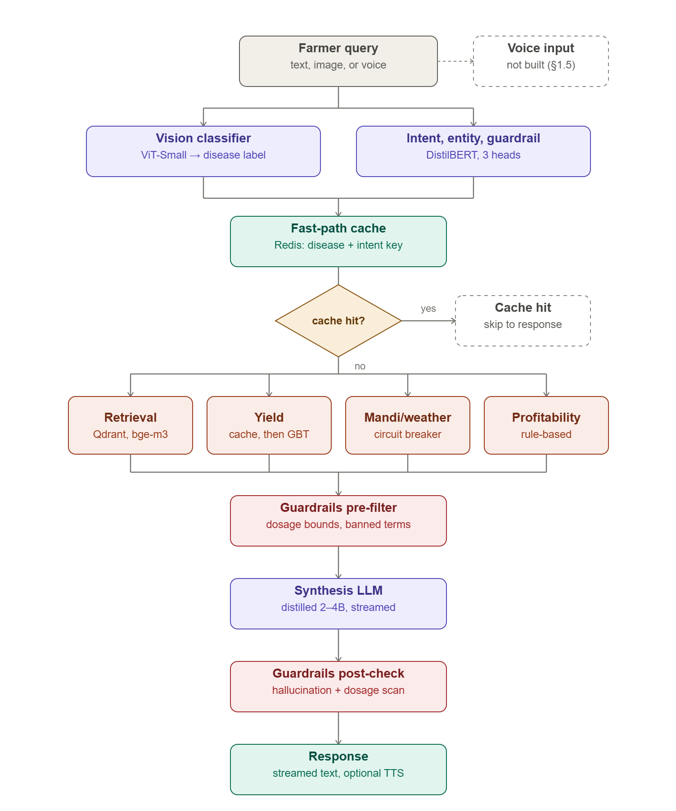

# FarmerVision: Farmer Query Assistant

**Course:** DS and AI Lab | **Group:** 7 | **Institution:** IIT Madras  
**GitHub:** [Group-7-DS-and-AI-Lab-Project](https://github.com/23f3004092/Group-7-DS-and-AI-Lab-Project) | **Status:** Milestones 1–6 complete — deployed (REST API + mobile app) with full documentation

---

## Project Overview

FarmerVision is an agentic AI system designed to help Indian farmers get instant, accurate answers to their agricultural queries — available 24/7. Farmers can type a question or upload a crop leaf image, and the system classifies their intent, retrieves information from the most relevant source, and generates a plain-language response.

This addresses a critical gap: the Kisan Call Centre (KCC) — India's primary farmer support system — is human-staffed, limited in hours, and cannot scale to meet demand.

---

## Problem Statement

Indian farmers frequently face urgent queries related to crop diseases, pest outbreaks, fertilizer usage, mandi prices, and government schemes. Existing automated systems (e.g. KisanQRS) use basic clustering over past KCC answers and explicitly filter out price queries — leaving a large portion of farmer needs unmet. No existing system combines multi-source retrieval, visual disease detection, and intent-based routing into a single unified assistant.

FarmerVision solves this by:
- Detecting crop disease from leaf images using a fine-tuned ViT
- Classifying query intent, entities, and off-domain queries using a multi-head LLM
- Generating a grounded, plain-language answer via a distilled LLM
- Estimating crop yield from historical and regional data

---

## Features

- 🌿 **Crop Disease Detection** — ViT-S/16 fine-tuned on a 20-class rice + wheat leaf-disease corpus; 0.8998 test accuracy, 0.8671 20-way macro-F1 (n=1,287). Served as a suggestion, not a diagnosis, until confidence calibration is added
- 🔍 **Intent Classification** — Multilingual DistilBERT with three heads on one backbone: intent (0.884 accuracy / 0.715 macro-F1), crop/district entity extraction (0.958 entity F1), and an off-domain guardrail (must run combined with rule-based filters — see [Results](#results))
- 📚 **RAG-based Advisory** — bge-m3 + Qdrant retrieval over 723K KCC and government-document chunks; answers generated by a distilled, 4-bit `gemma-3-4b-it` with citations and numeric-grounding safety checks
- 💰 **Live Mandi Prices** — Real-time price retrieval via Agmarknet API
- 🏛️ **Scheme Information** — Government scheme guidance via ICAR document RAG
- 📈 **Yield Prediction** — Tuned LightGBM regression, R² 0.9572 / RMSE 2.41 on 64,021 held-out rows

---

## Architecture


**Request workflow** — what happens per query, from input to streamed response (§3.1):




---

## Dataset Details

| Dataset | Purpose | Source | Size |
|---|---|---|---|
| KCC Query Dataset (UP, 2020–2025) | RAG knowledge base + intent/entity/guardrail training | [data.gov.in](https://data.gov.in) | 716,303 retrieval chunks; 28,772/3,597/3,597 train/val/test rows for classification |
| Rice + Wheat leaf-disease corpus | ViT fine-tuning (20 classes, replaces earlier PlantVillage plan) | Kaggle/curated | 12,823 images — 10,252/1,284/1,287 train/val/test |
| ICAR & government advisory docs | Scheme/advisory RAG | [icar.org.in](https://icar.org.in) | 7,136 retrieval chunks |
| Agmarknet API | Live mandi price retrieval | [agmarknet.gov.in](https://agmarknet.gov.in) | Real-time API |
| Crop production/yield records | Yield prediction (LightGBM) | Government agri-production data | 426,803 cleaned rows — 308,364/54,418/64,021 train/val/test |


---

## Installation

```bash
git clone https://github.com/23f3004092/Group-7-DS-and-AI-Lab-Project.git
cd Group-7-DS-and-AI-Lab-Project

# research / model code
python -m venv venv && source venv/bin/activate   # Windows: venv\Scripts\activate
pip install -r requirements.txt
```
Python 3.11 recommended. A GPU (≥16 GB) is needed only to **serve/train the LLM**; retrieval, vision, guardrail, and yield run on CPU. Full setup: [`docs/technical_doc.md`](docs/technical_doc.md) §1.

---

## Running

**Live model-inference API** (deployed on a GCP GPU VM) — `POST /query`, `/classify`, `/vision`, `/diagnose` at `http://<host>:8000`. See [`docs/api_doc.md`](docs/api_doc.md); operations (start/stop, rebuild, expose) in `docs/internal/do_not_open/RUNBOOK_AND_API.md`.

**Free demo (Colab GPU)** — open [`notebooks/19_farmervision_serve_colab.ipynb`](notebooks/19_farmervision_serve_colab.ipynb), select a T4 runtime, and Run all; it serves the full stack behind a public tunnel.

**Product backend + mobile app** (on the `tanmay` branch):
```bash
pip install -r backend/requirements.txt && cp .env.example .env   # add API keys
python run.py                                                     # backend on :8000
cd mobile && npm install && npx expo start                       # Expo mobile app
```

---

## Results

Milestone 4 trained each module; Milestone 5 evaluated all five on held-out data against stated baselines. Every module met its target metric. Full detail: [Milestone 4 Report](docs/reports/Milestone_4_Report.md) (training) · [Milestone 5 Report](docs/reports/Milestone_5_Report.md) (evaluation, baselines, ablations, error analysis).

| Module | Headline metric | Result |
|---|---|---|
| Vision (ViT-S/16, 20 rice/wheat classes) | wheat-15 macro-F1 (test) / 20-way macro-F1 / accuracy | 0.8631 / 0.8671 / 0.8998 (n=1,287) |
| Intent classification (DistilBERT multilingual) | Accuracy / macro-F1 | 0.884 / 0.715 (n=3,597) |
| Entity extraction (NER) | Entity F1 | 0.958 |
| Guardrail (off-domain filter) | Test F1 / adversarial recall | 1.000 on test; 0.571 alone / 1.000 combined with rules |
| Retrieval (bge-m3 + Qdrant, 723K chunks) | Precision@5 / Recall@5, human-judged | 0.725 / 0.498 |
| Answer generation (distilled `gemma-3-4b-it`) | Language match / numeric grounding / RAGAS Faithfullness | 0.994 / 1.000 / 0.956 |
| Yield prediction (LightGBM, tuned) | R² / RMSE | 0.9572 / 2.41 (n=64,021) |

**Caveats carried into Milestone 6:**
- Vision errors concentrate in one cluster of visually similar wheat diseases (tan spot, leaf blight, common root rot, mite, mildew); output should be presented as a suggestion, not a diagnosis, until confidence calibration is added.
- The guardrail model alone recalls only 0.571 on adversarial queries — it must be deployed combined with rule-based filters, never alone.
- Hinglish queries are the weakest input across the whole pipeline (e.g. retrieval precision@5 0.589 vs. 0.831 for English).
- Retrieval and generation are considered complete and deployment-ready as configured; vision, intent/guardrail, and yield are ready for pilot use with the caveats above.

---

## Deployment & Demo

FarmerVision is deployed as a **REST API + mobile app**:

- **Model-inference API** (RAG + vision + generation) — distilled models served on a **GCP GPU VM** (FastAPI, `:8000`): `POST /query`, `/classify`, `/vision`, `/diagnose`. Reference: [`docs/api_doc.md`](docs/api_doc.md).
- **Product backend + mobile app** — FastAPI (`/api/*`) + Expo React Native app (Home · Leaf Scanner · Advisor Chat · Yield · Settings) + admin dashboard (`backend/`, `mobile/`, `admin/` — `tanmay` branch).
- **Free demo fallback** — [`notebooks/19_farmervision_serve_colab.ipynb`](notebooks/19_farmervision_serve_colab.ipynb) runs the whole stack on a Colab GPU behind a public tunnel.

🔗 **Live API:** `http://<host>:8000` (URL + API key on request) · **Demo video:** _(add link)_ · **Screenshots:** `docs/user_guide.md`

### Milestone-6 Documentation (`docs/`)

| Doc | Purpose |
|---|---|
| [overview.md](docs/overview.md) | problem, architecture diagram, deployed components |
| [technical_doc.md](docs/technical_doc.md) | setup, data pipeline, models, training/eval, inference, deployment, reproducibility |
| [user_guide.md](docs/user_guide.md) | end-user (farmer) guide + troubleshooting |
| [api_doc.md](docs/api_doc.md) | REST API reference (product backend + model-inference API) |
| [licenses.md](docs/licenses.md) | code, dataset, and model licenses + citations |

---

## Project Structure

```
Group-7-DS-and-AI-Lab-Project/          (main branch — research + deployment)
├── README.md · LICENSE (MIT) · requirements.txt
├── docs/
|    ├── technical_doc.md
|    ├── user_guide.md
|    ├── api_doc.md
|    ├── licenses.md 
│   ├── overview.md
│   ├── reports/               ← milestone reports + Final_Project_Report.md
│   ├── architecture/          ← system diagrams
│   └── internal/do_not_open/  ← GCP deployment: requiredforgcp/ (FastAPI gateway + scripts),
│                                 RUNBOOK_AND_API.md, API_SPEC.md, Deployment_Report_GCP.md
├── notebooks/                 ← EDA, training, evaluation + 19_farmervision_serve_colab.ipynb
├── scripts/                   ← utilities + run_e2e_eval.py / build_e2e_eval_dataset.py
├── src/                       ← reusable source code (data, models, retrieval, evaluation, ...)
├── data/                      ← sample data only; see data/README.md
├── models/ · outputs/ · tests/ · configs/

Product app (on the `tanmay` branch):
├── backend/                   ← FastAPI product API (/api/query, /mandi, /weather, /admin, /mcp)
├── mobile/                    ← Expo React Native app (Home, Leaf Scanner, Advisor Chat, Yield, Settings)
└── admin/                     ← React/Vite admin dashboard
```

---

## Milestones

| Milestone | Focus | Deadline | Status |
|---|---|---|---|
| M1 | Problem Definition & Literature Review | July 2 | ✅ Done |
| M2 | Dataset Preparation | July 9 | ✅ Done |
| M3 | Model Architecture & End-to-End Setup | July 23 | ✅ Done |
| M4 | Model Training | July 30 | ✅ Done ([report](docs/reports/Milestone_4_Report.md)) |
| M5 | Evaluation & Analysis | Aug 6 | ✅ Done ([report](docs/reports/Milestone_5_Report.md)) |
| M6 | Deployment & Documentation | Aug 13 | ✅ Done ([docs](docs/overview.md)) |
| Final | Project Presentation | Aug 20+ | ⏳ Upcoming |

---

## Team

| Name | Role |
|---|---|
| [Mahesh Ishran] | CV model fine-tuning and evaluations |
| [Aneeqa] | Dataset preparation for RAG + Entity Intent model training |
| [Lokesh] | Vision Dataset preparation + Yield prediction model + End to End model evals |
| [Harliv Singh] | RAG Vector db setup + Distillation + GCP model deployment   |
| [Tanmay Sahu] | Mobile app + product backend (mandi/weather) + deployment + Yield prediction model |

---

## References

1. **Rana, A., et al. (2023).** *KisanQRS: A Deep Learning-Based Automated Query-Response System for Kisan Call Centre.*
   
2. **ReadyTensor (2025).** *Agentic AI for Smart Agriculture: Multimodal RAG System.*
   

3. **Hughes, D., & Salathé, M. (2016).** *An Open Access Repository of Images on Plant Health to Enable the Development of Mobile Disease Diagnostics.*


4. **Singh, D., et al. (2020).** *PlantDoc: A Dataset for Visual Plant Disease Detection.*
  

5. **Mwebaze, E., et al.** *Cassava Leaf Disease Classification Dataset.*


6. **PlantWild (2024).**


7. **Balpande, A., et al. (2024).** *AI-Powered Agriculture Optimization Chatbot Using RAG and Generative AI.*
   

8. **Digital Green.** *FarmerChat.*


9. **International Food Policy Research Institute (IFPRI).** *GAIA Phase II (2025–2027): Generative AI for Agricultural Information Access.*
   

10. **World Economic Forum (2025).** *Shaping the Deep-Tech Revolution in Agriculture.*
    

11. **World Economic Forum (2025).** *How AI is Enabling Agricultural Intelligence and Revolutionizing Farming.*
    
12. **Government of India.** *Kisan e-Mitra.*
    

13. **Government of India.** *Union Budget 2026–27: Bharat-VISTAAR.*

14. **Wadhwani Institute for AI.** *AgriAI Collect.*


15. **Syngenta.** *Cropwise Digital Farm Management Platform.*

16. **Khurana, S., et al.** *MuRIL: Multilingual Representations for Indian Languages.*

17. **Kakwani, D., et al.** *IndicBERT: A Multilingual Model for Indian Languages.*


---

*Last updated: August 2026 (post-Milestone 6 — deployed) | Group 7 | DS and AI Lab | IIT Madras*
