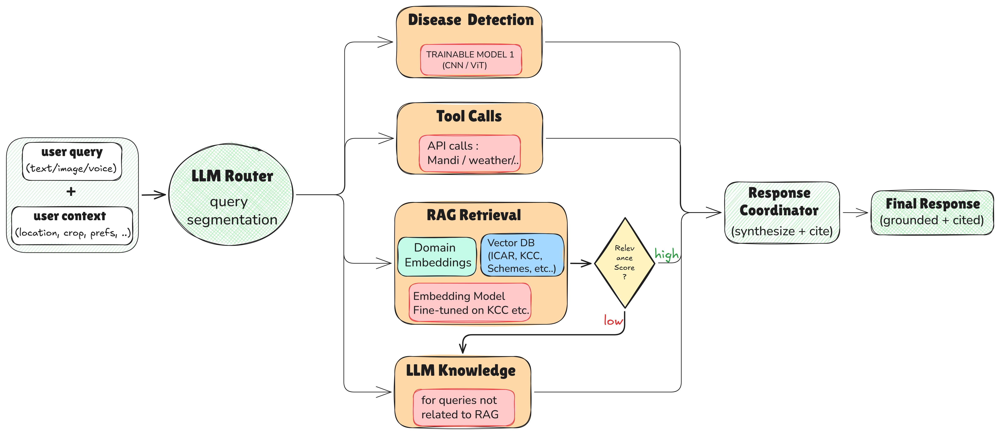
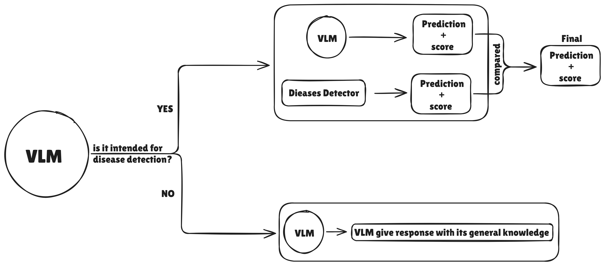
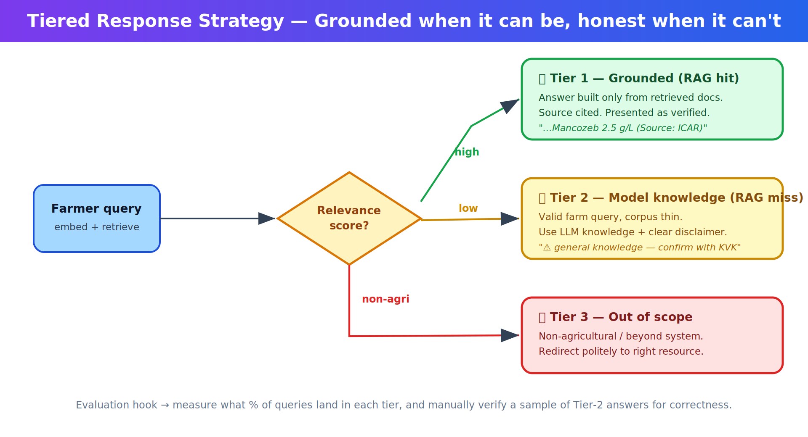
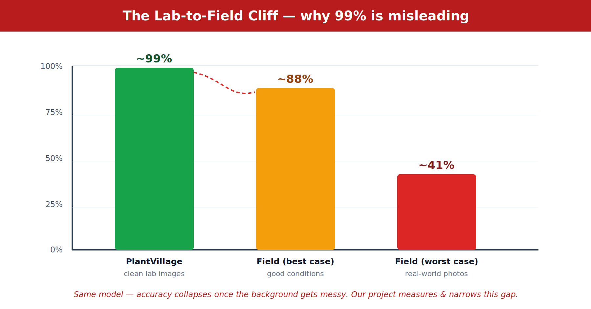

<div align="center">

# 🌾 Milestone 1 — Problem Definition & Literature Review

### A Field-Robust, Confidence-Aware, Faithfulness-Grounded Crop Advisory System


</div>

---

> ⚠️ <span style="color: red;">**IMPORTANT**</span>
> **The one-line identity of this project:**
> It's **not another agri-chatbot**. It's a system that studies and *reduces the two biggest trust failures in AI agriculture* — **disease detection that breaks in real fields**, and **advice that sounds confident but is made up** — with every claim backed by a number we can measure.

<div align="center">

| 🎯 The Promise | 💥 The Failure It Fixes | 📏 How We Prove It |
|:---|:---|:---|
| **Field-robust** vision | Models hit 99% in the lab, collapse to ~41% in the field | Test on *real-field* datasets, quantify the gap |
| **Confidence-aware** answers | Systems guess even when clueless | Abstain below a threshold; report abstention correctness |
| **Faithfulness-grounded** advice | LLMs hallucinate pesticide doses | Every claim traces to a cited source (RAGAS) |

</div>

---

## 📑 Contents

1. [Problem Statement](#-1-problem-statement)
2. [Scope & Boundaries](#-2-scope--boundaries)
3. [Stakeholders](#-3-stakeholders)
4. [Objectives](#-4-objectives-measurable)
5. [Proposed Solution](#-5-proposed-solution-at-a-glance)
6. [System Architecture](#-6-system-architecture)
7. [Disease Detector — Architecture Deep-Dive](#-7-disease-detector--architecture-deep-dive)
8. [The System in Action — Scenarios](#-8-the-system-in-action--scenarios)
9. [Literature Review & Existing Solutions](#-9-literature-review--existing-solutions)
10. [Comparative Analysis](#-10-comparative-analysis)
11. [Datasets & Evaluation](#-11-datasets--evaluation)
12. [Milestone 1 Scope Recap](#-12-milestone-1-scope-recap)
13. [References](#-13-references)

---

## 🧩 1. Problem Statement

India's 120+ million smallholder farming households depend on **timely, accurate agronomic intelligence** — *what is this disease, what do I spray, what dose, which scheme covers me, what's today's price* — to protect their yields and livelihoods. The main institutional lifeline, the **Kisan Call Centre (KCC)**, handles millions of calls a year but is bottlenecked by limited hours, high call volumes, language barriers, and a complete inability to *look* at a photo of a sick crop.

Existing AI advisory tools don't close the gap either. They fail in three specific, measurable ways:

> [!WARNING]
> ### The Three Trust Failures 💥
>
> **1️⃣ Disease detection collapses in real fields.**
> Models trained on clean lab datasets (PlantVillage) hit **98–99%** accuracy — then crater to **50–88%**, and as low as **~41%**, on real field photos with messy backgrounds, harsh light, and overlapping leaves. A farmer shooting a leaf in the sun against soil *is* the failure case. Most projects report 99% on PlantVillage and quietly stop.
>
> **2️⃣ LLM advice hallucinates.**
> General LLMs produce plausible but **wrong** agronomic advice — dangerous when the output is a pesticide dose. A 2025 KCC study found retrieval-only answering had near-zero hallucination, while the generative layer *introduced* it. Fluency vs. faithfulness is a real, measurable tension.
>
> **3️⃣ Systems don't know when they're wrong.**
> No confidence calibration, no graceful abstention. Telling a farmer *"spray Mancozeb"* at 38% confidence isn't helpful — it's harmful.

**This project attacks all three head-on:** a crop advisory that **(a)** detects disease reliably under real field conditions, **(b)** *abstains gracefully* when unsure instead of guessing, and **(c)** returns treatment advice **provably grounded** in authoritative sources, with full citation traceability. Every clause is a claim we can put a number on — which is exactly what makes it defensible in review.

---

## 🗺️ 2. Scope & Boundaries

> [!NOTE]
> ### 📍 A deliberate scoping decision: start local, then scale
> To keep complexity manageable within the timeline, the team will **focus on a few selected regions/crops first** rather than all of India at once. This keeps the **RAG knowledge base compact and high-quality** (fewer documents, tighter curation) and lets us actually *measure* performance where we have ground truth. Once the solution proves out on the chosen locations, the same architecture **extends to new regions** by simply adding their advisories to the corpus — the pipeline doesn't change, only the data grows.

<table>
<tr>
<td width="50%" valign="top">

**✅ In Scope (Core Build)**

- Multimodal input: text + crop images *(voice = stretch goal)*
- LLM-based intent routing / query segmentation
- CNN/ViT disease detector, field-robust, calibrated + abstaining
- RAG advisory grounded in ICAR / KCC / scheme docs, with citations
- Domain-adapted embedding model (fine-tuned on KCC)
- Live APIs: mandi prices (Agmarknet) + weather
- Multi-turn **context elicitation** (location, crop stage, method)
- **Tiered response** (grounded → transparent fallback → redirect)

</td>
<td width="50%" valign="top">

**⛔ Out of Scope**

- Physical farm actuation (irrigation, drone spraying)
- Live video / drone monitoring
- Crop planning & yield prediction
- Legal dispute handling
- On-device / local LLM deployment
- Satellite-based crop monitoring
- Nationwide coverage *(intentionally — see local-first note)*

</td>
</tr>
</table>

> [!TIP]
> **Voice is a stretch goal.** Speech-to-Text (IndicWhisper) and Text-to-Speech (Sarvam TTS / Kokoro-82M) via WhatsApp/IVR are high-value for low-literacy users, and we'll build them **if time permits** after the core is solid. The core system works fully in text + image.

---

## 👥 3. Stakeholders

| | Stakeholder | Role |Their Interest |
|:---:|:---|:---|:---|
| 👨‍🌾 | **Smallholder farmers** *(primary users)* | End users who query the system via text, image|Fast, accurate, localized advice in their language; disease ID; scheme help; prices |
| 🧑‍🏫 | **Extension officers / KVKs** | Field agents from KVKs and state agriculture departments|A tool that extends their reach and absorbs repetitive queries |
| ☎️ | **KCC operators** | Staff handling farmer helpline queries|Automated first-line responses to cut call volume and wait times |
| 🏛️ | **ICAR & State Agri Universities** | Content providers and domain experts|Their advisories power the knowledge base; system accuracy validates their outreach |
| 🏢 | **Government agencies** *(MoA, DAC&FW)* | Policy makers and scheme administrators|Scalable last-mile delivery of scheme awareness (PMFBY, PM-KISAN) |
| 🌐 | **AgriTech / NGOs** *(Digital Green, Wadhwani AI)* | Ecosystem partners and potential adopters|Integration or white-labeling of advisory capabilities |
| 🎓 | **Academic evaluators** | Capstone reviewers and examiners|Measurable contributions with quantitative evaluation of trainable components |

---

## 🎯 4. Objectives (Measurable)

Each objective is measurable, tied to a milestone, and traceable to one of the three trust failures.

| # | Objective | 📏 Success Metric | Milestone |
|:---:|:---|:---|:---:|
| **O1** | Disease detector that survives real field conditions | Accuracy/F1 on lab (PlantVillage) **vs.** field (PlantDoc/Cassava); quantify + narrow the gap | M3–M5 |
| **O2** | Confidence-aware abstention | Abstention rate **and** abstention *correctness* | M5 |
| **O3** | All advice grounded + cited | RAGAS: Context Precision/Recall, **Faithfulness**, Response Relevancy | M5 |
| **O4** | Domain-adapted retrieval | Recall@5/@10, MRR, nDCG — generic **vs.** fine-tuned embeddings | M4–M5 |
| **O5** | Multimodal, intent-routed system | End-to-end demo across text + image *(+ voice if reached)* | M6 |
| **O6** | Live data + personalization | Real-time API calls; responses that vary by location/crop stage/method | M6 |

---

## 🧠 5. Proposed Solution (At a Glance)

A **multi-source agentic RAG framework** that ingests messy real-world inputs — vernacular voice, code-mixed "Hinglish" text, crop imagery — and routes each to the right specialized backend, then synthesizes one grounded, cited answer.

<div align="center">

```
        text / image / voice  +  user context
                     │
              ┌──────▼──────┐
              │  LLM Router  │   ← understands intent natively
              └──────┬──────┘
      ┌───────┬──────┼───────┬────────────┐
      ▼       ▼      ▼        ▼            ▼
  Disease   Tool   RAG     LLM        (context
  Detector  Calls  Retrieval Knowledge  elicitation)
      └───────┴──────┴───────┴────────────┘
                     ▼
          Response Coordinator  → grounded + cited answer
```

</div>

<details>
<summary><b>🔍 Click to expand: the four core components</b></summary>

<br>

**🧬 Component 1 — Disease Detector** *(Trainable Model 1: CNN/ViT)*  
>A **convolutional neural network** or **vision transformer** trained for field-robust crop disease classification. Unlike standard PlantVillage-trained models, this detector is trained with aggressive field-realistic augmentation and evaluated against real-field datasets (PlantDoc, Cassava). It produces calibrated confidence scores and abstains when confidence falls below a defined threshold, preventing dangerous misclassification.  
*(Full deep-dive in §7.)*

**🧭 Component 2 — Domain-Adapted Embedding Model** *(Trainable Model 2)*
>sentence-transformer model fine-tuned on KCC agricultural Q&A pairs using contrastive learning. General-purpose embedding models fail on agricultural Hindi/regional terminology — terms like *"makka"* (maize), *"tana chhedak"* (stem borer), *"phaphund"* (fungus), and *"geela sadan"* (wet rot) are underrepresented in their training data. Fine-tuning pulls a farmer's query and the right advisory *closer together* in vector space, directly lifting retrieval quality.  

**📚 Component 3 — RAG Advisory Engine**
>A **vector database (ChromaDB/FAISS)** indexed with  
*ICAR advisories*,  
*KCC historical Q&A pairs*,  
*state agricultural university guidelines*,  
*government scheme documents*, and  
*pest control medication details*.  
Queries are embedded using the domain-adapted model (Component 2), and the top-K most semantically similar document chunks are retrieved.  
The LLM then generates responses grounded strictly in these retrieved documents, with source citations. A relevance score threshold determines whether  
->the response is grounded (Tier 1),  
->falls back to LLM knowledge with transparent disclaimers (Tier 2), or  
 ->redirects as out-of-scope (Tier 3).  
 *(see §8, Scenario 9)*.  


**🚦 Component 4 — LLM Router + Response Coordinator**
 >The LLM natively understands query intent and segments incoming queries across four paths:  
->**disease detection** (image inputs),  
->**tool calls** (mandi prices, weather APIs),  
->**RAG retrieval** (advisory, scheme, pest management queries), and  
->**general LLM knowledge** (for queries not covered by RAG).  
The Response Coordinator synthesizes outputs from all activated paths into a single grounded, cited final response.

</details>

> [!NOTE]
> ### 🧪 On model selection — a Milestone-1 stance
> Throughout this document we list **all candidate architectures** under consideration for each trainable component (e.g. EfficientNet-B0 / ResNet-50 / ViT-Small for vision; MuRIL / IndicBERT / multilingual-e5 for language). **Final selection is deliberately deferred** — it will follow an **extensive comparative evaluation** of capabilities, accuracy, latency, and deployment footprint in M3–M4. Committing early would be premature; committing *with evidence* is the point of the later milestones.

---

## 🏗️ 6. System Architecture



<div align="center"><i>Figure 1 — Updated multimodal routing pipeline. User query (text/image/voice) + context flow into the LLM Router, which dispatches to Disease Detection, Tool Calls, RAG Retrieval, or LLM Knowledge. RAG uses the fine-tuned Domain Embeddings and a Vector DB (ICAR, KCC, Schemes); a relevance-score gate chooses grounded RAG vs. LLM fallback. All paths converge at the Response Coordinator, which synthesizes and cites.</i></div>

<details>
<summary><b>🔄 Click to expand: how data actually flows through the pipeline</b></summary>

<br>

**① Input Layer** — Farmer submits via text, image, or voice *(stretch)*. Context (location, crop, preferences) is gathered through elicitation prompts and optionally saved as a farmer profile.

**② Routing Layer** — The LLM Router reads query + context and segments intent. A single query can fire **multiple paths at once** — e.g. a diseased-leaf photo triggers *both* the detector *and* RAG (for treatment).

**③ Processing Layer** — The detector emits a structured object `{disease, confidence, crop}` that flows *into* RAG as an enriched query. The embedding model vectorizes the query, searches the DB, returns top-K chunks; a relevance check picks the tier.

**④ Synthesis Layer** — The Response Coordinator fuses detector output + retrieved docs + API data + context into one answer with **inline citations, confidence indicators, and disclaimers.**

</details>

---

## 🧬 7. Disease Detector — Architecture Deep-Dive

This is the heart of the "field-robust" promise, and our strongest computer-vision contribution. Here's the full pipeline:




<div align="center"><i>Figure 2 & 3 — The disease detector. A VLM gate first asks "is this even a leaf?"; leaves go to the specialized detector, everything else is handled by the VLM's general knowledge. The backbone is chosen from a candidate set, trained under field-realistic augmentation, and wrapped in confidence calibration + abstention.</i></div>

<br>

<table>
<tr><td width="33%" valign="top">

### 🏛️ Backbone candidates
*(final pick deferred to M3–M4)*

- **EfficientNet-B0** — light, mobile-friendly
- **ResNet-50** — strong, well-understood baseline
- **ViT-Small** — global attention, good on texture

</td><td width="33%" valign="top">

### 🌦️ Field-robust training
The trick that narrows the gap:

- Background randomization
- Lighting variation
- Blur / motion simulation
- Random crop & occlusion

</td><td width="33%" valign="top">

### 🎚️ Confidence & abstention
Safety, made measurable:

- Softmax + **temperature scaling**
- Reliability tracked via **ECE**
- `conf ≥ τ` → answer
- `conf < τ` → **"not sure"**

</td></tr>
</table>

> [!TIP]
> **Why the VLM gate matters.** Instead of forcing *every* image into a disease bucket, the VLM first identifies *what it's looking at*. A leaf → specialized detector (precise, calibrated). A tractor, soil, or pest close-up → the VLM answers directly with its general knowledge. Best of both worlds: a trainable core for the rubric **and** a system that doesn't waste the VLM's breadth. Bonus idea under consideration — let the VLM *also* predict the disease, giving **two independent confidence scores** to cross-check and reduce ambiguity.


---

## 🎬 8. The System in Action — Scenarios

> Each scenario is a little story showing one capability or edge case. Expand the ones you're curious about. 👇

<details open>
<summary><b>🍅 Scenario 1 — Image disease detection (the field-robust win)</b></summary>

<br>

**👨‍🌾 Farmer:** Photographs a tomato leaf with yellow-brown spots — outdoors, bright sun, soil in the background. *This is exactly the case that kills lab-trained models.*

**⚙️ Inside:** Router → detector. Because it trained on field-realistic augmentation and tested on PlantDoc/Cassava, it handles the messy background. Returns *"Early Blight — 82%"*. Above threshold → the disease becomes a structured RAG query for treatment.

> 🍅 **Detected: Early Blight** (*Alternaria solani*) — Confidence: **High (82%)**
>
> **Recommended action** *(Source: ICAR advisory, Rajasthan SAU):*
> Remove and destroy affected leaves. Apply **Mancozeb 75% WP at 2.5 g/litre**. Repeat after 10–15 days if symptoms persist. Improve plant spacing for airflow.
>
> ⚠️ *Retrieved from ICAR guidelines. Confirm dosage with your local KVK for your soil.*

✅ Every fact traces to a retrieved document — the LLM didn't *invent* "2.5 g/litre."

</details>

<details>
<summary><b>📷 Scenario 2 — When the photo is bad, the system says so (abstention)</b></summary>

<br>

**👨‍🌾 Farmer:** Uploads a blurry, low-light, folded wheat leaf. Detector returns *"Rust — 38%"* — **below threshold.**

Instead of guessing, it does what most apps never do — **admits uncertainty:**

> 📷 I couldn't identify the disease confidently from this photo.
> **For a clearer shot:** hold 15–20 cm away · use daylight, avoid shadows · plain background if possible.
> If urgent, contact your KVK or call the KCC at **1800-180-1551**.

✅ Measurable *and* a safety feature — "spray X" at 38% confidence is actively harmful.

</details>

<details>
<summary><b>🐛 Scenario 3 — Vague text query, ranked grounded options</b></summary>

<br>

**👨‍🌾 Farmer:** *"Meri kapas mein koi keeda lag gaya hai, kya karu?"* (some pest in my cotton — what do I do?)

"Koi keeda" names no specific pest, so the system retrieves the common cotton pests + differentiators rather than hallucinating one answer:

> **1. Bollworm** — holes in bolls, frass near flowers → *Emamectin Benzoate 5% SG, 4 g/10 L* *(KCC, Maharashtra)*
> **2. Whitefly** — white insects under leaves, sticky honeydew → *Diafenthiuron 50% WP, 12 g/10 L* *(ICAR-CICR)*
> **3. Jassid/Aphid** — leaf curling, edge-yellowing → *Imidacloprid 17.8% SL, 3 ml/10 L* *(KCC, Gujarat)*
>
> Can you describe or photograph the pest for a sharper recommendation?

✅ Ranked, sourced, and *asks a clarifying question* instead of forcing false confidence.

</details>

<details>
<summary><b>💰 Scenario 4 — Live mandi price (tool-call path)</b></summary>

<br>

**👨‍🌾 Farmer:** *"What's the price of wheat in the mandi today?"* → Router classifies **price query** → fires the **Agmarknet API**.

> **Wheat prices today (near you):**
> Jaipur ₹2,450/q · Kota ₹2,420/q · MSP (2025-26) ₹2,425/q
> 💡 Selling at Jaipur is ~₹25/q above MSP.

✅ Real-time data the RAG corpus can't (and shouldn't) store.

</details>

<details>
<summary><b>📜 Scenario 5 — Government scheme (same RAG, different domain)</b></summary>

<br>

**👨‍🌾 Farmer:** *"Tell me about PM Fasal Bima Yojana."*

> **Pradhan Mantri Fasal Bima Yojana (PMFBY)** *(Source: Dept. of Agriculture, GoI)*
> Crop insurance for natural calamities, pests, diseases. Premium: **Kharif 2%**, **Rabi 1.5%**. Enroll via bank or CSC. Deadline ~2–3 weeks before the season.

✅ One RAG architecture serves disease *and* scheme queries — the intent just routes to a different slice of the corpus.

</details>

<details>
<summary><b>🚜 Scenario 6 — Not a leaf? Don't force it (OOD detection)</b></summary>

<br>

**👨‍🌾 Farmer:** Accidentally uploads a photo of a tractor.

The VLM gate recognizes it isn't a plant leaf; the detector's confidence is uniformly low → no forced classification:

> This doesn't look like a crop or plant leaf. Please upload a close-up of the affected leaf, stem, or fruit and I'll take a look.

✅ Most systems shove *any* image into *some* disease class — recognizing "this isn't even a leaf" is a real differentiator.

</details>

<details>
<summary><b>🌧️ Scenario 7 — Context-aware personalization</b></summary>

<br>

**👨‍🌾 Farmer:** *"What should I spray for early blight on tomato?"* → system elicits context → **Rajasthan · Flowering · Organic.**

> For **organic** management at flowering in Rajasthan: **Trichoderma viride 4 g/litre** foliar spray, or **neem oil 5% at 5 ml/litre**. Avoid spraying 8–11 AM to protect pollinators. *(Source: ICAR organic package)*

Had they picked *"Chemical,"* the answer would recommend Mancozeb with a different citation. ✅ Same query, personalized outcome.

</details>

<details>
<summary><b>🚧 Scenario 8 — Honest about its own boundary</b></summary>

<br>

**👨‍🌾 Farmer:** *"What should I plant next season?"* — needs soil, yield history, market forecasts, agro-climatic zones → **beyond scope.**

> That depends on your soil, water, climate zone, and market prices — data I don't fully have. Best next steps: your **KVK** for soil testing, the **ICAR crop calendar** for your zone, and **eNAM** for market trends. I'm strongest on disease ID, pest management, and scheme info — ask me anything there!

✅ Knowing where to stop is a design decision *and* a safety feature.

</details>

<details>
<summary><b>🚦 Scenario 9 — The 3-tier decision, made visible (NEW)</b></summary>

<br>

This scenario shows the **tiered response strategy** — how the system decides, per query, whether to speak with authority, speak with a disclaimer, or step aside.



<div align="center"><i>Figure 3 — After retrieval, a relevance-score gate routes the query to one of three tiers.</i></div>

**Same farmer, two different queries:**

**🟢 Query A — "How to control early blight in tomato?"**
Top retrieved chunk scores **0.89** — a direct ICAR match. → **Tier 1, grounded:**
> Early Blight — apply **Mancozeb 75% WP, 2.5 g/litre** at first symptoms; repeat in 10–15 days. *(Source: ICAR-IIVR, 2023)*
> *No disclaimer needed — verified.*

**🟡 Query B — "Which wheat seed variety for rabi season?"**
Top chunk scores **0.42** — vaguely related, not region-specific. → **Tier 2, transparent fallback:**
> *Based on general knowledge (not a specific verified advisory):* for Barmer, Rajasthan with limited irrigation, consider short-duration, drought-tolerant **Raj 4120** or **HI 1544**.
> ⚠️ *Please confirm with your local KVK or seed dealer — variety availability changes year to year.*

**🔴 Query C — "What's the cricket score?"** → **Tier 3, redirect:** politely declines, points elsewhere.

> [!TIP]
> **This is also an evaluation goldmine.** We can report *what percentage of queries land in each tier*, and manually verify a sample of Tier-2 answers for correctness — turning "how trustworthy is it?" into a number.

</details>

---

## 📚 9. Literature Review & Existing Solutions

>We group by theme:  
**advisory systems**,  
**computer vision**,  
**Indian-language NLP**, and  
**faithfulness/voice**.

### 🤖 9.1 AI-Powered Advisory Systems

<details open>
<summary><b>KisanQRS (Rehman et al., 2023) — closest prior work</b> 🔗 <a href="https://arxiv.org/abs/2411.08883">arXiv:2411.08883</a> · <a href="https://www.sciencedirect.com/science/article/abs/pii/S0168169923005689">ScienceDirect</a></summary>

<br>

A DL query-response system trained on a subset of **34M KCC call logs**. Threshold-based clustering + **LSTM** for query mapping. Achieves **96.58% top F1** on query mapping across five states and **96.20% NDCG** for answer retrieval.

| ✅ Strengths | ❌ Weaknesses |
|:---|:---|
| Large-scale validation on *real* KCC data | Returns *clustered past answers* — no natural-language generation |
| Strong retrieval ranking | **Price/weather queries filtered out entirely** during preprocessing |
| Efficient clustering architecture | No image-based disease detection |
| | No multi-source routing; no explicit Hinglish handling |

</details>

<details>
<summary><b>Agentic AI for Smart Agriculture — Multimodal RAG (ReadyTensor, 2025)</b> 🔗 <a href="https://www.readytensor.ai/">ReadyTensor</a></summary>

<br>

Combines **YOLOv8** disease detection with a RAG pipeline (**Qdrant** + Groq LLMs), multilingual, refines on feedback.

| ✅ Strengths | ❌ Weaknesses |
|:---|:---|
| CV + RAG combined effectively | **No KCC backbone** — generic knowledge base |
| Multilingual; feedback-driven refinement | No intent classification; no live prices |
| | Not tailored to Indian data sources |

</details>

<details>
<summary><b>Krishi Sathi & multi-turn dialogue systems</b></summary>

<br>

Excellent **multi-turn dialogue** with agent-initiated clarifying questions. **Weakness:** lacks field-tested computer vision.

</details>

<details>
<summary><b>AI Chatbot for Farmers — RAG + Leaf Image Analysis (2025)</b></summary>

<br>

RAG + leaf image analysis; **4.4/5 satisfaction** in a study of **200 farmers**; multilingual + voice.

| ✅ Strengths | ❌ Weaknesses |
|:---|:---|
| Validated with real farmers | No KCC-specific grounding |
| Voice + multilingual | No intent classification; no live mandi prices |
| | Disease→treatment grounding not tied to verified sources |

</details>

<details>
<summary><b>RAG-Based Advisory Frameworks (Balpande et al. 2024; others 2024–25)</b></summary>

<br>

RAG pipelines over agri documents; strong retrieval-evaluation methodology. **Weaknesses:** general-purpose, not KCC-grounded, no multi-intent or live-data integration.

</details>

<details>
<summary><b>FarmerChat — Digital Green / IFPRI GAIA</b> 🔗 <a href="https://www.digitalgreen.org/">Digital Green</a></summary>

<br>

The most **widely deployed** GenAI advisory: **830k+ users**, 5 countries, 15 languages, **10M+ queries**; voice/text/image in local languages. **Gaps for us:** no public field-robustness benchmarks, no public hallucination/faithfulness metrics, architecture not open for academic comparison.

</details>

<details>
<summary><b>Government initiatives — Kisan e-Mitra & Bharat-VISTAAR</b></summary>

<br>

**Kisan e-Mitra** handles **20,000+ queries/day** in 11 languages. **Bharat-VISTAAR** (Union Budget 2026-27) proposes integrating AgriStack + ICAR practices with AI advisory. The **National Pest Surveillance System** IDs pests across **61 crops / 400+ species**. *Our project aligns with this national direction while solving the technical gaps (field-robustness, faithfulness) these systems haven't.*

</details>

### 👁️ 9.2 Computer Vision for Disease Detection

> [!CAUTION]
> **The central CV problem — the lab-to-field cliff.**



<div align="center"><i>Figure 4 — The same model that scores ~99% on clean lab images can fall to ~41% on real field photos. Narrowing this gap is our core CV contribution.</i></div>

<details>
<summary><b>Architectural interventions from the literature</b></summary>

<br>

- **Segmentation-first** — UNet / BERT-based masks isolate the lesion before classification (e.g. **STAR-Net** for fungal morphologies).
- **Domain adaptation** — Fourier Domain Adaptation & sim2real align lab↔field feature distributions.
- **Rapid edge detection** — single-stage **YOLOv8** for mobile bounding-box detection.
- **Vision-Language Models** — **SCOLD** (Swin-T + RoBERTa, Context-Aware Soft Targets) reframes classification as image-text retrieval.

</details>

### 🗣️ 9.3 Indian-Language NLP

<details>
<summary><b>The Hinglish / code-mixing challenge & specialized models</b> 🔗 <a href="https://huggingface.co/google/muril-base-cased">MuRIL</a> · <a href="https://huggingface.co/ai4bharat/indic-bert">IndicBERT</a></summary>

<br>

Standard **mBERT** fails on transliterated, code-mixed vernacular. Agri terms — *tana chhedak* (stem borer), *phaphund* (fungus), *geela sadan* (wet rot), *davai* (pesticide) — are under-represented in general multilingual training data. Models pre-trained on Indian languages (**MuRIL**, **IndicBERT**, hybrids like **BhaavNet**), fine-tuned on KCC logs + corpora like **AgriGov**, get materially higher accuracy on intent classification and NER.

</details>

### 🛡️ 9.4 Faithfulness, Sensors & Voice

<details>
<summary><b>Faithfulness / hallucination guardrails</b> 🔗 <a href="https://docs.ragas.io/">RAGAS</a></summary>

<br>

**RAGAS** metrics for continuous safety: **Context Precision/Recall** (retrieval signal-to-noise + completeness), **Faithfulness** (every claim traces to context — the ultimate guardrail), **Response Relevancy** (does it answer the question?). Multi-agent evaluator setups act as neurosymbolic guardrails before output reaches the user.

</details>

<details>
<summary><b>Context-aware retrieval & sensor integration</b></summary>

<br>

Generic RAG is unsafe for agriculture — advice must key on geolocation, weather, soil. Frameworks like **GeoGraphRAG-Soil (GGRS)** and **AgriRegion** intersect text knowledge with geospatial rules; metadata filtering (region, soil, crop) enforces contextual safety. IoT sensor drift (e.g. salinity corroding moisture sensors) means sensor inputs should be treated *probabilistically*, cross-checked against historical/satellite baselines.

</details>

<details>
<summary><b>Voice interfaces for low-literacy access</b> — <i>(our stretch goal)</i></summary>

<br>

Zero-shot text prompting fails low-literacy users; multi-turn clarification is essential. Voice-first design pairs STT (**IndicWhisper**) with TTS (**Kokoro-82M**, **Sarvam TTS**) over WhatsApp/IVR so farmers can *listen repeatedly*. **Wadhwani AI's AgriAI Collect** proved the pattern — ASR + LLM extraction + human-in-the-loop validation, **32,000 users**.

</details>

### 🏭 9.5 Industry Solutions

<details>
<summary><b>Syngenta Cropwise · Plantix · Intello Labs</b> 🔗 <a href="https://www.weforum.org/">WEF context</a></summary>

<br>

- **Syngenta Cropwise** — precision farm management across **70M+ hectares, 30+ countries**; built for large commercial ops, not low-connectivity smallholders.
- **Plantix (PEAT)** — smartphone disease diagnosis for smallholders; a 2025 Burkina Faso cassava study found accuracy limits vs. molecular ground truth — the lab-to-field gap, *in a deployed product*.
- **Intello Labs (Fruitsort)** — CV produce grading, **40× faster** than manual; commercially proven, but post-harvest, not in-field advisory.

The **WEF 2025 deep-tech report** names the exact barriers we target: data-quality issues, **hallucinations**, **on-field variability**, and limited model transferability that erodes farmer trust.

</details>

---

## ⚖️ 10. Comparative Analysis

**How our system stacks up against the field:** ✅ = present, ⚠️ = partial, ❌ = absent

| Capability | KisanQRS | ReadyTensor | Krishi Sathi | RAG+Leaf | FarmerChat | **Ours** |
|:---|:---:|:---:|:---:|:---:|:---:|:---:|
| KCC-data backbone | ✅ | ❌ | ❌ | ❌ | ❌ | ✅ |
| LLM answer generation | ❌ | ✅ | ✅ | ✅ | ✅ | ✅ |
| Image disease detection | ❌ | ✅ | ❌ | ✅ | ✅ | ✅ |
| **Field-robustness evaluated** | ❌ | ❌ | ❌ | ❌ | ⚠️ | ✅ |
| **Confidence-aware abstention** | ❌ | ❌ | ❌ | ❌ | ❌ | ✅ |
| **Faithfulness metrics (RAGAS)** | ❌ | ❌ | ❌ | ❌ | ⚠️ | ✅ |
| Live mandi prices | ❌ | ❌ | ❌ | ❌ | ❌ | ✅ |
| Multi-source routing | ❌ | ❌ | ❌ | ❌ | ⚠️ | ✅ |
| Hinglish / vernacular | ❌ | ❌ | ❌ | ⚠️ | ✅ | ✅ |
| Multi-turn dialogue | ❌ | ⚠️ | ✅ | ⚠️ | ✅ | ✅ |
| Voice I/O | ❌ | ❌ | ❌ | ✅ | ✅ | ⚠️ *(stretch)* |
| Domain-adapted embeddings | ❌ | ❌ | ❌ | ❌ | ⚠️ | ✅ |
| Context elicitation | ❌ | ❌ | ✅ | ❌ | ⚠️ | ✅ |
| Tiered RAG + fallback | ❌ | ❌ | ❌ | ❌ | ⚠️ | ✅ |

> [!IMPORTANT]
> ### 🔑 What actually makes us different
> **1. Field-robustness as a *measured claim*** — we train on PlantVillage, test on PlantDoc/Cassava, and report the gap. Nobody above publicly does this.  
> **2. Abstention** — the system says *"I'm not sure"* and we score how often that's the right call.  
> **3. Faithfulness as a number** — RAGAS on every answer, targeting the most dangerous failure (hallucinated doses).  
> **4. Domain-adapted retrieval** — measurable before/after recall lift on agri-Hindi.  
> **5. Synthesis** — we combine KCC grounding (KisanQRS), CV+RAG (ReadyTensor), dialogue (Krishi Sathi), and accessibility (FarmerChat) — *plus* the three things none of them measure.

---

## 📊 11. Datasets & Evaluation

### 🗃️ Datasets (all public — no scraping, no custom collection needed)

| Dataset | Role | Size | Link |
|:---|:---|:---|:---|
| **KCC Query-Response** | Intent training · RAG corpus · embedding fine-tune | Lakhs of labeled Q&A | 🔗 [data.gov.in](https://data.gov.in/) |
| **PlantVillage** | Disease detector — lab baseline | 54,306 imgs / 38 classes | 🔗 [GitHub](https://github.com/spMohanty/PlantVillage-Dataset) |
| **PlantDoc** | Disease detector — field eval | 2,598 imgs / 13 crops | 🔗 [GitHub](https://github.com/pratikkayal/PlantDoc-Dataset) |
| **Cassava Leaf Disease** | Field eval — farmer mobile photos | 21,367 imgs / 5 classes | 🔗 [Kaggle](https://www.kaggle.com/competitions/cassava-leaf-disease-classification) |
| **PlantWild** (2024) | Multimodal field eval | 18,542 imgs / 89 classes | *in-the-wild, text-per-class* |
| **FieldPlant** (2023) | Field eval — pathologist-labeled | 5,170 imgs / 27 classes | *plant-pathology annotated* |
| **ICAR advisories + scheme docs** | RAG knowledge base | 100s of docs | *ICAR / gov portals* |

> [!NOTE]
> Because we're **starting local**, only the advisories for our selected regions/crops go into the vector DB at first — keeping it **small, curated, and high-precision.** More regions = more documents, same pipeline.

### 🧮 Evaluation — grouped by our three promises (so it doesn't feel like a metric dump)

Rather than a wall of numbers, here's the **one headline metric per promise** — the full detail is folded below.

<div align="center">

| 🎯 Promise | ⭐ Headline Metric | 👍 Good Result Looks Like |
|:---|:---|:---|
| **Field-robust** | Field-vs-lab F1 gap | Gap shrinks after augmentation |
| **Confidence-aware** | Abstention correctness | Most abstentions were genuinely hard cases |
| **Faithful** | RAGAS Faithfulness | High % of claims trace to sources |
| **Good retrieval** | Recall@5 (fine-tuned vs generic) | e.g. 62% → 84% |

</div>

<details>
<summary><b>📋 Click to expand: the complete metric breakdown (for M5)</b></summary>

<br>

**🧬 Disease Detector (Model 1)**
- Accuracy · macro-F1 · per-class F1 on **PlantVillage (lab)** vs **PlantDoc/Cassava (field)** → quantify the domain gap
- Confusion matrix — which diseases get confused
- Abstention rate + abstention *correctness*
- **Expected Calibration Error (ECE)** — are the confidence scores actually reliable?

**🧭 Embedding Model (Model 2)**
- **Recall@5, Recall@10, MRR, nDCG** — generic vs fine-tuned
- Per-category lift (e.g. pest queries +30%, scheme queries +5% — standard terminology)
- Failure-case analysis — which queries still retrieve the wrong doc, and why

**📚 End-to-End RAG**
- **RAGAS**: Context Precision, Context Recall, **Faithfulness**, Response Relevancy
- **Tier distribution** — % of queries at Tier 1 / 2 / 3
- Manual verification of a Tier-2 sample (200+) for factual correctness

**🔍 Optional — faithfulness classifier (M5 booster)**
- Hand-label ~150–200 (context, response) pairs → train a lightweight classifier → run it across 1,000+ outputs → report e.g. *"94% of responses grounded in sources."* A quantitative faithfulness number that beats "we checked 50 by hand."

</details>

---

## ✅ 12. Milestone 1 Scope Recap

| Deliverable | Status |
|:---|:---:|
| Problem statement with measurable objectives | ✅ |
| Literature review of solutions & academic work | ✅ |
| Strengths/weaknesses of existing approaches | ✅ |
| Comparative analysis vs. our approach | ✅ |
| Benchmarks, baselines & evaluation metrics identified | ✅ |
| System architecture designed | ✅ |
| Datasets identified & availability confirmed | ✅ |
| Credible references included | ✅ |

**Milestone 1 covers:** multimodal ingestion (text/image; voice = stretch), LLM intent routing, RAG over ICAR/AgriGov/KCC, live APIs (Agmarknet/weather), multi-turn dialogue design, two trainable model specs (disease classifier + embedding model), and a full evaluation framework.

**Milestone 1 excludes:** physical actuation, live video, legal disputes, on-device LLM, crop planning/yield prediction, satellite imagery, and nationwide coverage *(local-first by design)*.

---

## 🔗 13. References

1. Rehman, M.Z.U., Raghuvanshi, D., Kumar, N. (2023). *KisanQRS: A Deep Learning-based Automated Query-Response System for Agricultural Decision-Making.* Computers and Electronics in Agriculture. — [arXiv:2411.08883](https://arxiv.org/abs/2411.08883) · [ScienceDirect](https://www.sciencedirect.com/science/article/abs/pii/S0168169923005689)
2. ReadyTensor (2025). *Agentic AI for Smart Agriculture: Multimodal RAG System.* — [readytensor.ai](https://www.readytensor.ai/)
3. Hughes, D., Salathé, M. (2016). *PlantVillage — An open access repository of images on plant health.* — [GitHub](https://github.com/spMohanty/PlantVillage-Dataset)
4. Singh, D., et al. (2020). *PlantDoc: A Dataset for Visual Plant Disease Detection.* CoDS-COMAD. — [arXiv:1911.10317](https://arxiv.org/abs/1911.10317) · [GitHub](https://github.com/pratikkayal/PlantDoc-Dataset)
5. Mwebaze, E., et al. *Cassava Leaf Disease Classification.* Makerere University / Kaggle. — [Kaggle](https://www.kaggle.com/competitions/cassava-leaf-disease-classification)
6. *PlantWild* (2024) — largest in-the-wild multi-crop dataset with per-class text descriptions.
7. *FieldPlant* (2023) — pathologist-annotated field disease dataset.
8. Balpande, A., et al. (2024). *AI-Powered Agriculture Optimization Chatbot Using RAG and GenAI.*
9. Digital Green. *FarmerChat.* — [digitalgreen.org](https://www.digitalgreen.org/)
10. IFPRI. *GAIA Phase II (2025–2027): Generative AI for Agricultural Information Access.*
11. World Economic Forum (2025). *Shaping the Deep-Tech Revolution in Agriculture.* — [weforum.org](https://www.weforum.org/)
12. World Economic Forum. *How AI is Enabling Agricultural Intelligence and Revolutionizing Farming.* — [weforum.org](https://www.weforum.org/)
13. Government of India. *Kisan e-Mitra — voice-based AI chatbot.*
14. Government of India, Union Budget 2026-27. *Bharat-VISTAAR — multilingual AI agricultural advisory.*
15. Wadhwani Institute for AI. *AgriAI Collect.*
16. Khanuja, S., et al. *MuRIL: Multilingual Representations for Indian Languages.* Google. — [Hugging Face](https://huggingface.co/google/muril-base-cased)
17. Kakwani, D., et al. *IndicBERT.* AI4Bharat. — [Hugging Face](https://huggingface.co/ai4bharat/indic-bert)
18. Es, S., et al. *RAGAS: Automated Evaluation of Retrieval Augmented Generation.* — [docs.ragas.io](https://docs.ragas.io/)
19. Intello Labs. *Fruitsort — CV-based produce quality assessment.*
20. Government of India. *National Pest Surveillance System.*
21. Reimers, N., Gurevych, I. *Sentence-BERT / sentence-transformers.* — [sbert.net](https://www.sbert.net/)

---

<div align="center">

*Prepared for Milestone 1 · Architecture reflects the team's updated multimodal routing pipeline.*
**Model choices intentionally kept open — final selection follows comparative evaluation.** 🌱

</div>
