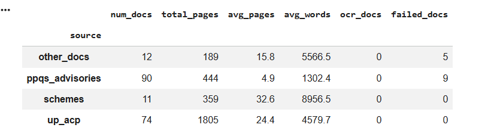
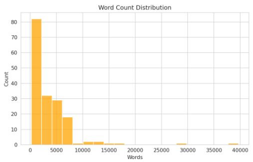
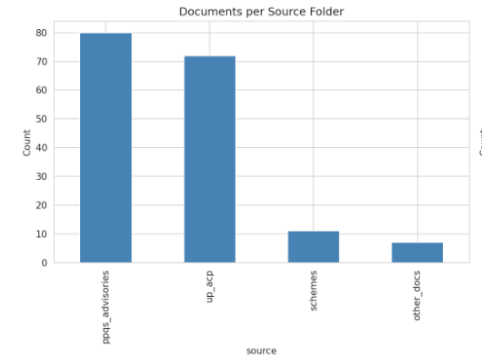

# Milestone 2 — Dataset Identification, Understanding & Preparation

## A Decoupled, Agentic Multimodal Crop Advisory System for Uttar Pradesh

### Contents

- [Milestone 2 — Dataset Identification, Understanding \& Preparation](#milestone-2--dataset-identification-understanding--preparation)
  - [A Decoupled, Agentic Multimodal Crop Advisory System for Uttar Pradesh](#a-decoupled-agentic-multimodal-crop-advisory-system-for-uttar-pradesh)
    - [Contents](#contents)
  - [1. Introduction](#1-introduction)
    - [Objectives of Milestone 2](#objectives-of-milestone-2)
    - [Relationship Between the Datasets and Project Goals](#relationship-between-the-datasets-and-project-goals)
    - [2. Dataset Identification](#2-dataset-identification)
    - [3. Dataset Description](#3-dataset-description)
    - [4. Data Governance](#4-data-governance)
    - [5. Exploratory Data Analysis (EDA)](#5-exploratory-data-analysis-eda)
    - [6. Data Preprocessing](#6-data-preprocessing)
    - [7. Dataset Integration (if multiple datasets)](#7-dataset-integration-if-multiple-datasets)
    - [8. Data Augmentation (if applicable)](#8-data-augmentation-if-applicable)
    - [9. Dataset Splitting](#9-dataset-splitting)
    - [10. Final Prepared Dataset](#10-final-prepared-dataset)
    - [11. Challenges Encountered](#11-challenges-encountered)
    - [12. Deliverables Produced](#12-deliverables-produced)
    - [13. Summary and Next Steps](#13-summary-and-next-steps)
  - [Team Review \& Sign-Off](#team-review--sign-off)

---

## 1. Introduction

In **Milestone 1**, we proposed a **decoupled, agentic multimodal crop advisory system** for smallholder farmers in Uttar Pradesh, focusing on **rice and wheat** cultivation. The proposed architecture consists of three major components: a vision subsystem for crop disease identification, a Retrieval-Augmented Generation (RAG) subsystem that retrieves information from government schemes, agricultural advisories, and Kisan Call Centre (KCC) data, and a quantized Large Language Model (LLM) that generates grounded, context-aware recommendations.

Building upon this foundation, **Milestone 2 focuses on identifying, understanding, and preparing the datasets required for each subsystem** through comprehensive Exploratory Data Analysis (EDA) and preprocessing. For the vision subsystem, three complementary datasets are used: the **Rice Leaf Disease Dataset**, **Wheat Disease Dataset**, and **PlantDoc Dataset**. The Rice and Wheat datasets provide well-labelled disease images captured under controlled conditions, while PlantDoc contributes real-world field images containing variations in lighting, backgrounds, and image quality, improving the model's ability to generalize to practical farming environments. The RAG subsystem utilizes government schemes, agricultural advisories, and KCC resources to build a reliable knowledge base, while the yield prediction subsystem relies on historical agricultural datasets for district-level yield estimation.

### Objectives of Milestone 2

* Identify and document the datasets required for the vision, RAG, and yield prediction subsystems.
* Perform exploratory data analysis to understand the structure, quality, and characteristics of each dataset.
* Detect and address issues such as missing values, duplicate records, corrupted samples, and inconsistent formats.
* Clean and preprocess the datasets to prepare them for model training and evaluation.
* Produce well-documented, training-ready datasets for use in the subsequent milestones.

### Relationship Between the Datasets and Project Goals

Each dataset directly supports the objectives defined in Milestone 1. The **Rice Leaf Disease**, **Wheat Disease**, and **PlantDoc** datasets enable robust crop disease detection by combining controlled and real-world images. The RAG corpus provides reliable agricultural knowledge for grounded response generation, while the historical yield dataset supports district-level yield prediction. Together, these datasets form the foundation for developing the proposed multimodal crop advisory system.

---

### 2. Dataset Identification

**2.1 Vision / Disease Detection Dataset(s)**

* **Dataset name(s):** 
* **Source(s) and download links:** 
* **Public/private/licensed status:** 
* **Purpose:** 
* **Why each dataset was selected:**
* **Alternatives considered:** 

**2.2 RAG / NLP PDFs (UP govt PDFs, schemes, Farming Handbooks)**

* **Dataset name(s):** UP State Government agricultural scheme PDFs, central scheme operational guidelines, and ICAR/PPQS advisories.
* **Source(s) and download links:**
  * PIB Press Release (scheme announcement) — https://www.pib.gov.in/PressReleaseIframePage.aspx?PRID=2002012&reg=48&lang=2
  * UP Agriculture Central Guidelines — https://agridarshan.up.gov.in/central-guideline
  * PPQS Advisories — https://ppqs.gov.in/advisories-section?page=0
  * Agriculture Contingency Plan (Uttar Pradesh) — https://agriwelfare.gov.in/en/AgricultureContigencyPlan/UTTAR%20PRADESH?page=1
  * PM-KISAN Operational Guidelines — https://pmkisan.gov.in/Documents/PM-KMY%20-%20Operational%20Guidelines.pdf
  * PM-KISAN Samman Nidhi Scheme (Revised Guidelines) — https://pmkisan.gov.in/Documents/RevisedPM-KISANOperationalGuidelines(English).pdf
  * Pradhan Mantri Fasal Bima Yojana (PMFBY) Guidelines — https://pmfby.gov.in/guidelines
  * Kisan Credit Card Guidelines (RBI) — https://www.rbi.org.in/commonman/Upload/English/Notification/PDFs/04MCKCC03072017.pdf
  * Modified Interest Subvention Scheme (MISS) — sourced via web search (no single stable official PDF URL; document saved locally, source to be re-verified before final submission)
  * NFSNM Guidelines (FY 2025–26) — https://www.nfsm.gov.in/Guidelines/NFSNM%20GUIDELINES%20APPROVED%20FY%202025-2026.pdf
  * NFSNM Circulars — https://www.nfsm.gov.in/circulars.aspx
  * IPM Package of Practices — Paddy Blast Management — https://ppqs.gov.in/sites/default/files/pop_for_management_of_paddy_blast.pdf
  * Wheat Cultivation in India (ICAR-IIWBR Pocket Guide) — https://iiwbr.org.in/wp-content/uploads/2023/08/EB-52-Wheat-Cultivation-in-India-Pocket-Guide.pdf
  * ICAR Indian Farming Magazine (Nov 2025) — https://icar.org.in/sites/default/files/2025-10/Indian%20Farming%20November%202025.pdf
  * Rice-Based Cropping Systems (ICAR) — https://icar.org.in/sites/default/files/inline-files/Rice-based-cropping-systems.pdf
* **Public/private/licensed status:** Publicly available government/institutional data (Union and UP State government portals, ICAR, RBI); usage falls under open government data licensing, though a couple of sources (e.g. MISS) were located via general web search rather than a single stable government URL and should be re-verified for licensing before final submission.
* **Purpose:** Forms the localized knowledge base for the MuRIL-embedded RAG pipeline, grounding LLM responses in real agronomic Q&A, scheme eligibility/operational details, and crop-specific advisories rather than parametric (and potentially hallucinated) knowledge.
* **Why each dataset was selected:** KCC logs are the same source structure the project aims to augment/automate (per the Problem Statement), ensuring domain alignment; scheme PDFs and advisories are the authoritative, up-to-date sources for policy and agronomic guidance, addressing the "outdated scheme" and dosage-hallucination risks flagged in Milestone 1.
* **Alternatives considered:** General-purpose agricultural web-scraped text was considered but rejected due to higher noise and copyright/reliability concerns.

**2.3 RAG / NLP KCC ( Kisan Call Centre (KCC))**

* **Dataset name(s):** 
* **Source(s) and download links:** 
* **Public/private/licensed status:** 
* **Purpose:** 
* **Why each dataset was selected:** 
* **Alternatives considered:** 

**2.4 Yield Prediction Dataset (Should-Have)**

* **Dataset name(s):** 
* **Source(s) and download links:** 
* **Public/private/licensed status:** 
* **Purpose:** 
* **Why each dataset was selected:** 
* **Alternatives considered:** 
---

### 3. Dataset Description

**3.1 Vision Dataset**
* Number of images (per class, train/field)
* Target variable(s) — disease classes
* Feature description (image properties, resolution, channels)
* Data format
* Sample records (example images/labels)
* Dataset schema

**3.2 RAG/NLP PDF Corpus**
* **Number of documents:** 187 PDFs collected across 4 source folders (Other_docs, Schemes, PPQS_Advisories, UP_ACF_PDFs); 170 PDFs after removing unreadable and near-duplicate documents.
* **Number of features:** Not feature-based in the tabular sense — each document contributes variable-length text, later split into chunks (chunk size to be finalized in Milestone 3 for MuRIL embedding).
* **Target variable(s):** N/A (retrieval corpus, not a labeled prediction task).
* **Feature description:** Per-document metadata captured during EDA — `source`, `filename`, `page_count`, `word_count`, `extraction_method` (native/ocr/ocr_retry/excluded_unreadable), `detected_language`, `detected_year`, `garbage_char_ratio`.
* **Data format:** PDF (source), extracted plain text (`.txt`) per document.
* **Sample records:**

  *Example 1 (source: schemes, native extraction):*
  > "Interest Subvention is provided on short term crop loans and short term loans for allied activities including animal husbandry, dairy, fisheries, bee keeping etc"

  *Example 2 (source: schemes, native_extraction):*
  > "Interest subvention and prompt repayment incentive benefits on short term crop loans and short term loans for allied activities will be available on an overall limit"
  
* **Dataset schema:** See `pdf_inventory_clean.csv` — one row per document with the metadata fields listed above.

`[PLACEHOLDER: insert screenshot/table of a few rows from pdf_inventory_clean.csv]`

**3.3 RAG / NLP KCC**
* Number of records
* Number of features
* Target variable(s) — yield
* Feature description
* Data format
* Sample records
* Dataset schema

**3.4 Yield Dataset**
* Number of records
* Number of features
* Target variable(s) — yield
* Feature description
* Data format
* Sample records
* Dataset schema

---

### 4. Data Governance

* **Data Source & Licensing:**
  * *RAG/NLP corpus:* All PDFs sourced from public government/institutional portals (data.gov.in KCC transcripts, PIB, UP Dept. of Agriculture, PM-KISAN, PMFBY, RBI, NFSM, PPQS, ICAR/IIWBR). Falls under open government data usage; exact license terms per source `[PLACEHOLDER: confirm and cite specific license/ToU per portal, especially the MISS document sourced via web search]`.
  * *Vision / Yield datasets:* `[PLACEHOLDER — owned by teammate]`
* **Privacy:** RAG/NLP corpus is institutional/policy documentation — no PII expected; a manual spot-check will confirm no farmer-identifying data is present in KCC excerpts. `[PLACEHOLDER — vision/yield privacy notes owned by teammate]`
* **Data Quality (RAG/NLP corpus):** Of 187 collected PDFs, `[PLACEHOLDER: X]` required OCR (scanned documents), `[PLACEHOLDER: X]` failed extraction even after a higher-DPI OCR retry and were excluded, and 33 near-duplicate pairs were identified and resolved (weaker copy dropped), leaving 170 clean documents. Full audit trail in `excluded_unreadable_docs.csv` and `excluded_near_duplicate_docs.csv`. `[PLACEHOLDER — vision/yield data quality notes owned by teammate]`
* **Ethics & Bias:** Document year distribution should be reviewed for overrepresentation of outdated schemes (ties to the hallucination risk flagged in Milestone 1); `[PLACEHOLDER: note any district/topic imbalance observed]`. `[PLACEHOLDER — vision/yield bias notes owned by teammate]`
* **Reproducibility & Compliance:** RAG/NLP corpus versioned via `pdf_inventory_clean.csv` (documents all preprocessing decisions: extraction method, exclusions, duplicate resolution). `[PLACEHOLDER — vision/yield versioning owned by teammate]`

---

### 5. Exploratory Data Analysis (EDA)

**5.1 Vision Dataset EDA**
* Summary statistics
* Class distribution (per disease)
* Missing/corrupt image analysis
* Duplicate analysis
* Outlier/quality analysis (blur, lighting)
* Visualizations

**5.2 RAG/NLP PDF Corpus EDA**
* **Summary statistics:** 187 PDFs collected across 4 source folders (Other_docs, Schemes, PPQS_Advisories, UP_ACF_PDFs); per-folder doc count, total pages, and average word count documented in `pdf_inventory_clean.csv`.

* **Language:** Language detection (via langdetect, with a Devanagari-ratio fallback) found the corpus to be overwhelmingly English (168/170 documents); 2 documents were misclassified as Welsh/Catalan due to short/noisy text samples — these are detector artifacts, not genuine non-English content, and were manually verified as English.
* **Document length distribution:** Page count and word count distributions computed and plotted.

* **Missing value analysis:** Documents with failed/near-empty text extraction were retried at higher OCR DPI (300); those still unreadable were excluded (`excluded_unreadable_docs.csv`).14 of 187 PDFs were excluded
* **Duplicate analysis:** Exact duplicates flagged via file hash; 33 near-duplicate pairs (similarity > 0.90) identified via text similarity and resolved by keeping the higher-word-count copy (`excluded_near_duplicate_docs.csv`), giving a final clean corpus of 170 documents.
* **Word frequency / domain terms:** Top frequent words (stopwords removed) computed across the clean corpus to sanity-check extraction quality and vocabulary coverage.
  
  

* **Other Visualizations:**

  

**5.3 RAG / NLP KCC**
* Summary statistics
* Feature distributions
* Missing value analysis
* Outlier analysis
* Correlation analysis
* Visualizations

**5.4 Yield Dataset EDA**
* Summary statistics
* Feature distributions
* Missing value analysis
* Outlier analysis
* Correlation analysis
* Visualizations

---

### 6. Data Preprocessing

**6.1 Vision**
* Cleaning steps
* Missing/corrupt file handling
* Label correction
* Image resizing/normalization
* Augmentation prep

**6.2 RAG/NLP PDFs**
* **Text cleaning:** Text extracted per PDF via `pdfplumber` (native) with `pytesseract` OCR fallback (English + Hindi) for scanned documents; garbage-character ratio computed to flag low-quality extractions for review.
* **De-duplication:** Exact duplicates removed via content hash; 33 near-duplicate document pairs resolved by retaining the more complete (higher word-count / native-extraction) copy.
* **Standardization:** Consistent per-document metadata schema (`source`, `extraction_method`, `detected_language`, `detected_year`, etc.) recorded for every retained document.
* **Tokenization:** `[PLACEHOLDER: finalize chunk size/strategy for MuRIL embedding in Milestone 3 — e.g. 256/512-token chunks]`
* **Encoding (metadata fields):** `[PLACEHOLDER: define metadata filters for retrieval, e.g. source-type tag, year, language]`

**6.3 RAG / NLP KCC**
* Missing value treatment
* Normalization/scaling
* Encoding categorical variables
* Feature engineering
* Feature selection

**6.4 Yield**
* Missing value treatment
* Normalization/scaling
* Encoding categorical variables
* Feature engineering
* Feature selection

---

### 7. Dataset Integration (if multiple datasets)

* Datasets combined
* Integration methodology
* Schema alignment
* Handling conflicting attributes
* Deduplication after merging

---

### 8. Data Augmentation (if applicable)

* Augmentation techniques used (vision: rotation, brightness, background synthesis, etc.)
* Rationale
* Examples
* Number of augmented samples generated

---

### 9. Dataset Splitting

* Train/Validation/Test split ratio (per dataset)
* Number of samples in each split
* Stratified sampling (if applicable)
* Justification for split strategy
* Leakage prevention measures

---

### 10. Final Prepared Dataset

* Final dataset size (per dataset)
* Number of features
* Final class distribution
* Summary of preprocessing completed
* Readiness for model training

---

### 11. Challenges Encountered

* **Data quality problems (RAG/NLP corpus):** A subset of scanned government PDFs failed native text extraction; required OCR, and some remained unreadable even after a higher-DPI retry (14 of them), and were excluded from the corpus.
* **Duplication (RAG/NLP corpus):** 33 near-duplicate document pairs found (e.g. same circular re-uploaded across portals) — resolved via automated similarity-based comparison, though a few pairs may warrant manual review.
* **Licensing constraints (RAG/NLP corpus):** `[PLACEHOLDER: confirm exact usage terms per government portal before final submission, particularly for the MISS document sourced via general web search rather than an official stable URL]`
* `[PLACEHOLDER — vision/yield challenges owned by teammates]`

---

### 12. Deliverables Produced

* **RAG/NLP corpus (this section's contribution):** `pdf_inventory_clean.csv` (cleaned document inventory, 170 documents), extracted `.txt` files per PDF, `excluded_unreadable_docs.csv`, `excluded_near_duplicate_docs.csv`, `PDF_Corpus_EDA.ipynb` (EDA notebook), `corpus_overview.png`, `word_frequency.png`.
* `[PLACEHOLDER — vision dataset deliverables owned by teammate]`
* `[PLACEHOLDER — yield dataset deliverables owned by teammate]`
* `[PLACEHOLDER — kcc dataset deliverables owned by teammate]`
* `[PLACEHOLDER — Train/Validation/Test splits, once finalized in Section 9]`

---

### 13. Summary and Next Steps

* Summary of work completed
* Key observations from the data
* Confirmation that the dataset is ready for model training
* Planned activities for Milestone 3

---

## Team Review & Sign-Off

| # | Team Member | Role | Reviewed & Approved | Date | Signature |
|:-:|-------------|------|:-------------------:|:----:|-----------|
| 1 | Mahesh | | ☐ | | |
| 2 | Harliv | | ☐ | | |
| 3 | Lokesh | | ☐ | | |
| 4 | Aneeqa | | ☐ | | |
| 5 | Tanmay | | ☐ | | |

**Document version:** Milestone 2 — Skeleton · **Prepared:** July 2026