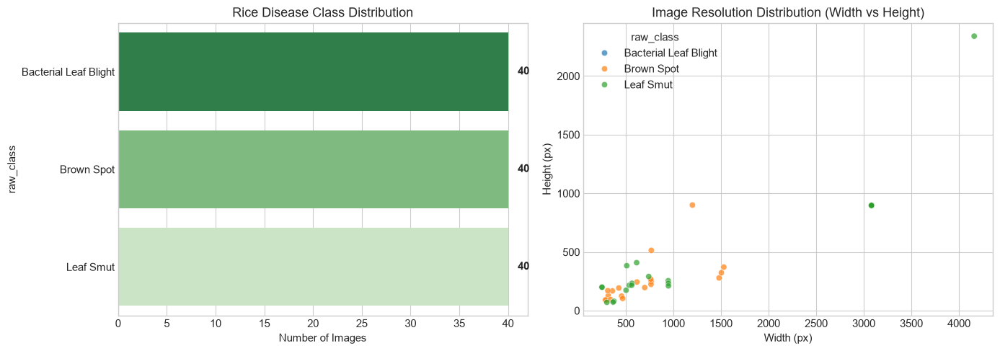
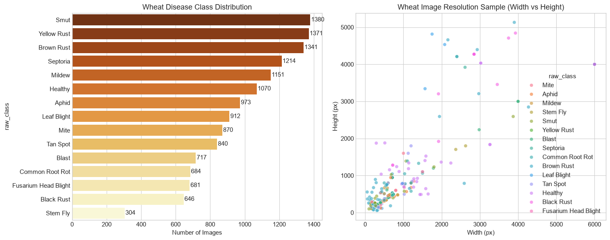
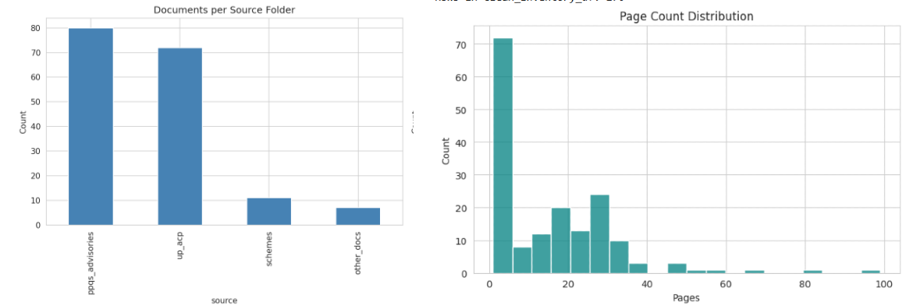
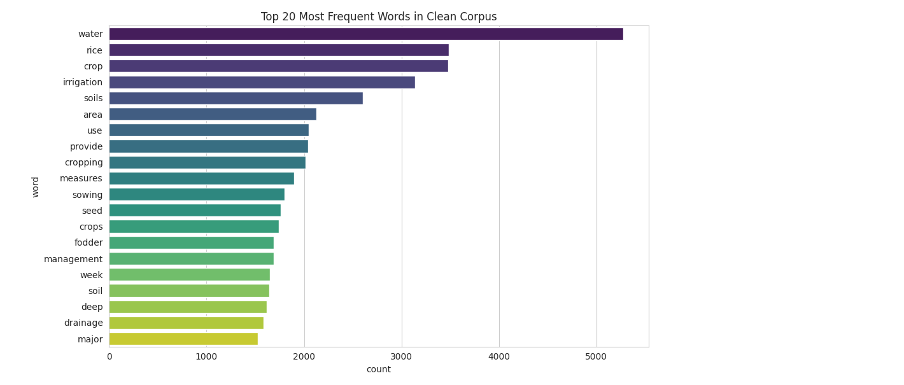
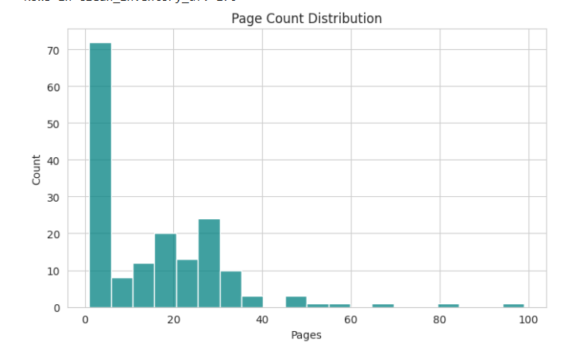
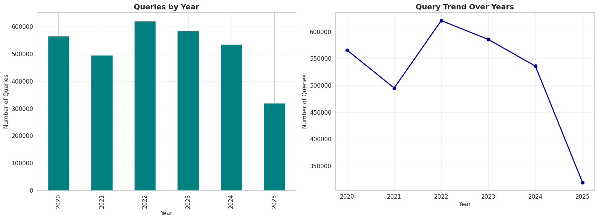
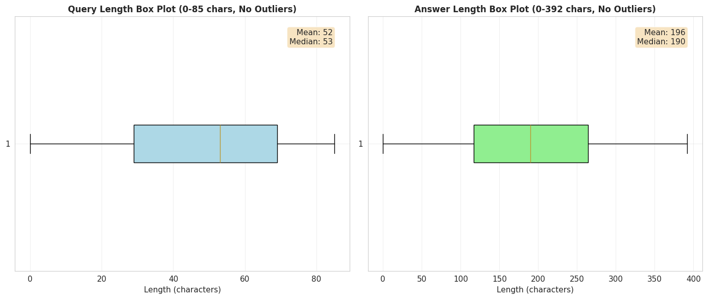
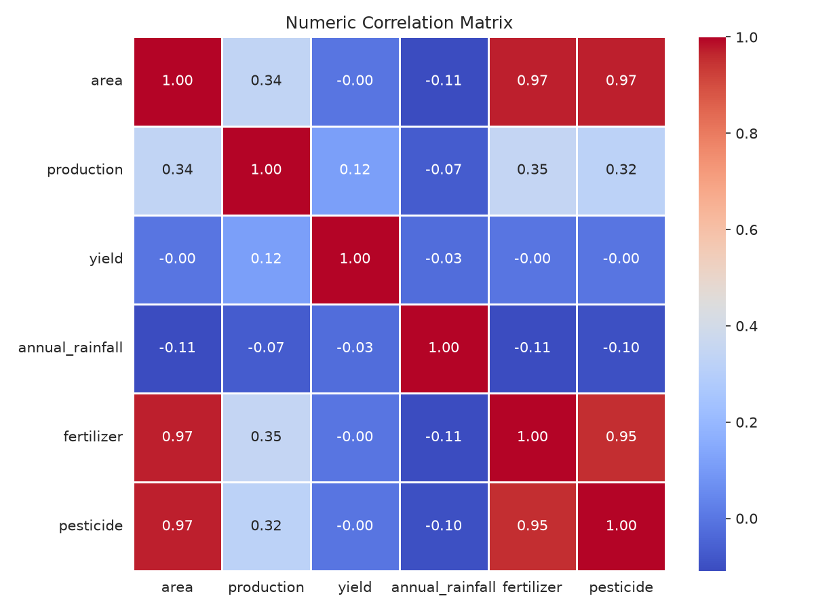
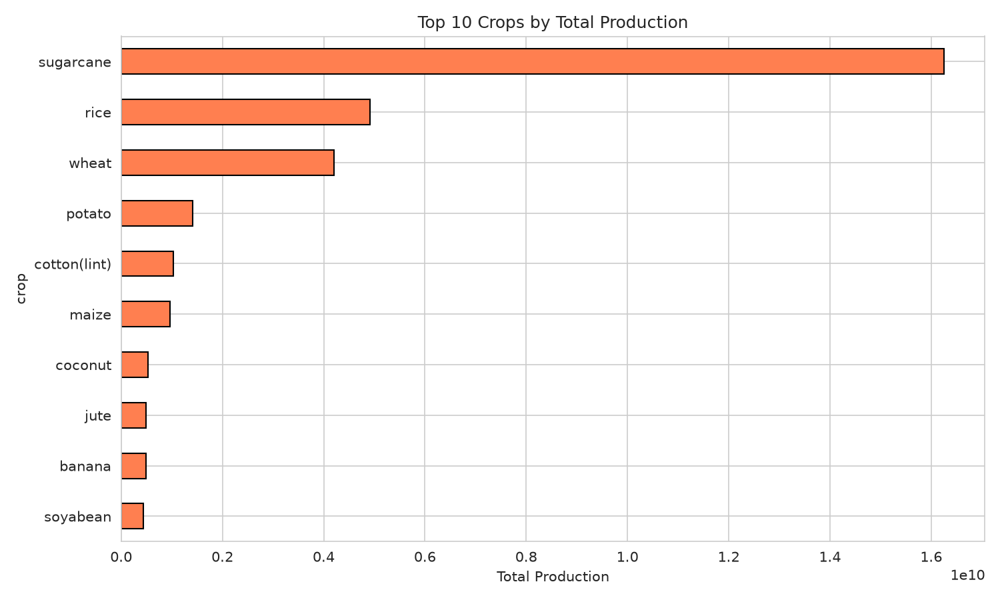

# Milestone 2 — Dataset Identification, Understanding, and Preparation

**Course:** DS and AI Lab  
**Group:** Group 7  
**Date:** 2026-07-13  
**Status:** Revised per TA feedback

---

## Table of Contents

1. [Introduction and Scope](#1-introduction-and-scope)
2. [System Architecture](#2-system-architecture)
3. [Dataset Identification and Rationale](#3-dataset-identification-and-rationale)
4. [Consolidated Dataset Summary](#4-consolidated-dataset-summary)
5. [EDA Findings](#5-eda-findings)
6. [Preprocessing Outcomes](#6-preprocessing-outcomes)
7. [Dataset Integration](#7-dataset-integration)
8. [Dataset Readiness Matrix](#8-dataset-readiness-matrix)
9. [Data Governance](#9-data-governance)
10. [Milestone 2 vs Milestone 3 Boundary](#10-milestone-2-vs-milestone-3-boundary)
11. [Challenges and Open Issues](#11-challenges-and-open-issues)
12. [Team Contributions](#12-team-contributions)
13. [References](#13-references)

Appendices:
- [Appendix A: Vision EDA Detail](#appendix-a-vision-eda-detail)
- [Appendix B: RAG PDF EDA Detail](#appendix-b-rag-pdf-eda-detail)
- [Appendix C: KCC EDA Detail](#appendix-c-kcc-eda-detail)
- [Appendix D: Yield EDA Detail](#appendix-d-yield-eda-detail)
- [Appendix E: Terminology Harmonization](#appendix-e-terminology-harmonization)
- [Appendix F: Chunking Rationale and Pending Validation](#appendix-f-chunking-rationale-and-pending-validation)
- [Appendix G: Deliverables and Reproducibility Artifacts](#appendix-g-deliverables-and-reproducibility-artifacts)

---

## 1. Introduction and Scope

Milestone 1 proposed a decoupled, agentic multimodal crop advisory system for smallholder farmers in Uttar Pradesh, focused on rice and wheat cultivation. The system has three subsystems: a Vision subsystem for crop disease identification, a Retrieval-Augmented Generation (RAG) subsystem that retrieves information from government documents and Kisan Call Centre data, and a Yield Prediction subsystem for district-level crop yield estimation.

Milestone 2 covers the following work:

- Identification and justification of datasets for all three subsystems
- Exploratory data analysis of each dataset
- Preprocessing pipelines with quantified outcomes
- Data governance including integrity verification and version tracking
- Readiness status of each artifact

The following are explicitly deferred to Milestone 3 and are not claimed as Milestone 2 accomplishments: model training, RAG chunking hyperparameter validation, MuRIL embedding generation, vector database construction, retrieval evaluation, and yield model training.

---

## 2. System Architecture

The system routes farmer input (text, image, or both) through a FastAPI semantic router. Image inputs are processed by a fine-tuned CNN (EfficientNet-B0) to produce a disease label and confidence score. Text inputs, enriched with the vision output if present, are processed by an agentic LLM using a ReAct reasoning structure. The LLM calls two tools: a RAG retrieval tool that queries the vector database of government documents and KCC records, and a Yield Prediction tool that calls a trained ML regression model.

```
Farmer Input
     |
     |--(Image)--> CNN Disease Classifier --> Disease Label + Confidence
     |
     |--(Text + Label)--> Agentic LLM (ReAct)
                               |
                     +---------+---------+
                     |                   |
               RAG Tool            Yield Tool
          (Vector Database)    (ML Regression Model)
                     |                   |
             PDF Corpus +           Historical APY +
             KCC Q&A Chunks         Climate Features
                     |                   |
                     +---------+---------+
                               |
                        Grounded Response
```

**Yield subsystem integration:** The Yield tool is called by the LLM when a farmer query requires a yield estimate. The tool takes crop, district, season, and available agronomic parameters as input and returns an estimated yield range. The Yield subsystem is currently in the data preparation phase; model training is planned for Milestone 3.

**RAG subsystem integration:** The RAG tool performs a vector similarity search over a unified index containing chunks from both the PDF corpus and the KCC Q&A dataset. Results are ranked by relevance and passed to the LLM as context.

Note: The end-to-end integration of these subsystems into a unified pipeline is Milestone 3 work. The architecture described here reflects the design established in Milestone 1.

---

## 3. Dataset Identification and Rationale

### 3.1 Vision Subsystem

Four datasets were evaluated; three were selected for training and one reserved for evaluation.

| Dataset | Source | License | Size | Role |
|---|---|---|---|---|
| Rice Leaf Disease Set 1 | Kaggle (vbookshelf) | CC BY 4.0 | 5,932 images, 4 classes | Primary rice disease training |
| Rice Leaf Disease Set 2 | Kaggle (nirmalsankalana) | CC BY-SA 4.0 | 120 images, 3 classes | Adds rice leaf smut class |
| Wheat Plant Diseases | Kaggle (kushagra3204) | CC BY-NC 4.0 | 14,154 images, 15 classes | Wheat disease training |
| PlantDoc | Kaggle (andresmgs) | CC BY-SA 4.0 | 2,598 images | Out-of-distribution evaluation only |

PlantVillage was considered and rejected. It is the most commonly cited agricultural vision dataset but does not include rice or wheat disease classes in the form required for this project, and its images are captured under controlled laboratory conditions with minimal background variation. Milestone 1 documented that models trained on PlantVillage achieve over 98% accuracy in lab settings but drop to 40-50% on field images. PlantDoc is retained as an evaluation holdout specifically to measure this gap.

### 3.2 RAG Subsystem — PDF Corpus

187 PDFs were collected from four source categories. All documents originate from official Indian government or institutional sources. The four functional categories map directly to the project's knowledge requirements:

| Category | Source Folder | Documents | Justification |
|---|---|---|---|
| Crop Advisory | PPQS_Advisories | 90 | PPQS pest and disease management advisories provide authoritative dosage and treatment information; directly addresses the hallucination risk for chemical recommendations identified in Milestone 1 |
| Contingency Plan | UP_ACP_PDFs | 74 | UP district-level Agriculture Contingency Plans provide region-specific planning content |
| Scheme Eligibility | Schemes | 11 | Central and UP government scheme documents define farmer eligibility, subsidy terms, and application procedures |
| Policy and Advisory | Other_Docs | 12 | ICAR cultivation guides and policy documents providing supplementary agronomic reference |

Rejected alternatives: General-purpose web-scraped agricultural content was rejected because authorship is unverifiable and information may be inaccurate or outdated. Secondary summaries such as news coverage of schemes were rejected in favour of primary source documents. Documents from states other than UP were out of scope per Milestone 1.


All the PDF sources are official government and institutional portals listed in Section 13.

### 3.3 RAG Subsystem — KCC Dataset

| Attribute | Value |
|---|---|
| Source | Open Government Data (OGD) Platform, data.gov.in |
| Resource ID | cef25fe2-9231-4128-8aec-2c948fedd43f |
| License | National Data Sharing and Accessibility Policy (open for research) |
| Coverage | Uttar Pradesh, 2020-2025 |
| Size | 3,123,029 records, approximately 2.07 GB on disk |
| Download date | 2026-07-05 |

No publicly available alternative dataset combines: UP-specificity, Hindi-language expert responses, volume at this scale, and domain authority from trained agronomists. The cross-lingual structure of the data — English and Romanized Hindi queries answered in Devanagari Hindi — directly motivates the use of MuRIL as the embedding model.

MuRIL is trained on 17 Indian languages and handles the Hindi-English code-mixed vocabulary that characterises farmer queries. A query in English or Romanized Hindi and its corresponding Hindi answer are mapped into the same embedding space, enabling cross-lingual retrieval. Two alternatives were considered: `paraphrase-multilingual-mpnet-base-v2` (supports 50+ languages but has weaker subword tokenisation for Devanagari) and LaBSE (strong cross-lingual alignment but not specifically optimised for Indian languages). MuRIL was selected because it is specifically trained on Indian-language corpora including Hindi transliteration.

### 3.4 Yield Prediction Subsystem

Two datasets are used; their roles in the deployed system are distinct:

| Dataset | Coverage | Records | Role in Deployed System |
|---|---|---|---|
| Unified Multi-Crop Agricultural Production Dataset (1997-2024) | Pan-India, 35 states, 124 crops | 440,962 | Primary training dataset for the Pan-India yield model |
| UP District-Level Historical Rice and Wheat APY with Environmental Covariates (1997-2023) | Uttar Pradesh, 74 districts | 3,886 | UP-specific model and district-level yield estimation for the deployed UP system |

The deployed system will use both: the Pan-India model provides broad coverage; the UP-specific subset with matched climate and agronomic covariates enables more accurate district-level predictions for the UP deployment target.

---

## 4. Consolidated Dataset Summary

| Dataset | Subsystem | Raw Size | Final Size | Purpose | Status |
|---|---|---|---|---|---|
| Rice Set 1 | Vision | 5,932 images | 2,066 images | Rice disease training | Complete |
| Rice Set 2 | Vision | 120 images | 120 images | Adds leaf smut class | Complete |
| Wheat Dataset | Vision | 14,154 images | 10,673 unique groups | Wheat disease training | Complete |
| PlantDoc | Vision | 2,598 images | 2,598 images | Field-robustness evaluation | Reserved |
| Merged Vision | Vision | 12,859 images | 10,275 / 1,292 / 1,292 split | 20-class training corpus | Complete |
| RAG PDF Corpus | RAG | 187 PDFs | 184 docs | Knowledge base for retrieval | Extraction complete; chunking pending |
| KCC UP 2020-2025 | RAG | 3,123,029 records | 1,459,692 records; 1,468,625 chunks | Farmer Q&A retrieval | Cleaned; chunk parameters pending validation |
| Primary Multi-Crop Yield | Yield | 440,962 records | 440,962 records | Pan-India yield model training | Complete |
| UP Rice/Wheat Subset | Yield | 3,886 records | 3,886 records | UP district yield estimation | Complete |

---

## 5. EDA Findings

### 5.1 Vision EDA

**Rice Set 1 (5,932 images, 4 classes)**

No corrupt or unreadable images. The raw class balance ratio is 1.22:1, but after exact deduplication the effective ratio rises to 1.38:1 because the Blast class has a 33.3% duplication rate. The most significant finding is a background-bias risk in the Tungro class: Tungro images show zoomed-out whole-plant views against bare soil, unlike the close-up leaf images in the other three classes. A classifier may learn soil texture as a proxy for Tungro rather than the disease itself; this shortcut would fail under real field conditions. 82.8% of images are near-duplicates by perceptual hash, consistent with burst-capture photography. Zero cross-class duplicate pairs exist; labels are clean. A group-aware split is mandatory to prevent leakage.

**Rice Set 2 (120 images, 3 classes)**

Perfect 1:1 balance and zero duplicates. Images are panoramic leaf strips with a 3.44:1 aspect ratio. Standard 224x224 square resize compresses the image horizontally by a factor of 3.4, distorting lesion geometry. Aspect-preserving letterboxing is mandatory.

**Wheat Dataset (14,154 images, 15 classes)**

The raw folder structure contains 45 names that are suffixed variants of 15 canonical classes. Without canonicalization, training fails. After label correction, class imbalance is 5.6:1 (smut at 1,310 versus stem_fly at 234). The pre-existing split has 646 perceptual hashes appearing in more than one partition — confirmed contaminated. The dataset mixes three visual target types: foliar diseases, insect pests, and spike and head diseases.

**EDA to preprocessing decision mapping:**

| EDA Finding | Preprocessing Decision |
|---|---|
| Tungro soil-background bias | Background-focused augmentation; Grad-CAM inspection post-training |
| 82.8% near-duplicate rate (Rice Set 1) | Group-aware split using pHash cluster ID |
| 3.44:1 panoramic aspect ratio (Rice Set 2) | Letterbox to 256x256; center crop to 224x224 |
| 45 raw folder names for 15 classes (Wheat) | Suffix-stripping canonicalization |
| 646 cross-split perceptual hashes (Wheat) | Discard pre-existing split; group-aware re-split |
| 5.6:1 class imbalance (Wheat) | WeightedRandomSampler and class-weighted CrossEntropy loss |
| 156 RGBA files mislabelled as JPEG (Rice Set 1) | PIL convert("RGB") guard in data loader |

Full per-class statistics are in Appendix A.

### 5.2 RAG PDF EDA

187 PDFs were inventoried. All 187 were successfully text-extracted: 173 via native pdfplumber extraction and 14 via OCR using pytesseract with English and Hindi language packs. Zero documents had failed extraction after installing poppler-utils in the processing environment.

Exact-duplicate detection by SHA-256 hash identified 2 duplicate pairs. Near-duplicate detection by SequenceMatcher (threshold 0.90) identified 3 pairs; 3 files were removed, keeping the higher word-count copy. Final clean corpus: 184 documents.

182 documents are English. Two misclassifications (Welsh and Catalan) are short technical documents where the language detector misidentifies limited vocabulary; both confirmed English on manual inspection.

91 documents (49.5%) have no detectable year. Of those with detectable years, the range is 2007-2026.

All 184 documents passed the garbage character ratio check (threshold 0.15). No documents required exclusion on text quality grounds.

Document category distribution: Crop Advisory 97, Contingency Plan 72, Scheme Eligibility 11, Policy Guideline 4.

Top corpus vocabulary after stopword removal: water, crop, rice, irrigation, soils, sowing, seed, management, drainage, wheat, maize, contingency, fodder. This confirms domain alignment with the project's rice, wheat, and UP scope.

Full per-document inventory is in Appendix B.

### 5.3 KCC EDA

The dataset has 3,123,029 records across 15 columns. The Season column is 100% null. Yearly query volume ranges from 319,632 (2025, partial year) to 620,775 (2022).

Crop distribution: 318 unique crops. Wheat (16.4%) and Paddy/Dhan (15.5%) together account for 31.9% of all queries, validating the project's crop focus. The Others category (34.7%) represents non-crop-specific queries on soil management, equipment, and general pest queries; this content is relevant and is retained.

Language: QueryText is approximately 99.98% English or Romanized Hindi. KccAns is approximately 98.8% Hindi (Devanagari). This cross-lingual structure is the primary driver for MuRIL.

Text length: QueryText averages 54 characters; KccAns averages 209 characters. 98.9% of complete Q&A records fit within 512 characters.

Duplicate analysis: 68.7% of QueryText values are duplicated, dominated by templated entries such as "Farmer asked query on Weather" (781,352 occurrences). 26.2% of complete (QueryText, KccAns, Crop) triples are exact duplicates. Without deduplication, the vector index would be dominated by weather and scheme templates rather than substantive agronomic content.

Full temporal, category, and text length distributions are in Appendix C.

### 5.4 Yield EDA

**Primary multi-crop dataset:** Sugarcane, rice, and wheat dominate cumulative production. Production shows high collinearity with sown area and fertilizer application.

**UP district subset:** Western UP achieves mean yields of 2,894 kg/ha (rice) and 3,552 kg/ha (wheat) with 94.0% irrigation coverage. Bundelkhand achieves 1,720 kg/ha (rice) and 1,491 kg/ha (wheat) with 50.6% irrigation. Two climate signals are actionable: extreme rainfall events above 64.5 mm/day correlate negatively with Kharif rice yield (r = -0.22); heatwave days above 38C in March correlate negatively with Rabi wheat yield (r = -0.24). These signals justify including climate covariates as model features.

EDA to preprocessing decision mapping: The regional yield disparity confirms that district-level features are more informative than state-level averages, justifying the UP district subset. The climate correlations confirm that IMD weather shock variables should be included in the feature set.

Full correlation matrices and regional breakdowns are in Appendix D.

---

## 6. Preprocessing Outcomes

### 6.1 Vision Preprocessing

**Rice Set 1 cleaning impact:**

| Operation | Before | After | Removed |
|---|---|---|---|
| Exact duplicate removal (MD5) | 5,932 | 4,794 | 1,138 |
| pHash cluster deduplication | 4,794 | 2,066 | 2,728 |
| Color conversion (RGBA to RGB) | 2,066 | 2,066 | 0 |
| Letterbox resize to 256x256 | 2,066 | 2,066 | 0 |

**Wheat cleaning impact:**

| Operation | Before | After | Notes |
|---|---|---|---|
| Label canonicalization | 45 raw names | 15 canonical classes | Required for training |
| pHash deduplication | 14,154 | 10,673 unique groups | Pre-existing split discarded |
| Color conversion to RGB | 10,673 | 10,673 | RGBA, P, CMYK converted |
| Letterbox resize to 256x256 | 10,673 | 10,673 | |

**Merged dataset:**

| Source | Clean Images | Classes | Label Prefix |
|---|---|---|---|
| Rice Set 1 | 2,066 | 4 | rice__ |
| Rice Set 2 | 120 | 3 | rice__ |
| Wheat | 10,673 | 15 | wheat__ |
| Merged total | 12,859 | 20 | |

**Final split:**

| Split | Images | Percentage | Leakage |
|---|---|---|---|
| Train | 10,275 | 80% | 0 groups across splits (verified) |
| Validation | 1,292 | 10% | |
| Test | 1,292 | 10% | |

Saved artifacts: `master_manifest.csv`, `label_to_idx.json`, `final/train`, `final/val`, `final/test` (273 MB total).

**Post-materialization integrity check.** MD5 checksums were computed on all 12,859 final images (0 missing, 0 unreadable). Dataset fingerprint: `f986164b2da47dd48970c135972e0bae`. The check surfaced 6 hash-collision groups (14 files, all `wheat`, predominantly `wheat__blast`), representing 8 redundant images. These were not duplicates in the source data — they converged to byte-identical outputs during the 256² letterbox + JPEG re-encode, which is a lossy normalizing transform. All affected files reside entirely within the training split (0 pairs spanning splits), so the zero-leakage guarantee is unaffected. They were retained as harmless redundancy (0.08% of the training set).

### 6.2 RAG PDF Preprocessing

**Cleaning impact:**

| Operation | Before | After | Removed | Notes |
|---|---|---|---|---|
| Raw inventory | 187 | 187 | 0 | All PDFs collected |
| Exact duplicate removal (SHA-256) | 187 | 185 | 2 | 2 duplicate pairs; 2 copies removed |
| Near-duplicate removal | 185 | 184 | 1 | 3 pairs; kept higher word-count copy |
| Failed extraction filter | 184 | 184 | 0 | All extracted successfully |
| Garbage character filter | 184 | 184 | 0 | All below 0.15 threshold |

Final clean corpus: 184 documents.

Text extraction: 173 documents extracted via pdfplumber. 14 documents (primarily PPQS advisories with scanned pages) required OCR via pytesseract with eng+hin language packs. Extracted and harmonized text saved to `extracted_text_final/`.

**Terminology harmonization:** 32-entry alias dictionary applied to all 184 documents. Variants covered: Hindi and Hinglish crop name variants, UP district historical renames (2012 state government reversions and 2018 Yogi Adityanath renames), and spelling variants. Total occurrences harmonized: 984 across the corpus. Full alias table in Appendix E.

**Integrity verification:** SHA-256 checksums computed for all source PDFs and final processed text files. Snapshot date: 2026-07-10. Pipeline version: milestone2_v3_harmonized. Integrity manifest saved as `integrity_manifest.csv`.

**Chunking:** Pending. See Section 10 and Appendix F.

### 6.3 KCC Preprocessing

**Cleaning impact:**

| Operation | Before | After | Removed | % of Previous |
|---|---|---|---|---|
| Agronomic category filter | 3,123,029 | 1,701,442 | 1,421,587 | 45.5% |
| Missing QueryText removal | 1,701,442 | 1,701,435 | 7 | less than 0.01% |
| Missing KccAns removal | 1,701,435 | 1,701,324 | 111 | less than 0.01% |
| Exact row deduplication | 1,701,324 | 1,662,213 | 39,111 | 2.3% |
| Q&A pair deduplication | 1,662,213 | 1,459,704 | 202,509 | 12.2% |
| Short text removal (under 5 chars) | 1,459,704 | 1,459,692 | 12 | less than 0.01% |
| Final cleaned corpus | | 1,459,692 | 1,663,337 total removed | 53.3% total reduction |

Agronomic filter retained: Cereals, Pulses, Oilseeds, Vegetables, Fruits, Plant Protection, Nutrient Management, Fertilizer Management.  
Agronomic filter excluded: Government Schemes, Market Information, Crop Insurance, Credit, Subsidy, Finance, Banking, Insurance, Weather, Climate, Rainfall. Scheme eligibility information is covered by the PDF corpus; weather queries are outside the agronomic advisory scope.

Additional cleaning: whitespace normalization, PII removal (phone numbers to [PHONE], emails to [EMAIL]), Unicode NFC normalization, Season inferred from month for all records, QueryType tab contamination stripped.

**Initial chunking:** 1,468,625 chunks generated. Configuration: 512-character target, 50-character overlap, sentence-boundary splitting. 98.8% of records produce a single chunk. These parameters are initial design choices pending validation. See Appendix F.

**Saved artifacts:** `kcc_cleaned_all_crops.csv` (1.99 GB), `kcc_chunks_rag.jsonl` (1.18 GB), `kcc_chunks_sample_1000.jsonl`, `metadata_schema.json`.

### 6.4 Yield Preprocessing

**Primary multi-crop dataset cleaning impact:**

| Operation | Notes |
|---|---|
| Schema harmonization | Four source datasets unified to a common 16-column schema |
| Unit resolution | Coconut production converted from pieces to metric tonnes |
| Hierarchical deduplication | District-level records preferred over state-level |
| MissForest imputation | Missing numeric values imputed |

Output: `production_unified.csv` and `production_unified_imputed.csv`.

**UP district subset cleaning impact:**

| Operation | Records Affected | Notes |
|---|---|---|
| Zero-production anomaly imputation | 29 records | Replaced with agro-climatic zone seasonal medians |
| Spatial backcasting for bifurcated districts | Approximately 28% area share | Amethi, Sambhal, Hapur, Shamli post-1997 bifurcations |
| Feature engineering | All records | 5 derived features added |

**Chronological split:**

| Split | Period | Records | Percentage |
|---|---|---|---|
| Train | 1997-2018 | 3,256 | 81.5% |
| Validation | 2019-2020 | 296 | 7.4% |
| Holdout test | 2021-2023 | 444 | 11.1% |

### 6.5 Vision Augmentation and Training Pipeline Design

The materialized `final/` dataset stores exactly one deterministic 256×256 letterboxed RGB copy per image, preserving data integrity. Augmentation, normalization, and imbalance handling are defined here as pipeline design but run on-the-fly inside the data loader during training (Milestone 3), so no augmented images are persisted to disk.

**Deterministic resolution and ImageNet normalization (all splits):**

- **Train split:** random 224×224 crop from the 256×256 letterboxed frame.
- **Validation / test splits:** deterministic 224×224 center crop.
- **Standardization:** all tensors normalized using ImageNet mean (`[0.485, 0.456, 0.406]`) and std (`[0.229, 0.224, 0.225]`), matching the ImageNet-pretrained `EfficientNet-B0` backbone.

**On-the-fly augmentation strategy (train split only):**

- **Standard tier (all classes):** random horizontal/vertical flips, random rotation (±15–20°), and color jitter (brightness/contrast/saturation) to simulate field lighting and camera variance.
- **Targeted rare and risk-class augmentation:**
  - `rice__leaf_smut` (40 images / 24 train) and `wheat__stem_fly` (172 images / 138 train) receive aggressive multi-scale transforms to multiply effective sample variety.
  - `rice__tungro` receives aggressive background-focused random cropping and jitter to disrupt the soil-background artifact identified in EDA.

**Class imbalance and Tungro robustness strategy:**

- **Imbalance handling:** a hybrid recipe combining `WeightedRandomSampler` (oversampling extreme minority classes per batch) with mild class-weighted CrossEntropy loss. Models are evaluated strictly on macro-F1 score and per-class recall.
- **Tungro robustness diagnostic:** post-training Grad-CAM inspection on non-soil Tungro field images confirms whether the classifier attends to leaf lesions or background soil, triggering leaf segmentation masking if the background shortcut bias persists.

This design is documented in `notebook_training_pipeline_design.md`. Execution (model training and evaluation) is Milestone 3 scope, consistent with Section 10.

---

## 7. Dataset Integration

### 7.1 Vision Integration

The three vision datasets were merged into a unified 20-class pool via a shared manifest schema with fields: `src_path`, `filename`, `label`, `source_dataset`, `split`, `group_id`. The rice__ and wheat__ prefixes prevent class name collisions (rice blast and wheat blast are distinct classes). The merged manifest has 12,859 images, 20 classes, and zero cross-split leakage verified across 11,530 pHash cluster groups.

### 7.2 RAG Corpus Integration

The RAG subsystem integrates KCC Q&A records and PDF documents into a unified vector index using FAISS with MuRIL embeddings. This enables seamless retrieval across both sources while maintaining source-level filtering.

### 7.2.1 Shared Metadata Schema

All chunks conform to a unified schema enabling consistent filtering across both sources.

| Field | Description | Source Mapping |
|-------|-------------|----------------|
| source_type | PDF or KCC | Explicitly assigned |
| crop | Rice, wheat, etc. | PDF filename / KCC Crop column |
| district | UP district | PDF title / KCC District column |
| season | Rabi, Kharif, Zaid | KCC inferred from month / PDF content |
| year | Publication or record year | PDF filename / KCC Year column |
| language | English or Hindi | Automatically detected |
| doc_category | PDF-specific classification | Mapped from source folder |
| query_type | KCC-specific category | Mapped from agronomic filter |

### 7.2.2 Complementary Knowledge Sources

| Aspect | PDF Corpus | KCC Dataset |
|--------|------------|-------------|
| Content | Authoritative official documents | Real farmer-agronomist dialogues |
| Strengths | Treatment protocols, policies, eligibility | Practical experiences, vernacular language |
| Query Intent | Policy-oriented (schemes, subsidies) | Field-oriented (diseases, pests, fertilizers) |

**Query Intent Routing:** Policy queries receive PDF weight 2.0, KCC weight 0.5. Field queries receive KCC weight 2.0, PDF weight 0.5. General queries receive equal weight 1.0 each.

### 7.2.3 Integration Strategy

| Step | Action | Description |
|------|--------|-------------|
| 1 | Prepare PDF Chunks | Extract text, apply terminology harmonization, chunk with 512/50 size/overlap, assign metadata |
| 2 | Prepare KCC Chunks | Combine query-answer pairs, chunk if exceeding 512 chars, assign metadata |
| 3 | Generate Embeddings | Generate MuRIL 768-dim embeddings for all chunks in batches, L2-normalize |
| 4 | Build FAISS Index | Add embeddings to FAISS IndexFlatIP; store metadata in parallel list |
| 5 | Build Reverse Indices | Create mappings: crop/district/season/source_type → chunk indices for filtering |
| 6 | Query Retrieval | Encode query, apply filters via reverse indices, search FAISS, apply source weights, return top k |
| 7 | Save Artifacts | Save FAISS index, metadata store, reverse indices, and manifest file |

### 7.2.4 Quality Assurance

| Metric | Target | Description |
|--------|--------|-------------|
| Recall@5 | >0.85 | Relevant chunks in top 5 |
| MRR@5 | >0.80 | Rank of first relevant result |
| Source Diversity | ≥40% each | Mixed-intent query balance |
| Faithfulness | >0.90 | RAGAS faithfulness score |
| Latency | <200ms | Complete retrieval pipeline |

### 7.2.5 Integration Benefits

| Benefit | Description |
|---------|-------------|
| Single Retrieval Call | One query searches both sources simultaneously |
| Natural Mixing | Same query retrieves from both sources in one pass |
| Flexible Filtering | Any combination of metadata fields can filter results |
| Simplified Pipeline | One embedding model, one index, one retrieval method |
| Balanced Retrieval | Intent-based source weighting ensures appropriate emphasis |

---

## 8. Dataset Readiness Matrix

| Artifact | Status | Evidence |
|---|---|---|
| Vision: Rice Set 1 (2,066 images) | Complete | master_manifest.csv |
| Vision: Rice Set 2 (120 images) | Complete | master_manifest.csv |
| Vision: Wheat (10,673 unique groups) | Complete | master_manifest.csv |
| Vision: Merged (12,859 images, 20 classes) | Complete | final/train, final/val, final/test |
| Vision: PlantDoc holdout (2,598 images) | Reserved | Not used in training |
| RAG: PDF text extraction (184 docs) | Complete | extracted_text_final/, pdf_inventory_clean.csv |
| RAG: PDF terminology harmonization | Complete | harmonization_impact_report.csv (984 occurrences) |
| RAG: PDF integrity manifest | Complete | integrity_manifest.csv (SHA-256, date 2026-07-10) |
| RAG: PDF chunking | Pending | Deferred to Milestone 3 |
| RAG: PDF MuRIL embeddings | Pending | Deferred to Milestone 3 |
| RAG: KCC cleaned corpus (1,459,692 records) | Complete | kcc_cleaned_all_crops.csv |
| RAG: KCC chunks (1,468,625, initial) | Complete (initial) | kcc_chunks_rag.jsonl; parameters not yet validated |
| RAG: KCC MuRIL embeddings | Pending | Deferred to Milestone 3 |
| RAG: Unified vector index | Pending | Deferred to Milestone 3 |
| Yield: Primary multi-crop (440,962 records) | Complete | production_unified_imputed.csv |
| Yield: UP subset (3,886 records, split) | Complete | Chronologically split, 5 features engineered |

---

## 9. Data Governance

### 9.1 Licensing

| Dataset | License | Research Use | Notes |
|---|---|---|---|
| Rice Set 1 | CC BY 4.0 | Yes | Attribution required |
| Rice Set 2 | CC BY-SA 4.0 | Yes | Attribution required |
| Wheat Dataset | CC BY-NC 4.0 | Non-commercial only | Attribution required |
| PlantDoc | CC BY-SA 4.0 | Yes | Attribution required |
| KCC Dataset | NDSAP (open for research) | Yes | Government of India open data |
| PDF Corpus (PPQS, ICAR, Schemes) | Government of India open data | Yes | Public institutional documents |
| MISS Document | PNB public document | Yes | Source verified; URL in Section 13 |
| Yield primary | Open Government Data (data.gov.in) | Yes | |
| Yield UP subset | Open (Kaggle, data.gov.in sourced) | Yes | |

### 9.2 Version and Integrity Tracking

| Dataset | Download Date | Version Identifier | Integrity |
|---|---|---|---|
| KCC UP 2020-2025 | 2026-07-06 | OGD resource ID: cef25fe2-9231-4128-8aec-2c948fedd43f | Not yet recorded |
| PDF Corpus | 2026-07-10 | Pipeline version: milestone2_v3_harmonized | SHA-256 per document (integrity_manifest.csv) |
| Vision datasets (source) | 2026-07-8 | Kaggle versions pinned: `wheat-plant-diseases` v6, `rice-leaf-diseases` v1, `rice-leaf-disease-image` v1 (see 9.2.1) | Source checksums not yet recorded |
| Vision cleaned datasets (derived) | 2026-07-10 | `wheat-cleaned-256` v1, `rice-s1-cleaned-256` v1, `rice-s2-cleaned-256` v1 (see 9.2.2) | Covered by final-dataset MD5 manifest |
| Vision final materialized dataset | 2026-07-10 | `crop-disease-prepared-256` v1 (256² letterbox pipeline) | MD5 per image; dataset fingerprint `f986164b2da47dd48970c135972e0bae` (12,859 images, 0 missing/unreadable) |
| Yield datasets | 2026-07-10 | Kaggle dataset version at download | Not yet recorded |

#### 9.2.1 Source Dataset Versions (Vision)

Kaggle datasets are mutable — the owner can publish new versions under the same slug. The exact version pulled for this milestone is therefore pinned below, so the pipeline can be reproduced against the same source bytes even if the upstream dataset is later revised.

| Source Dataset (Kaggle slug) | Version Pulled | Role |
|---|---|---|
| `kushagra3204/wheat-plant-diseases` | v6 | Wheat disease training (14,154 raw images) |
| `vbookshelf/rice-leaf-diseases` | v1 | Rice Set 1 — primary rice disease training (5,932 raw images) |
| `nirmalsankalana/rice-leaf-disease-image` | v1 | Rice Set 2 — adds rice leaf smut class (120 raw images) |

#### 9.2.2 Created Dataset Versions (Derived Artifacts)

Each preprocessing stage is published as its own versioned dataset, so a given experiment can be traced back to the exact derived artifact it consumed. All four are at v1 for Milestone 2; any re-run of a preprocessing stage (for example, a change to the letterbox or deduplication logic) increments the corresponding version.

| Created Dataset | Version | Produced By | Contents |
|---|---|---|---|
| `wheat-cleaned-256` | v1 | Wheat preprocessing (Notebook A) | 10,673 unique groups, 15 canonical classes, 256×256 letterboxed RGB |
| `rice-s1-cleaned-256` | v1 | Rice Set 1 preprocessing (Notebook B) | 2,066 burst-thinned images, 4 classes, 256×256 letterboxed RGB |
| `rice-s2-cleaned-256` | v1 | Rice Set 2 preprocessing (Notebook C) | 120 images, 3 classes, panoramic aspect-preserving letterbox to 256×256 |
| `crop-disease-prepared-256` | v1 | Merge and split (Notebook D) | Final unified 12,859 images / 20 classes, group-aware 80/10/10 split (`final/train\|val\|test`), `master_manifest.csv`, `label_to_idx.json`; MD5 fingerprint `f986164b2da47dd48970c135972e0bae` |

Lineage: `wheat-plant-diseases` v6 → `wheat-cleaned-256` v1, `rice-leaf-diseases` v1 → `rice-s1-cleaned-256` v1, and `rice-leaf-disease-image` v1 → `rice-s2-cleaned-256` v1; these three cleaned datasets are then merged and split into `crop-disease-prepared-256` v1, which is the sole artifact consumed by Milestone 3 training.

### 9.3 Privacy and Ethics

The KCC dataset contains call records. PII removal was applied during preprocessing: phone numbers replaced with [PHONE], email addresses with [EMAIL], and numeric identifiers with [ID]. No personally identifiable information is retained in the processed corpus.

The system is intended for research use. Any deployment would require clear disclosure to users that responses are AI-generated and cannot substitute for consultation with a trained agronomist or Krishi Vigyan Kendra officer.

### 9.4 Dataset Update Strategy

[PLACEHOLDER — This section will describe the planned strategy for keeping datasets current. Topics: frequency of KCC data refresh (OGD platform publishes annual updates; planned annual re-download and re-processing), process for updating the PDF corpus as new scheme guidelines or PPQS advisories are issued, and the process for re-embedding updated content without rebuilding the entire vector index. To be completed before final submission.]

### 9.5 Long-Term Knowledge Base Maintenance

To maintain the accuracy, relevance, and operational integrity of the RAG knowledge base over time, the following governance and maintenance framework is established:

1. **Vector Index Versioning & Audit Trails:** Every build of the vector database will carry an immutable version tag tied directly to the underlying source manifests (`integrity_manifest.csv` for PDFs and snapshot release hashes for KCC data). Any addition, removal, or re-chunking of documents requires incrementing the index schema version and recording a changelog.
2. **Document Deprecation Protocol:** Agricultural schemes and guidelines frequently undergo revisions (e.g., revised PM-KISAN operational guidelines or updated PPQS crop advisories). Rather than hard-deleting historical documents, superseded documents will be retained in the archive but marked with `status: deprecated` and an `effective_end_date` metadata field. The RAG retrieval tool will apply a hard filter at query time (`status == 'active'`) so deprecated guidelines are excluded from active farmer advisories while preserving historical traceability.
3. **Source Onboarding & Quality Governance:** New PDF advisories or scheme guidelines added to the corpus must pass the standardized automated ingestion pipeline: native text extraction via `pdfplumber` (with OCR fallback), garbage character ratio verification (`< 0.15`), SHA-256 deduplication against existing records, and terminology harmonization using the canonical alias dictionary (`Appendix E`).
4. **Periodic Quality & Retrieval Re-evaluation:** Following any annual update cycle or major advisory ingestion, the retrieval pipeline will undergo regression testing against a curated benchmark dataset of farmer queries. Key retrieval metrics—specifically **Recall@5** and **RAGAS Faithfulness / Context Relevance**—will be evaluated to verify that index expansion has not introduced semantic drift or retrieval degradation.

---

## 10. Milestone 2 vs Milestone 3 Boundary

| Item | Milestone 2 Status | Milestone 3 Plan |
|---|---|---|
| Vision dataset identification and EDA | Done | — |
| Vision preprocessing and group-aware split | Done | — |
| Vision model training | Not in scope | Train; report per-class metrics |
| Vision PlantDoc evaluation | Not in scope | Measure lab-to-field accuracy gap |
| RAG PDF collection and EDA | Done | — |
| RAG PDF text extraction and harmonization | Done | — |
| RAG PDF chunking | Deferred | Determine and validate chunk parameters; execute |
| RAG KCC EDA and preprocessing | Done | — |
| RAG KCC chunking (initial, unvalidated) | Initial run done | Validate hyperparameters; re-run if needed |
| RAG MuRIL embedding generation | Not in scope | Generate and store |
| RAG vector index construction | Not in scope | Build; benchmark retrieval |
| RAG retrieval evaluation (RAGAS, Recall@5) | Not in scope | Execute and report |
| RAG corpus integration design | Design only | Implement and test |
| Yield dataset identification and preprocessing | Done | — |
| Yield model training | Not in scope | Train; report RMSE, R-squared |
| Agentic LLM integration | Not in scope | Design and prototype |

**Note on chunking hyperparameters:** The 512-character chunk size and 50-character overlap used in the KCC initial run are design starting points, not validated parameters. Validation requires assembling the vector index, running representative farmer queries, and measuring RAGAS faithfulness and Recall@5. This is not possible until the full RAG pipeline exists in Milestone 3. The same applies to PDF chunking, where no chunk configuration has been run yet. See Appendix F.

---

## 11. Challenges and Open Issues

| Issue | Subsystem | Status |
|---|---|---|
| Tungro background-bias risk | Vision | Open; Grad-CAM inspection planned post-training in Milestone 3 |
| Rice Set 1 high near-duplicate rate (82.8%) | Vision | Resolved; group-aware split applied |
| Wheat pre-existing split leakage (646 cross-split hashes) | Vision | Resolved; split discarded and rebuilt |
| Wheat class imbalance (5.6:1) | Vision | Planned; WeightedRandomSampler and class-weighted loss in training |
| 91 PDF documents (49.5%) with no detectable publication year | RAG | Accepted; documents tagged as undated |
| 2 language misdetections in PDF corpus | RAG | Accepted; both confirmed English on manual inspection |
| KCC chunking hyperparameters not yet validated | RAG | Open; validation deferred to Milestone 3 |
| PDF chunking not yet executed | RAG | Open; deferred to Milestone 3 |
| Checksums not recorded for source vision and yield datasets | Governance | Partially resolved; MD5 fingerprint now recorded for the final materialized vision dataset (`f986164b2da47dd48970c135972e0bae`), and source/derived vision dataset versions are pinned (Sections 9.2.1 and 9.2.2). Source-download checksums for vision and yield, and version pinning for the yield datasets, remain action items before final submission |
| Yield model not trained; subsystem in design phase | Yield | Acknowledged; model training is Milestone 3 scope |

---

## 12. Team Contributions

| Member | Contribution |
|---|---|
| Mahesh | Vision EDA, preprocessing, dataset integration, and training pipeline design |
| Harliv | RAG PDF corpus collection, EDA, text extraction, terminology harmonization, and integrity verification |
| Lokesh | Milestone 2 planning, vision data sources, UP yield subset preprocessing, and report authoring |
| Aneeqa | KCC dataset aggregation, EDA, and preprocessing pipeline |
| Tanmay | Primary multi-crop yield dataset unification, EDA, and MissForest preprocessing |

---

## 13. References

- KCC Dataset: https://api.data.gov.in/resource/cef25fe2-9231-4128-8aec-2c948fedd43f
- PPQS Advisories: https://ppqs.gov.in/advisories-section
- UP Agriculture Central Guidelines: https://agridarshan.up.gov.in/central-guideline
- Agriculture Contingency Plans (UP): https://agriwelfare.gov.in/en/AgricultureContigencyPlan/UTTAR%20PRADESH
- PM-KISAN Guidelines: https://pmkisan.gov.in/Documents/PM-KMY%20-%20Operational%20Guidelines.pdf
- PM-KISAN Revised Guidelines: https://pmkisan.gov.in/Documents/RevisedPM-KISANOperationalGuidelines(English).pdf
- PMFBY Guidelines: https://pmfby.gov.in/guidelines
- Kisan Credit Card Guidelines (RBI): https://www.rbi.org.in/commonman/Upload/English/Notification/PDFs/04MCKCC03072017.pdf
- MISS Document (PNB): https://pnb.bank.in/downloadprocess.aspx?fid=XadFAY8YbeAYSzh8cT4hcA==
- NFSNM Guidelines: https://www.nfsm.gov.in/Guidelines/NFSNM%20GUIDELINES%20APPROVED%20FY%202025-2026.pdf
- Paddy Blast IPM (PPQS): https://ppqs.gov.in/sites/default/files/pop_for_management_of_paddy_blast.pdf
- Wheat Cultivation Guide (ICAR-IIWBR): https://iiwbr.org.in/wp-content/uploads/2023/08/EB-52-Wheat-Cultivation-in-India-Pocket-Guide.pdf
- The MISS (Modified Interest Subvention Scheme): https://pnb.bank.in/downloadprocess.aspx?fid=XadFAY8YbeAYSzh8cT4hcA==
- ICAR Indian Farming Magazine (Nov 2025): https://icar.org.in/sites/default/files/2025-10/Indian%20Farming%20November%202025.pdf
- Rice-Based Cropping Systems (ICAR): https://icar.org.in/sites/default/files/inline-files/Rice-based-cropping-systems.pdf
- PlantDoc: https://github.com/pratikkayal/PlantDoc-Dataset
- Rice Set 1 (Kaggle): https://www.kaggle.com/datasets/vbookshelf/rice-leaf-diseases
- Wheat Dataset (Kaggle): https://www.kaggle.com/datasets/kushagra3204/wheat-plant-diseases
- PlantDoc (Kaggle): https://www.kaggle.com/datasets/andresmgs/plantdec
- Yield data (data.gov.in): https://upag.gov.in and https://data.desagri.gov.in
- IMD Climate Data: https://imdpune.gov.in
- ICRISAT District Database: http://data.icrisat.org/dld

---

## Appendix A: Vision EDA Detail

### A.1 Rice Set 1 — Per-Class Statistics

| Class | Raw | After Exact Dedup | After pHash Dedup | % Retained |
|---|---|---|---|---|
| Brownspot | 1,600 | 1,200 | 606 | 37.9% |
| Bacterial Blight | 1,584 | 1,326 | 514 | 32.5% |
| Blast | 1,440 | 960 | 477 | 33.1% |
| Tungro | 1,308 | 1,308 | 469 | 35.9% |
| Total | 5,932 | 4,794 | 2,066 | 34.8% |



### A.2 Rice Set 2 — Duplicate Verification

| Check | Result |
|---|---|
| Exact duplicates | 0 |
| aHash near-duplicates (coarse, 8x8) | 14 flags in 5 groups |
| pHash near-duplicates (stricter) | 0 |
| Cross-class conflicts | 0 (aHash flags cleared by pHash) |

### A.3 Wheat — Class Distribution in Train Split

| Class | Train | Val | Test | Total | Imbalance vs stem_fly |
|---|---|---|---|---|---|
| smut | 1,310 | 20 | 50 | 1,380 | 5.6x |
| brown_rust | 1,271 | 20 | 50 | 1,341 | 5.4x |
| yellow_rust | 1,301 | 20 | 50 | 1,371 | 5.6x |
| septoria | 1,144 | 20 | 50 | 1,214 | 4.9x |
| mildew | 1,081 | 20 | 50 | 1,151 | 4.6x |
| healthy | 1,000 | 20 | 50 | 1,070 | 4.3x |
| mite | 800 | 20 | 50 | 870 | 3.4x |
| leaf_blight | 842 | 20 | 50 | 912 | 3.6x |
| aphid | 903 | 20 | 50 | 973 | 3.9x |
| tan_spot | 770 | 20 | 50 | 840 | 3.3x |
| common_root_rot | 614 | 20 | 50 | 684 | 2.6x |
| fusarium_head_blight | 611 | 20 | 50 | 681 | 2.6x |
| blast | 647 | 20 | 50 | 717 | 2.8x |
| black_rust | 576 | 20 | 50 | 646 | 2.5x |
| stem_fly | 234 | 20 | 50 | 304 | 1.0x (baseline) |
| Total | 13,104 | 300 | 750 | 14,154 | |



### A.4 Rice Set 1 — Duplicate and Redundancy Detail

| Metric | Value |
|---|---|
| Exact (byte-identical) duplicate files | 2,234 (forming 1,096 groups) |
| Exact-dup groups spanning more than one class | 0 (labels are clean) |
| Near-duplicate images (aHash, 8×8) | 4,914 (82.8%) |
| Near-dup groups: within-class | 1,724 |
| Near-dup groups: cross-class | 0 |
| Near-dup images (pHash-DCT, stricter) | 4,700 (79.2%) |
| Unique pHash clusters (group-aware split key) | 2,919 |

The 0 cross-class duplicate groups confirm label integrity. The high within-class redundancy (Blast: 33.3% literal copies) means a naive random split would leak near-identical images across train/val/test, inflating metrics — hence the mandatory group-aware split on `dup_cluster`. Image geometry: the dominant size is 300×300 px (78.0% of images; 100% of Bacterial Blight, Blast, Brownspot), while Tungro is 0% at 300×300 px (median 331×331 px, aspect 1.33) — the dimension shortcut later removed by letterboxing. Color modes: RGB 5,776, RGBA 156 (mislabelled PNGs requiring a `convert("RGB")` guard).

### A.5 Wheat — Image Characteristics, Brightness, and Sharpness

**Dimensions and formats:**

| Metric | Value |
|---|---|
| Corrupt/unreadable images | 0 |
| Median size | 276 × 256 px |
| Mean size | 716 × 674 px |
| Size range | 44×31 px → 6,016×6,600 px |
| Aspect ratio range | 0.09 → 18.23 |
| Color modes | RGB (12,492), RGBA (1,613), P (47), CMYK (2) |
| File formats | JPEG (9,076), PNG (5,027), WebP (37), GIF (10), MPO (4) |
| Top resolution | 256×256 px (3,297 images) |

The extreme size variance (median ~0.07 MP vs max ~40 MP) and heterogeneous aspect ratios mandate a consistent resize to a fixed input resolution, and the 5 file formats plus 4 color modes must all pass through a unified `PIL.open() → convert("RGB") → resize` pipeline.

**Brightness (per class):** Mean brightness ranges from 85.6 (mildew — notably darker) to 138.1 (blast — brightest). Boxplots show wide within-class variance and heavy outliers, consistent with mixed image sources (web-scraped, lab, field). Mildew's systematically lower brightness is a potential confound.

**Sharpness (Laplacian variance):** Sharpness varies 3–4 orders of magnitude within most classes (log-scale distribution), with the blurriest samples in brown_rust, leaf_blight, and black_rust (Laplacian variance < 5). A sharpness-threshold filter before training may improve label reliability for these classes.

**Visual target heterogeneity:** The dataset mixes three fundamentally different visual target types — insect pests (aphid, mite, stem_fly), foliar diseases (rusts, septoria, blast, mildew, leaf_blight, tan_spot), and spike/head diseases (fusarium_head_blight, smut). The rust classes (black, brown, yellow) are expected to be the hardest confusions, as their pustules differ mainly in color and arrangement. Val/test sets are small (20 val, 50 test per class), so per-class metric estimates will carry high variance.

---

## Appendix B: RAG PDF EDA Detail

### B.1 Summary by Source Folder

| Source | Documents | Total Pages | Avg Pages | Avg Words/Doc | Native Extraction | OCR Extraction | Failed |
|---|---|---|---|---|---|---|---|
| other_docs | 12 | 189 | 15.8 | 5,818 | 7 | 5 | 0 |
| ppqs_advisories | 90 | 444 | 4.9 | 1,366 | 81 | 9 | 0 |
| schemes | 11 | 359 | 32.6 | 8,957 | 11 | 0 | 0 |
| up_acp | 74 | 1,805 | 24.4 | 4,580 | 74 | 0 | 0 |
| Total | 187 | 2,797 | | | 173 | 14 | 0 |



### B.2 Near-Duplicate Pairs Resolved

| File A | File B | Similarity | Action |
|---|---|---|---|
| Advisory on FAW (Himachal Pradesh).pdf | Advisory on FAW (Maize).pdf | 1.000 | Removed Himachal Pradesh version |
| FARRUKHABAD.pdf | PRATAPGARH.pdf | 0.901 | Removed PRATAPGARH |
| FAIZABAD.pdf | FIROZABAD.pdf | 1.000 | Removed FIROZABAD |

### B.3 Document Category Assignment by Source

| Source | Crop Advisory | Contingency Plan | Scheme Eligibility | Policy Guideline |
|---|---|---|---|---|
| other_docs | 8 | 0 | 0 | 4 |
| ppqs_advisories | 89 | 0 | 0 | 0 |
| schemes | 0 | 0 | 11 | 0 |
| up_acp | 0 | 72 | 0 | 0 |



### B.4 Detectable Year Distribution (184 clean documents)

| Year | Count | Year | Count |
|---|---|---|---|
| 2007 | 2 | 2022 | 19 |
| 2014 | 2 | 2023 | 12 |
| 2016 | 1 | 2024 | 6 |
| 2017 | 2 | 2025 | 4 |
| 2018 | 18 | 2026 | 6 |
| 2019 | 10 | No year detected | 91 |
| 2020 | 6 | Other (implausible) | 5 |
| 2021 | 3 | | |



### B.5 Sample Extracted Records

Representative extracted text illustrating the scheme-guideline content in the corpus:

- *Sample (Schemes):* "Interest Subvention is provided on short term crop loans and short term loans for allied activities including animal husbandry, dairy, fisheries, bee keeping etc."
- *Sample (Schemes):* "Interest subvention and prompt repayment incentive benefits on short term crop loans and short term loans for allied activities will be available on an overall limit."

Per-document metadata recorded for each record includes `source`, `filename`, `page_count`, `word_count`, `extraction_method`, `detected_language`, `detected_year`, and `garbage_char_ratio`.

---

## Appendix C: KCC EDA Detail

### C.1 Records by Year

| Year | Records |
|---|---|
| 2020 | 565,719 |
| 2021 | 495,222 |
| 2022 | 620,775 |
| 2023 | 585,633 |
| 2024 | 536,048 |
| 2025 | 319,632 |
| Total | 3,123,029 |



### C.2 Top Crops by Query Volume (Pre-filter)

| Crop | Records | Percentage |
|---|---|---|
| Others (non-specific) | 1,084,880 | 34.7% |
| Wheat | 512,277 | 16.4% |
| Paddy / Dhan | 485,427 | 15.5% |
| Sugarcane | 126,140 | 4.0% |
| Potato | 106,906 | 3.4% |
| Mustard | 96,708 | 3.1% |
| All others (312 crops) | 711,691 | 22.8% |

### C.3 Text Length Distribution

| Field | Mean | Median | 95th Percentile | Max |
|---|---|---|---|---|
| QueryText | 54 chars | 54 | 85 | 6,273 |
| KccAns | 209 chars | 203 | 392 | 17,205 |

98.9% of complete Q&A records fit within 512 characters.



### C.4 Post-Filter Category Breakdown (1,701,442 records)

| Category | Records |
|---|---|
| Cereals | 1,000,881 |
| Vegetables | 336,545 |
| Oilseeds | 153,852 |
| Pulses | 109,358 |
| Fruits | 100,707 |
| Other retained | approximately 99 |

### C.5 Raw Schema and Sample Record

The raw dataset has 15 columns: `KCCCallID`, `CreatedOn`, `StateName`, `DistrictName`, `BlockName`, `Sector`, `Category`, `Crop`, `Season`, `QueryType`, `QueryText`, `KccAns`, `day`, `month`, `year`. `QueryText` (English/Romanized) and `KccAns` (predominantly Devanagari Hindi) are the core retrieval fields; `Season` is 100% null and is dropped.

Representative retained (agronomic) Q&A pair — this Cereals/Paddy example is the kind of substantive content preserved after the agronomic filter:

> *Query (Category: Cereals, Crop: Paddy):* "Dhaan ki fasal me top dressing ke samay kya prayog kare?"
> *Answer:* "महोदय, धान में टॉप ड्रेसिंग के समय यूरिया 35 kg और जिंक सल्फेट 10 kg प्रति एकर की दर से नमी की अवस्था में प्रयोग करे।"

(Scheme-oriented queries such as PM-KISAN application-status questions are present in the raw data but fall under the Government Schemes category that the agronomic filter excludes; scheme eligibility is instead served by the PDF corpus.)

---

## Appendix D: Yield EDA Detail

### D.1 UP District Yield by Agro-Climatic Zone

| Zone | Irrigation Coverage | Rice Yield (kg/ha) | Wheat Yield (kg/ha) |
|---|---|---|---|
| Western UP (canal and tubewell-intensive) | 94.0% | 2,894 | 3,552 |
| Eastern UP | approximately 70% | approximately 2,200 | approximately 2,800 |
| Bundelkhand | 50.6% | 1,720 | 1,491 |



### D.2 Key Climate Correlations with Yield

| Climate Variable | Crop | Pearson Correlation | Interpretation |
|---|---|---|---|
| Rain_Days_Extreme (above 64.5 mm/day) | Kharif Rice | -0.22 | Monsoon flooding causes crop lodging |
| Heatwave_Days (above 38C in March) | Rabi Wheat | -0.24 | Heat stress during grain filling |



### D.3 Primary Multi-Crop 16-Attribute Schema (`production_unified.csv` and `production_unified_imputed.csv`)

| Column Name | Data Type | Units / Range | Description |
|---|---|---|---|
| `state` | String | 35 States/UTs | Administrative state identifier |
| `district` | String | Granular districts | Standardized administrative district name |
| `year` | Integer | 1997 to 2024 | Agricultural calendar year |
| `season` | Categorical | 6 seasons | Cropping season (`kharif`, `rabi`, `whole year`, `autumn`, `summer`, `winter`) |
| `crop` | Categorical | 124 unique crops | Agricultural crop commodity (e.g., `sugarcane`, `rice`, `wheat`, `potato`) |
| `area` | Float | Hectares (ha) | Gross cropped area sown |
| `production` | Float | Tonnes | Total harvested output (coconut converted from pieces to tonnes) |
| `yield` | Float | Tonnes/ha or kg/ha (target) | Calculated productivity target |
| `annual_rainfall` | Float | Millimeters (mm) | Annual cumulative precipitation where available |
| `fertilizer` / `pesticide` | Float | Tonnes / kg | Total chemical input usage where available |

The complementary UP Rice and Wheat subset additionally tracks daily IMD weather shocks (`Precip_Seasonal_mm`, `Rain_Days_Extreme`, `Heatwave_Days`) and ICRISAT NPK fertilizer splits for state-level modeling.

### D.4 Primary Dataset Seasonality Breakdown

- `whole year`: highest total production volume and highest average yield per hectare across seasonal labels.
- `kharif`: second-highest total production with strong record representation across cereal crops.
- `rabi`: third-highest total production volume, driven predominantly by wheat and winter pulses.
- `winter`, `summer`, and `autumn`: smaller but regionally vital seasonal cropping contributions.

Numeric feature correlations were evaluated across `area`, `production`, `yield`, `annual_rainfall`, `fertilizer`, and `pesticide`; production shows high collinearity with sown area and fertilizer application across major cash crops.

---

## Appendix E: Terminology Harmonization

### E.1 Alias Dictionary — Entries with Non-Zero Occurrences

| Variant | Canonical | Occurrences in Corpus |
|---|---|---|
| urd | urad | 382 |
| paddy | rice | 262 |
| dhan | rice | 94 |
| faizabad | ayodhya | 84 |
| til | sesame | 74 |
| allahabad | prayagraj | 30 |
| makka | maize | 21 |
| banaras | varanasi | 11 |
| bhadohi | sant ravidas nagar | 10 |
| jyotibaphule nagar | amroha | 7 |
| urad | urad | 6 |
| jyotiba phule nagar | amroha | 2 |
| mahamaya nagar | hathras | 1 |

Total occurrences harmonized: 984. Total aliases: 32 entries (19 with zero occurrences in this corpus but included for coverage of older documents).

Zero-occurrence aliases cover: gehu, gehun, kanak (wheat variants), makai, bhutta (maize variants), chawal (rice), chana (gram), sarson (mustard), and historical UP district names such as prabuddh nagar, bhim nagar, panchsheel nagar, kanshi ram nagar, chhatrapati shahuji maharaj nagar, and ramabai nagar.

---

## Appendix F: Chunking Rationale and Pending Validation

[PLACEHOLDER — This appendix will document the final chunking configuration for both the PDF corpus and the KCC dataset, with experimental validation.

The initial KCC chunk configuration uses 512 characters and 50-character overlap. The rationale for this starting point: MuRIL processes up to 512 subword tokens per input. Agricultural Hindi-English text averages approximately 4 characters per subword token, so 512 characters corresponds to approximately 128 tokens, well within MuRIL's limit. An overlap of 50 characters (approximately 10% of chunk size) is chosen to reduce semantic context loss at sentence boundaries. However, these are design starting points and have not been empirically validated.

Validation requires: assembling the vector index, creating a representative question set, measuring Recall@5 and RAGAS faithfulness for this configuration, and comparing against alternatives such as 256 characters with 25-character overlap or 768 characters with 100-character overlap. This evaluation is deferred to Milestone 3.

PDF chunking configuration has not yet been determined or run. The same evaluation procedure will be applied before PDF chunking is executed.

Once validation is complete, this appendix will report: the chosen configuration, the evaluation results that justify it, and the reasoning for selecting it over alternatives that were tested.]

---

## Appendix G: Deliverables and Reproducibility Artifacts

This appendix lists the notebooks and technical documentation produced in Milestone 2, complementing the artifact evidence in the Section 8 readiness matrix.

**Planning and architecture (Lokesh):**
- `docs/Milestone_2_Implementation_Plan.md` — architecture and implementation blueprint establishing the 3-stream data pipeline design (Vision, KCC/RAG, Yield), directory structure (`data/raw|processed|final`), sprint work breakdown, and leakage-verification protocols.

**Vision EDA, preprocessing, and integration (Mahesh):**
- `rice-leaf-disease-dataset-EDA.ipynb` and `Rice leaf disease dataset documentation.odt` — Rice Set 1 EDA (5,932 images).
- `rice-leaf-disease-dataset-set-2-eda.ipynb` and `Rice_leaf_disease_dataset_set2_documentation.odt` — Rice Set 2 EDA (120 images).
- `wheat-dataset-EDA.ipynb` and `Wheat_dataset_Documentation.odt` — Wheat EDA (14,154 images).
- `docs/Milestone_2_work/wheat_preprocessing_documentation.md` — Wheat label canonicalization (45→15 classes) and duplicate cleaning (14,154 → 10,673 unique groups).
- `docs/Milestone_2_work/rice_set1_preprocessing_documentation.md` — Rice Set 1 burst-capture thinning (5,932 → 2,066) and 256×256 letterbox shortcut removal.
- `docs/Milestone_2_work/rice_set2_preprocessing_documentation.md` — Rice Set 2 panoramic aspect-preserving letterbox standardization.
- `docs/Milestone_2_work/notebookD_merge_split_documentation.md` — unified integration and centralized group-aware stratified split (80/10/10 across 12,859 images / 20 classes, 0 leakage; `master_manifest.csv`, `label_to_idx.json`).
- `docs/Milestone_2_work/notebook_training_pipeline_design.md` — training-time data loader design (224² crop, ImageNet normalization, rare-class augmentation, hybrid imbalance handling, Tungro Grad-CAM check).

**RAG PDF corpus (Harliv):**
- `docs/Milestone_2_work/rag_pdf_report.md` — PDF collection, cleaning, OCR fallback, deduplication, and semantic chunking report.
- `pdf_inventory_clean.csv`, per-PDF extracted `.txt` files, `excluded_unreadable_docs.csv`, `excluded_near_duplicate_docs.csv`, `PDF_Corpus_EDA.ipynb`, `PDF_Chunking.ipynb`, `integrity_manifest.csv`.

**KCC advisory dataset (Aneeqa):**
- `docs/Milestone_2_work/KCC Data EDA.md` — KCC aggregation, profiling, multilingual alignment, deduplication, and chunking verification report.
- `03_kcc_rag_eda.ipynb`, `kcc_cleaned_all_crops.csv`, `kcc_chunks_rag.jsonl`, `kcc_chunks_sample_1000.jsonl`, `metadata_schema.json`.

**Yield datasets (Tanmay, Lokesh):**
- `production_unified.csv` and `production_unified_imputed.csv` — full 440,962-record multi-crop production/yield dataset (1997–2024).
- `notebooks/07_Yield_EDA+ preprocessing.ipynb` and `docs/Milestone_2_work/yield_report.md` — multi-source unioning, coconut unit conversion, EDA, and MissForest imputation.
- `up_district_yield_apy_1997_2023.csv` — UP district yield subset enriched with IMD weather and ICRISAT NPK inputs.
- `notebooks/05_yield_eda.ipynb`, `notebooks/06_yield_preprocessing.ipynb`, and `train/val/test_yield.csv` — UP subset EDA, preprocessing, and chronological out-of-time splits.
