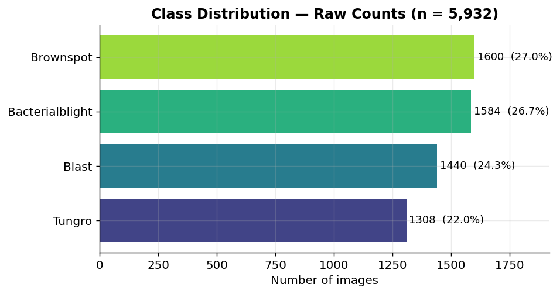
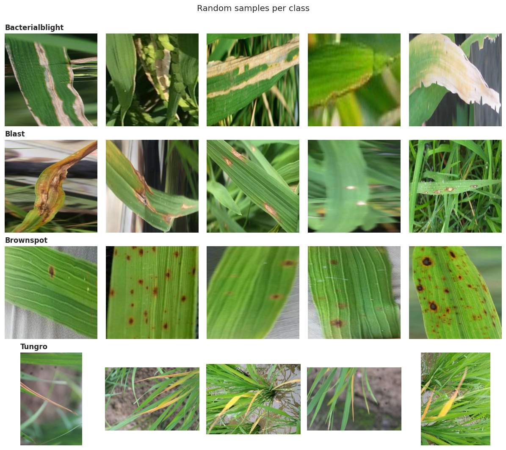
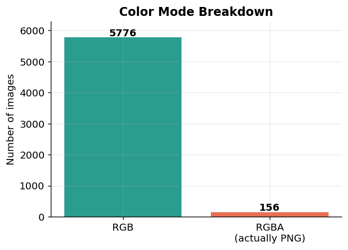
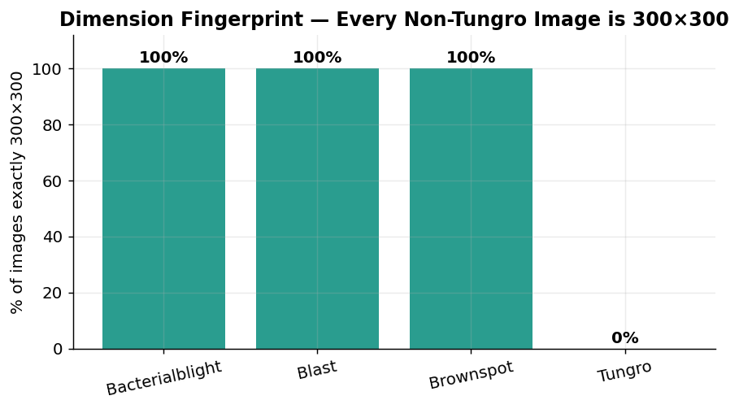
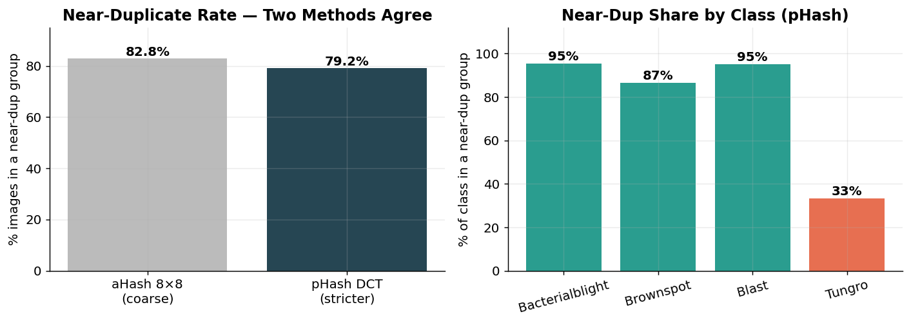
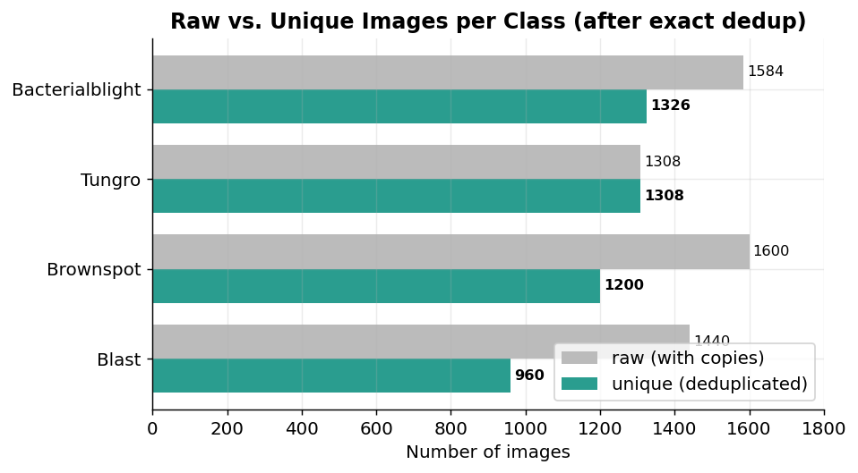
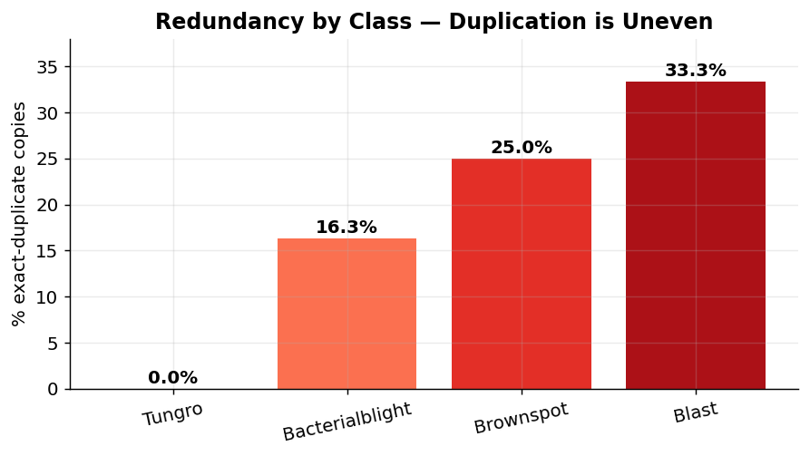

# Rice Leaf Disease Dataset — Exploratory Data Analysis

**Dataset:** `nirmalsankalana/rice-leaf-disease-image` (Kaggle)
**Purpose:** Source data for training a rice leaf disease classifier (computer-vision component of the farmer-advisory system).
**Environment:** EDA performed directly on Kaggle (data mounted read-only under `/kaggle/input`).

---

## 1. What this document is

This is a plain-language record of the exploratory data analysis (EDA) we ran on the rice leaf disease image dataset *before* any model training. The goal of EDA here is not to build anything — it is to **understand what the model will actually see**, and to catch problems in the data that would otherwise silently corrupt training or inflate accuracy. Every number below is explained in terms of *what it means* and *why it matters for the model*, not just reported.

The single most important takeaway, stated up front: **the labels are clean and trustworthy, but the dataset is heavily redundant and contains a strong "shortcut" the model could cheat on.** Both of those facts change how we must split and train the data. The rest of this document builds the evidence for that conclusion.

---

## 2. Dataset at a glance

| Property | Value |
|---|---|
| Total images | 5,932 |
| Number of classes | 4 |
| Classes | Bacterialblight, Blast, Brownspot, Tungro |
| Predefined train/val/test split | **None** — raw class folders only |
| File format (by name) | 100% `.jpg` |
| File format (by content) | 5,776 true JPEG + 156 PNG-encoded (mislabeled `.jpg`) |
| Corrupt/unreadable files | 0 |
| Unique images (after removing exact copies) | ~4,794 |

**Folder structure.** The images are organised as one folder per disease, nested two wrapper folders deep:

```
nirmalsankalana/                 (author username — wrapper)
    rice-leaf-disease-image/     (dataset name — wrapper)
        Bacterialblight/  → 1,584 images
        Blast/            → 1,440 images
        Brownspot/        → 1,600 images
        Tungro/           → 1,308 images
```

The class of each image is simply the name of the folder it sits in. Because there is **no train/val/test division**, the responsibility for creating a clean, leakage-free split falls entirely on us later — this turns out to be the highest-stakes design decision for this dataset (see Section 8).

---

## 3. Class distribution

The four classes are close in size. The counts:

| Class | Count | Share |
|---|---|---|
| Brownspot | 1,600 | 27.0% |
| Bacterialblight | 1,584 | 26.7% |
| Blast | 1,440 | 24.3% |
| Tungro | 1,308 | 22.0% |



**Terminology — imbalance ratio.** The *imbalance ratio* is the size of the largest class divided by the smallest. Here it is 1,600 / 1,308 = **1.22 : 1**. A ratio near 1 means the classes are roughly balanced; a "problem" dataset is more like 5:1 or 10:1, where a model can score high just by ignoring the rare class. At 1.22:1 the raw data looks essentially balanced, which *initially* suggested we would not need class-weighting or oversampling, and that plain accuracy would be a meaningful metric.

> **Important caveat, established later:** this 1.22:1 balance is measured *with duplicate copies included*. Once exact duplicates are removed (Section 7), the balance shifts and the ordering actually flips. The raw balance was partly manufactured by duplication.

---

## 4. Looking at the images (sample grid)

Numbers alone never tell you whether a folder actually contains what its label claims. We sampled five random images per class and looked at them directly.



**What each disease looks like, and whether the labels are trustworthy:**

| Class | Visual appearance | Verdict |
|---|---|---|
| **Bacterialblight** | Elongated straw/tan lesions along leaf margins and blades; some fully whitened, dried, tattered leaves. Tight leaf close-ups. | Distinct ✓ |
| **Blast** | Spindle / eye-shaped lesions with brown borders, plus tip dieback (browning inward from the tip). Leaf close-ups. | Mostly distinct ✓ |
| **Brownspot** | Scattered discrete brown circular/oval spots, some with yellow halos. Textbook symptom. Leaf close-ups. | Very distinct ✓ |
| **Tungro** | Yellow-orange discoloration on **whole plants / clumps**, photographed **zoomed-out against bare soil**. | Distinct — but for the *wrong reason* ⚠️ |

**The key finding — background bias / spurious correlation.** Three of the four classes (Bacterialblight, Blast, Brownspot) are tight close-ups of individual leaves against green or blurred foliage. **Tungro is the odd one out**: zoomed-out shots of entire plants against brown soil.

This is a classic *background-bias* (or *spurious-correlation*) problem, and it is exactly the "lab-to-field gap" issue the project is built to address. Here is why it is dangerous:

> A convolutional neural network does not know we *want* it to look at the leaf. If "brown soil background" perfectly predicts "Tungro" in the training data, the model will happily learn **that shortcut** instead of the actual viral yellowing symptom. We would then see a beautiful 97%+ validation accuracy that **collapses** the moment a farmer photographs a Tungro-infected plant against a green background — or, worse, the model labels *any* soil-background photo as Tungro. This is precisely the kind of silent failure that makes a disease detector useless in the field.

Other observations from the grid: lighting varies within each class (bright reflections and water droplets on some leaves, deep shadow on others) — this is actually **good**, because it forces the model to generalise. And within Bacterialblight the disease severity ranges from subtle to fully necrotic, which is realistic.

---

## 5. Image geometry — dimensions, aspect ratio, colour mode

Next we read the technical properties of every image (its width, height, and colour mode) without loading the full pixels.

**Colour modes:**

| Mode | Count |
|---|---|
| RGB | 5,776 |
| RGBA | 156 |



**Terminology — colour mode / RGBA.** *RGB* means three colour channels (red, green, blue). *RGBA* adds a fourth "alpha" (transparency) channel. Standard JPEGs cannot carry an alpha channel — so the 156 RGBA files are a signal that those files are not really JPEGs despite their `.jpg` name. (Confirmed in Section 6: they are PNGs.) The practical consequence is minor and already handled: every image is passed through a `convert to RGB` step at load time, which flattens the alpha channel away.

**Overall dimension summary:**

| Statistic | Width | Height | Aspect | Megapixels |
|---|---|---|---|---|
| mean | 312.2 | 312.2 | 1.02 | 0.10 |
| min | 209 | 209 | 0.66 | 0.06 |
| median (50%) | 300 | 300 | 1.00 | 0.09 |
| max | 603 | 603 | 1.51 | 0.24 |

**Terminology — aspect ratio.** Aspect ratio is width ÷ height. A value of **1.00** is a perfect square; **1.33** is the classic 4:3 camera shape; values below 1 are portrait (taller than wide). These are small images — around 0.1 megapixels each (a modern phone photo is 12+ megapixels), meaning the author already downscaled them heavily.

**The dimension fingerprint.** Two facts, read together, reveal something important:

- **78.0%** of all images (4,624 of them) are *exactly* 300×300.
- 4,624 is *exactly* Bacterialblight + Blast + Brownspot (1,584 + 1,440 + 1,600).

In other words, **every 300×300 image belongs to one of the three non-Tungro classes, and not a single Tungro image is 300×300.** The per-class median confirms it from the other side: Tungro's median is **331×331 with aspect 1.33** (native 4:3), while the other three are a clean 300×300 / 1.00.

 

So Tungro was not only *photographed* differently (zoomed-out, soil background) — it was also *processed* through a different pipeline. The three standard classes were squished to 300×300 squares; Tungro kept its native camera dimensions.

> **Note on reading the per-class median table:** the median width, median height, and median aspect are each computed *independently down their own column*, not row-by-row. So "median 331 wide, 331 tall, but aspect 1.33" is not a contradiction — most Tungro images are 4:3 rectangles, and the three column-medians simply land where they land separately.

We now have **three independent signals** that all separate Tungro from the rest: **background** (soil vs. foliage), **framing** (whole-plant vs. leaf close-up), and **dimensions** (native 4:3 vs. forced 300×300 square). When three unrelated properties all partition the data the same way, a neural network *will* find and exploit that partition unless we stop it.

---

## 6. Resolving the RGBA mystery + confirming the fingerprint

We checked what the 156 RGBA files actually are (by reading their internal format rather than their filename) and locked the dimension fingerprint into hard per-class numbers.

**The RGBA files are PNGs.** All 156 came back as PNG-encoded — named `.jpg` but internally PNG, which is why they carry an alpha channel. They sit in Bacterialblight (108) and Brownspot (48); none in Blast or Tungro. Fully understood, fully handled by the convert-to-RGB step. Nothing about the pipeline changes.

**The 300×300 fingerprint, exact:**

| Class | % exactly 300×300 |
|---|---|
| Bacterialblight | 100.0% |
| Blast | 100.0% |
| Brownspot | 100.0% |
| Tungro | **0.0%** |

There is no overlap whatsoever. This is the clean numeric version of the "Tungro was processed differently" finding.

---

## 7. Duplicate and near-duplicate detection

This is the highest-stakes structural check. If near-identical images end up on *both* sides of the train/test split, the model effectively sees the test set during training, and the reported accuracy becomes fiction. The filenames carried batch prefixes (`TUNGRO1_`, `TUNGRO2_`, …), hinting that many frames of the same subject may exist — so we tested for it directly.

### Two kinds of duplicate

- **Exact duplicate** = two files that are *byte-for-byte identical*. Detected with an **MD5 checksum** — a short "fingerprint" of a file's bytes; identical files produce identical fingerprints.
- **Near-duplicate** = two images that *look* the same to the eye but are not byte-identical (e.g. re-saved, slightly cropped, or a neighbouring video frame). Detected with **perceptual hashing** — a fingerprint of the image's *visual content* rather than its exact bytes.

### Results

**Exact duplicates:** 2,234 files are byte-for-byte identical, forming 1,096 groups. Keeping one copy per group removes 1,138 redundant files, leaving **~4,794 truly unique files** out of 5,932 (~19% of the dataset is literal copies).

**Near-duplicates:** we used two perceptual-hashing methods to cross-check each other:

- **aHash (average hash), 8×8:** a coarse method that shrinks each image to a 64-bit signature. Result: **82.8%** of images sit in a near-duplicate group.
- **pHash (perceptual hash, DCT-based):** a stricter, less collision-prone method. Result: **79.2%**.



The two independent methods agreeing at ~80% means the redundancy is **real, not a hashing artifact.** (We deliberately treated the coarse 82.8% with suspicion until the stricter pHash confirmed the same story.)

### The labels are clean

Crucially, both methods found **0 cross-class duplicate groups** — no file (exact or near) appears under two different disease labels. This rules out *label noise*, the failure mode that would place a hard ceiling on achievable accuracy. **The redundancy is severe, but the labelling is trustworthy — that combination is the whole story of this dataset.**

---

## 8. True (deduplicated) class balance

Once exact copies are removed, the "balanced" picture from Section 3 changes — and the change is uneven across classes.

| Class | Raw | Unique | % redundant |
|---|---|---|---|
| Tungro | 1,308 | 1,308 | **0.0%** |
| Bacterialblight | 1,584 | 1,326 | 16.3% |
| Brownspot | 1,600 | 1,200 | 25.0% |
| Blast | 1,440 | 960 | **33.3%** |





**The ordering flips.** Tungro has *zero* exact duplicates, while Blast is one-third padding. Strip the copies and Bacterialblight becomes the **largest** real class (1,326) and Blast the **smallest** (960) — a true imbalance ratio of **1.38 : 1** (still manageable). The headline is not the number but the mechanism: **the apparent balance was partly manufactured by duplication.**

**A reframing of the Tungro risk.** Every earlier signal flagged Tungro as the "odd one out." But on data *quality*, Tungro is actually the **cleanest** class — fully unique images, native resolution. The three 300×300 classes are the ones inflated with copies. So Tungro's problem is purely the *background/framing shortcut* (a modelling risk), not redundancy (a splitting risk). Two different problems, two different fixes — and now we know exactly which class needs which.

---

## 9. Consolidated findings

1. **Labels are clean.** Zero cross-class duplicates (exact or near). No label-noise contradictions. Achievable accuracy is not capped by mislabelling.
2. **Format is consistent and readable.** Zero corrupt files. 156 files are PNGs mis-named `.jpg`; harmless once every image is converted to RGB.
3. **Strong Tungro shortcut.** Background (soil), framing (whole-plant), and original dimensions (4:3) all separate Tungro from the other three classes. A model can "cheat" by learning the background instead of the disease.
4. **Severe redundancy.** ~19% exact copies; ~79–83% of images sit in a near-duplicate group. Confirmed by two independent hashing methods.
5. **Balance is partly artificial.** Raw 1.22:1 → true (deduplicated) 1.38:1, with the largest/smallest classes swapping places. Blast is the most padded (33% copies); Tungro has none.

---

## 10. What this means for modelling

**On the data split (most important):**
- **Do not use a plain random `train_test_split`.** With ~79% of images in near-duplicate groups, a random split would scatter near-identical images across train and test, leaking the test set into training and inflating accuracy by an estimated 10–20 points of pure fiction.
- **Use a group-aware split.** Cluster images by their perceptual hash, then assign *whole clusters* entirely to train **or** test, never both. (Tools such as `GroupShuffleSplit` or `StratifiedGroupKFold`, using the duplicate-cluster id as the group key.)
- **Deduplicate before computing class weights**, or the weights will skew toward Blast's copies.

**On the Tungro shortcut (three defences, in priority order):**
1. **Resize every image to one common size** (e.g. 224×224) at load time. This eliminates the *dimension* shortcut outright — 300×300 and 331×331 both become 224×224.
2. **Background augmentation** (random crops, background swaps, or segmentation masking) to attack the *soil-background* and *framing* shortcuts that survive resizing.
3. **A deliberate robustness test:** hold out or hand-collect a few Tungro images on green backgrounds and non-Tungro images on soil backgrounds, and confirm the model does not flip its prediction. If accuracy holds there, the shortcut has been beaten.

**On metrics:** because the true balance is mild (1.38:1), accuracy remains informative, but report **per-class recall / precision** as well — especially for Tungro (to catch shortcut-learning) and Blast (the smallest true class).

---

## 11. Reproducibility notes

- All hash computations (MD5, aHash, pHash) and per-image geometry were captured into a manifest so they never need recomputing.
- The manifest carries two columns that feed directly into a leakage-free split: a **duplicate-cluster id** (group key for a group-aware split) and an **exact-representative flag** (marks one image per exact-duplicate group, for training on deduplicated data).
- Random seeds were fixed for all sampling so the sample grid and any resampling are reproducible.

---

*Figures in this document were generated from the recorded cell outputs of the EDA notebook. The sample-image grid shows five random images per class; all bar charts are drawn from the exact counts reported by the notebook.*
