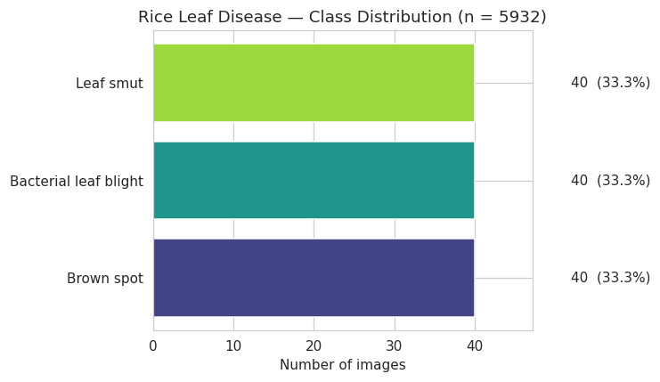
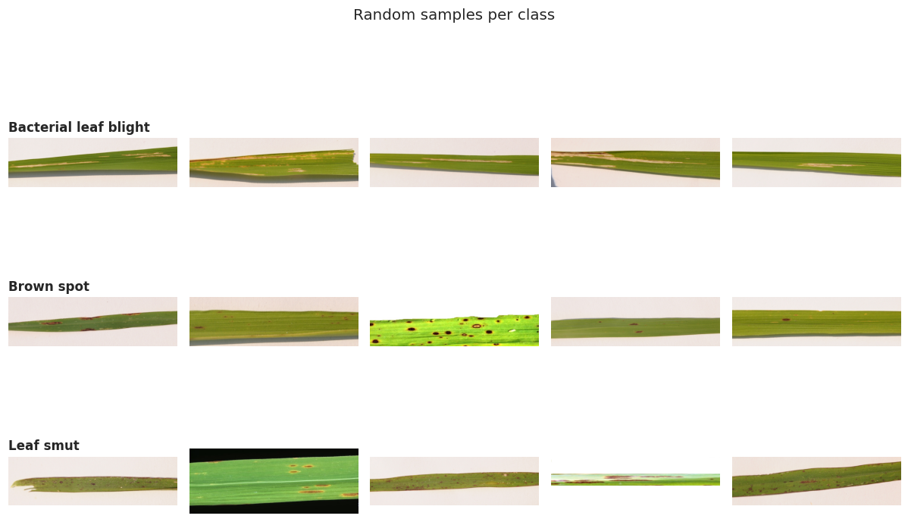
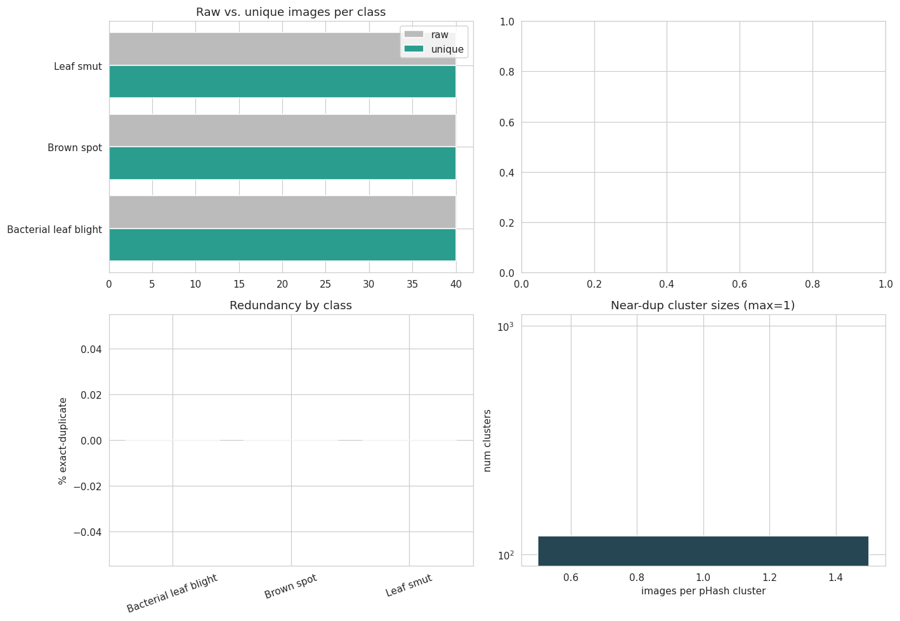

# Rice Leaf Disease Dataset — Exploratory Data Analysis
## Set 2 — vbookshelf/rice-leaf-diseases (Kaggle)

This is the companion EDA to the earlier `nirmalsankalana/rice-leaf-disease-image` analysis (**"Set 1"**). The exact same six-step pipeline was re-run on a second, unrelated rice-leaf dataset so the two can be compared directly. The headline is that this dataset is almost the mirror image of Set 1: where Set 1 was large, redundant, and quietly background-biased, Set 2 is tiny, pristine, and genuinely balanced — but its very small size and an unusual image geometry become the dominant risks. Two cells also carried over hard-coded values from the Set 1 notebook; both are flagged where they appear so the numbers are not misread.

---

## 1. Dataset structure & master dataframe

*Cell output — directory tree and dataframe summary*

```text
Datasets mounted under /kaggle/input:
  - datasets

Using DATA_ROOT = /kaggle/input/datasets

Directory structure (up to 3 levels):

vbookshelf/  (0 images directly inside)
    rice-leaf-diseases/  (0 images directly inside)
        rice_leaf_diseases/  (0 images directly inside)

Total images: 120

Splits found:
 split
all    120

Number of classes: 3
Classes: ['Bacterial leaf blight', 'Brown spot', 'Leaf smut']
```

The nesting is three wrapper folders deep (`vbookshelf/` → `rice-leaf-diseases/` → `rice_leaf_diseases/`) before the class folders, but the structure-agnostic discovery code handles it without changes. The dataset holds **120 images across 3 classes** — Bacterial leaf blight, Brown spot, and Leaf smut. As with Set 1, there is no train/val/test division (`split` is `all` for every file), so the responsibility for a clean split later is ours.

The contrast with Set 1 is stark and worth stating up front: Set 1 had **5,932 images across 4 classes**; this one has **120 images across 3 classes** — roughly 2% of the size, and a different (overlapping but not identical) label set. This is the classic small "rice leaf diseases" dataset, and its scale alone reshapes every downstream decision.

---

## 2. Class distribution + file-type breakdown

*Cell output — class balance and extensions*

```text
Class distribution:

                       count  percent
label
Brown spot                40     33.3
Bacterial leaf blight     40     33.3
Leaf smut                 40     33.3

Largest class : Brown spot (40)
Smallest class: Brown spot (40)
Imbalance ratio (max/min): 1.00 : 1

File extensions:
ext
.jpg    120
```



This is as balanced as a dataset gets: **exactly 40 images per class, a 1.00 : 1 imbalance ratio**, and a single file type (`.jpg`). Plain accuracy will be a meaningful metric with no need for class weighting or resampling.

One caveat about the chart itself: the title still reads **"n = 5932"** — that number is a hard-coded holdover from the Set 1 notebook and was not updated. The **true count here is 120**. The printed statistics above are correct; only the plot title is stale. (Worth fixing the `set_title` string before this figure goes into a report.)

A deeper point: unlike Set 1, this balance is **genuine, not manufactured**. Set 1's tidy 1.22 : 1 turned out to be partly the product of heavy duplication; here — as Sections 6 and 7 confirm — there are zero duplicates, so 40-per-class is 40 truly distinct images per class.

---

## 3. Sample image grid (one row per class)



**What each disease looks like, and how the framing compares across classes:**

| Class | What the samples show | Distinctness |
|---|---|---|
| Bacterial leaf blight | Long yellow-to-tan streaks and blighting running lengthwise down the blade, with drying and withering toward the edges and tips. Single leaf laid out horizontally. | Distinct ✓ |
| Brown spot | Many small, discrete brown oval spots scattered fairly evenly along the blade, some with pale margins. Textbook presentation. Single leaf strip. | Distinct ✓ |
| Leaf smut | Fine scattered dark angular flecks and specks along an otherwise greener blade — subtler and lower-contrast than the other two. Single leaf strip. | Mostly distinct ✓ |

The most important observation is what is *absent*. In Set 1, one class (Tungro) was photographed completely differently — zoomed-out whole plants against bare soil — which created a background-bias shortcut a CNN could exploit. **There is no equivalent trap here.** All three classes share the same framing: a single rice leaf laid out horizontally as a wide strip against a consistent, neutral background. No class is visually separable by its background or composition, so the model is pushed toward the lesions themselves rather than a contextual crutch.

The flip side of that shared framing is the geometry it produces — these are very wide, panoramic leaf strips — which turns out to be the single biggest issue for this dataset, quantified next.

---

## 4. Image dimensions, aspect ratio & color mode

*Cell output — dimensions, color modes, per-class geometry*

```text
Unreadable/corrupt images: 0

Color modes:
mode
RGB    120

Overall dimension summary:
         width   height  aspect  megapixels
count   120.00   120.00  120.00      120.00
mean   2398.44   721.34    3.31        2.09
std    1130.49   344.26    0.66        1.37
min     250.00    71.00    1.25        0.02
25%    1137.00   380.00    3.44        0.41
50%    3081.00   897.00    3.44        2.76
75%    3081.00   897.00    3.44        2.76
max    4160.00  2340.00    5.30        9.73

Most common (width, height) pairs:
  3081 x 897  ->  85 images (70.8%)
  250 x 200   ->   2 images (1.7%)
  ... (remaining pairs 1 image each)

Median dimensions per class:
                        width  height  aspect  megapixels
label
Bacterial leaf blight  3081.0   897.0    3.44        2.76
Brown spot             3081.0   897.0    3.44        2.76
Leaf smut              3081.0   897.0    3.44        2.76
```

This is the defining fingerprint of the dataset. Three facts stand out. First, the images are **large and extremely wide**: the dominant size is 3081×897 (70.8% of the set), giving an aspect ratio of about **3.44 : 1** — nearly three-and-a-half times wider than tall. Second, every file is clean **RGB with zero corruption**. Third — and this is the good news — the **median dimensions are identical across all three classes** (3081×897 each).

That third point is exactly the check that exposed Set 1's Tungro problem, and here it comes back clean: because no class has a distinct size signature, there is **no dimension shortcut for the model to learn**. Combined with the shared framing from Section 3, the label is not leaking through geometry or background.

But the 3.44 : 1 aspect ratio is a preprocessing landmine. The standard move — resizing to a square 224×224 — would compress each image horizontally by roughly 3.4×, badly distorting lesion shapes (round brown spots become ovals; streaks change proportion). Set 1's images were already near-square (300×300), so a naive `resize()` was harmless there; here it is not. When modeling, we should prefer aspect-preserving handling — letterbox/pad to square, tile the strip into square crops, or train at a wide input resolution — rather than a plain square resize.

---

## 5. Format check + per-class dimension fingerprint

*Cell output — RGBA / mislabeled-PNG check and 300×300 tally*

```text
RGBA images by class:
Series([], )

True encoded format of the RGBA files (despite the .jpg name):
(none)

300x300 images per class:
                       is_300x300  total  pct_300x300
label
Bacterial leaf blight           0     40          0.0
Brown spot                      0     40          0.0
Leaf smut                       0     40          0.0
```

These two checks were designed for Set 1's specific quirks, and here they deliberately come back **empty — which is itself the finding**. In Set 1, 156 files were PNGs (with alpha channels) hiding behind a `.jpg` extension, which needed a `.convert("RGB")` guard in the loader. Set 2 has **no RGBA images and no mislabeled PNGs at all** — every file is a true RGB JPEG — so that loader defense is unnecessary here.

The `300×300` tally is a Set-1-specific probe (Set 1 pre-resized three of its classes to exactly 300×300). Set 2 contains **zero** such images, consistent with Section 4: this dataset was never squished to a fixed square. The check is simply not meaningful for this dataset, and the `0.0%` across the board should be read as "not applicable," not as a problem.

---

## 6. Exact + near-duplicate detection (aHash)

*Cell output — exact duplicates and 8×8 perceptual-hash near-dups*

```text
Exact (byte-identical) duplicate files: 0
  ...forming 0 groups of identical images

Computing perceptual hashes ...

Near-duplicate groups (identical 8x8 perceptual hash): 5
Images involved in a near-dup group: 14 (11.7%)
  within-class near-dup groups : 1
  cross-class near-dup groups  : 4  (these are label-noise red flags)

Near-duplicate images per class:
label
Leaf smut                6
Brown spot               4
Bacterial leaf blight    4
```

Two very different signals here. The exact-duplicate result is unambiguous and excellent: **zero byte-identical files**. Where Set 1 had ~19% literal copies inflating its counts, every image in Set 2 is a distinct file.

The coarse 8×8 aHash then flags 14 images (11.7%) in 5 near-duplicate groups — and, more alarmingly, reports **4 cross-class groups** as potential label-noise red flags. This warrants caution rather than alarm: an 8×8 average-hash shrinks each image to just 64 bits, and on very wide, similarly-composed leaf strips like these it collapses distinct images together easily. Cross-class "matches" from such a coarse hash are exactly the kind of artifact a stricter hash should adjudicate — which is what the next step does.

---

## 7. True unique-image accounting + stricter pHash recount

*Cell output — exact-dedup accounting and DCT-based pHash recount*

```text
Raw images            : 120
Unique files (post exact-dedup): 120
Redundant exact copies removed : 0

Per-class exact-dedup accounting:
                       raw  unique  exact_dup_copies  pct_redundant
label
Brown spot              40      40                 0            0.0
Bacterial leaf blight   40      40                 0            0.0
Leaf smut               40      40                 0            0.0

TRUE (deduped) imbalance ratio: 1.00 : 1

Computing pHash (DCT) for all images...

--- Near-dup comparison at Hamming distance 0 ---
  aHash-8x8 (Cell 7): 4914 imgs (82.8%)  <- coarse   [HARD-CODED Set-1 value]
  pHash-DCT (now)   : 0 imgs (0.0%)  <- stricter
  pHash cross-class near-dup groups: 0

pHash near-dup images per class:
Series([], )
```

**True deduplicated accounting:**

| Class | Raw | Unique | % redundant |
|---|---|---|---|
| Brown spot | 40 | 40 | 0.0% |
| Bacterial leaf blight | 40 | 40 | 0.0% |
| Leaf smut | 40 | 40 | 0.0% |

The stricter DCT-based pHash settles it: **0 near-duplicates and 0 cross-class groups**. The 4 cross-class "red flags" from the coarse aHash in Section 6 were **false positives** — collisions of the 64-bit average hash, cleared entirely once a finer fingerprint is used. So the labels are clean and internally consistent: no image sits under two disease names, and no two images are even near-copies. Combined with the exact-dedup result, the **1.00 : 1 balance is fully genuine** — 40 truly independent images per class, none of it padded by duplication (the exact opposite of Set 1, where deduplication flipped the class ordering).

Important reading note on the comparison block: the line **"aHash-8x8 (Cell 7): 4914 imgs (82.8%)"** is a **hard-coded Set 1 value** printed literally by the cell — it is *not* Set 2's aHash result. Set 2's actual coarse-hash figure was **14 images (11.7%)**, from Section 6. So the honest comparison for this dataset is 11.7% (coarse aHash) → 0.0% (strict pHash), not 82.8% → 0.0%. The string should be updated before this appears in a report.

---

## 8. EDA summary dashboard + manifest export



*Cell output — manifest columns and export*

```text
Manifest columns ready: ['filepath', 'filename', 'label', 'split', 'ext',
  'width', 'height', 'mode', 'aspect', 'megapixels', 'md5', 'ahash_hex',
  'phash', 'dup_cluster', 'is_exact_rep']
Unique pHash clusters (use as split groups): 120
Exact-representative images (is_exact_rep=True): 120

Saved manifest -> /kaggle/working/rice_leaf_manifest.csv
```

The dashboard visually confirms everything above: raw and unique bars are identical for every class (no redundancy), the redundancy-by-class panel is flat at 0%, and the near-dup cluster-size histogram shows every cluster at size 1. Accordingly, there are **120 pHash clusters for 120 images** — each image is its own cluster — and all 120 are exact representatives. The manifest is exported with the same schema as Set 1 so the two feed an identical modeling pipeline.

(One cosmetic note: the top-right panel of the dashboard is intentionally blank — the plotting cell fills only three of the four quadrants. Harmless, but easy to tidy if the figure is reused.)

---

## 9. What this means for modeling

Set 2 is the cleanest possible dataset on every axis that matters for label integrity — balanced, duplicate-free, corruption-free, format-consistent, and free of the background/geometry shortcuts that made Set 1 risky. But two properties dominate any modeling plan:

- **Size is the binding constraint.** 120 images — 40 per class — is very small for training a disease classifier from scratch. This all but mandates transfer learning from a pretrained backbone, aggressive augmentation, and k-fold cross-validation (rather than a single held-out split) so every image is used for evaluation. A plain 80/20 split would leave ~8 test images per class, far too few to trust.
- **Geometry needs care.** The ~3.44 : 1 panoramic aspect ratio means a naive square resize will distort lesions. Prefer aspect-preserving preprocessing — pad/letterbox to square, tile the strip into square patches, or train at a wide input size.
- **A group-aware split is not needed here.** With zero exact and zero pHash near-duplicates, the leakage risk that dominated Set 1 is absent — a standard stratified split (or stratified k-fold) is safe. The `dup_cluster` column is retained only for pipeline symmetry with Set 1.

Compared side by side: Set 1 offers scale but demands defensive engineering (deduplication, group-aware splitting, background augmentation against the Tungro shortcut); Set 2 offers pristine, honest data but demands strategies for scarcity (transfer learning, heavy augmentation, cross-validation) and careful aspect-ratio handling. If both are ever combined, the differing class sets, resolutions, and aspect ratios must be reconciled first — they are not drop-in compatible.
