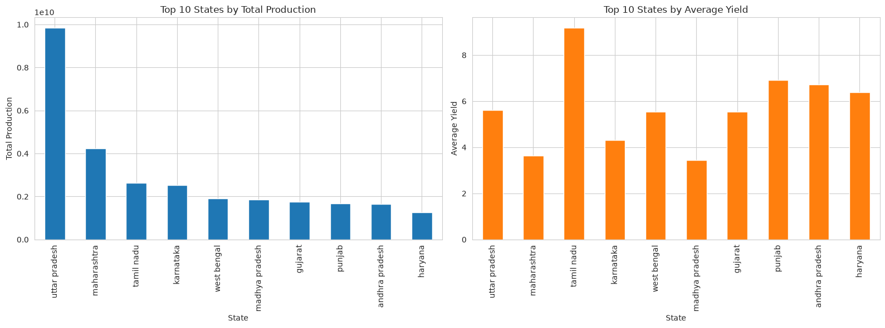
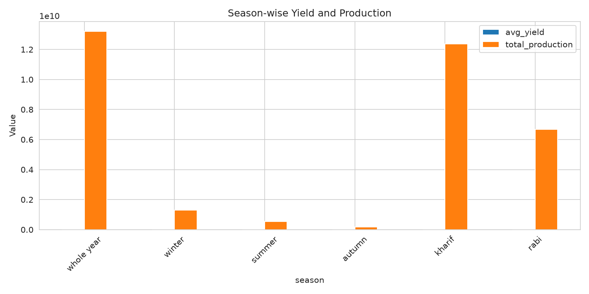

# Yield Notebook Summary

## Project Goal
Combine multiple Indian agriculture datasets into a unified production/yield dataset and perform exploratory data analysis after cleaning and imputing missing values.

## Data Sources
- `datasets/Crop Recommendation dataset.csv` — crop recommendation reference data (soil/climate attributes, no temporal/geographic keys)
- `datasets/crop_yield.csv` — state-level crop production and yield history (1997-2020)
- `datasets/crop-wise-area-production-yield.csv` — district-level crop statistics (1997-2015)
- `datasets/DES-District-Data-For-2024-25.csv` — district-level 2024-25 production snapshot

## Notebook Pipeline
1. Loaded all source CSV files, cleaned column names, and inspected basic shapes and missing cells.
2. Created a standalone `crop_ref` table from the recommendation dataset.
3. Normalized the three production datasets into a common schema:
   - `crop`, `year`, `state`, `district`, `season`, `area`, `production`, `yield`
   - Kept auxiliary metadata columns where available (`annual_rainfall`, `fertilizer`, `pesticide`, `crop_type`, etc.)
4. Standardized text fields, parsed year values, and normalized seasonal labels.
5. Unioned the normalized datasets into a single `production_unified` table.
6. Deduplicated overlapping rows by prioritizing more granular district-level data over state-level data.
7. Corrected coconut quantities by converting production/yield from pieces to tonnes.
8. Performed data quality reporting and exported `production_unified.csv`.
9. The EDA and data collection is performed covering all states and union teritories, for uttar pradesh necessary filter can be applied and acheived accordingly.

## Preprocessing
- Identified categorical and numeric columns in the unified dataset.
- Imputed missing categorical values using `SimpleImputer(strategy='most_frequent')`.
- Encoded categorical features with `OrdinalEncoder` and applied `MissForest` to impute the remaining missing values.
- Reversed categorical encoding after imputation to preserve readable values.
- Exported the imputed dataset to `production_unified_imputed.csv`.

## Final Dataset Stats
- Total rows: `440,962`
- Total columns: `16`
- Years covered: `1997` to `2024`
- Unique crops: `124`
- Unique states: `35`
- Season categories: `autumn`, `kharif`, `rabi`, `summer`, `whole year`, `winter`

## Key Results
### Top crops by total production
1. `sugarcane`
2. `rice`
3. `wheat`
4. `potato`
5. `cotton(lint)`
6. `maize`
7. `coconut`
8. `jute`
9. `banana`
10. `soyabean`

### Season summary
- `whole year`: highest total production and highest average yield among season labels
- `kharif`: second-highest total production and strong record count
- `rabi`: third-highest total production
- `winter`, `summer`, and `autumn` capture smaller but important seasonal contributions

## Exploratory Findings
- Production trends were plotted by year to show changes across the full historical span.
- Yield distribution was analyzed with both raw and log-scaled histograms to expose long-tailed behavior.
- State-level and crop-level aggregations were used to identify leading producers and seasonality patterns.
- Numeric feature correlation was evaluated for `area`, `production`, `yield`, `annual_rainfall`, `fertilizer`, and `pesticide`.

## Output Files
- `production_unified.csv`
- `production_unified_imputed.csv`
- `images/yearly_trends.png`
- `images/top_crops_production.png`
- `images/season_summary.png`
- `images/correlation_matrix.png`

## Visual Results
### Total Production and average yield by state

### Top crops by total production

### Season-wise comparison

### Numeric feature correlations

## Notes
- `crop_reco` remains a standalone reference table and is not merged directly into the time-series production dataset.
- The imputation process uses `MissForest` to preserve relationships across both numeric and categorical fields.
- The notebook is structured to support both data cleaning and analytical summary outputs in a single workflow.
