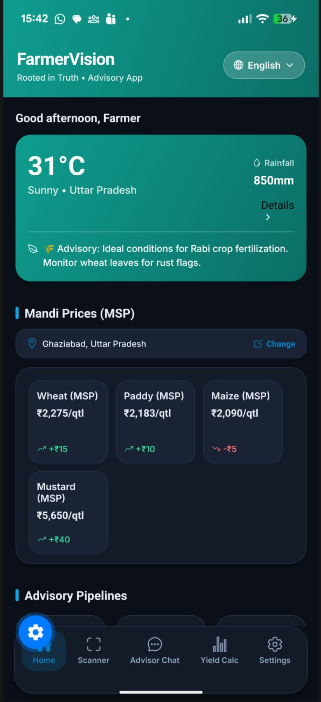
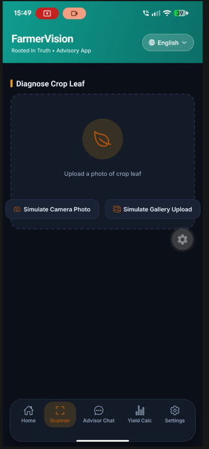
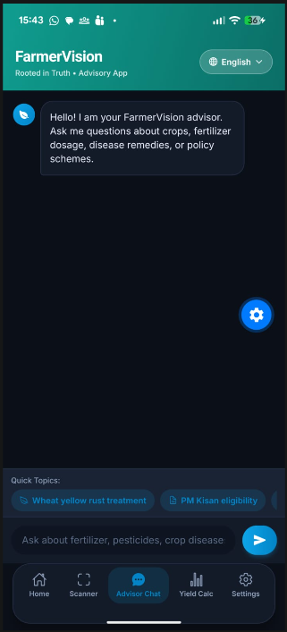
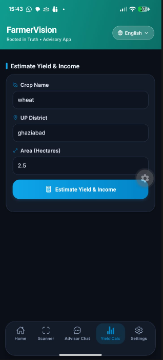
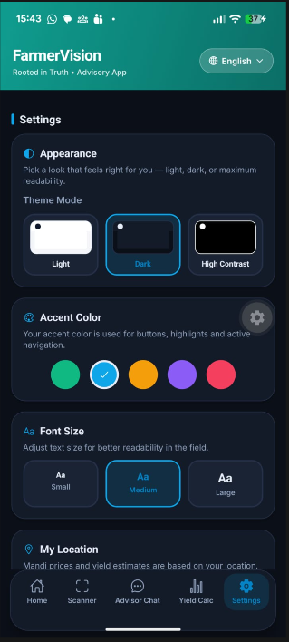

# FarmerVision — User Guide

*Milestone 6 · Section C · Audience: farmers and non-technical users*

## App Overview

FarmerVision is a mobile assistant for farmers. Ask a farming question by typing (in English,
Hindi, or Hinglish) or by taking a photo of a diseased leaf, and get an instant, plain-language
answer backed by trusted sources. The home screen also shows **live mandi (market) prices** and
**live weather** for your location, and you can estimate a crop's **yield**.

**Use cases:** "which medicine for yellow rust in wheat?", "how much urea for paddy?", diagnosing a
sick leaf from a photo, checking today's wheat price at your mandi, seeing the 3-day forecast, and
estimating expected yield for your plot.

## The five screens

| Screen | What it does |
|---|---|
| 🏠 **Home** | Live mandi price cards (one row per crop, `● Live` badge) + live weather (temp, condition, rain, humidity, 3-day forecast) for your location |
| 🍃 **Leaf Scanner** | Take/upload a leaf photo → crop & disease diagnosis with advice |
| 💬 **Advisor Chat** | Ask any farming question; get a grounded answer with tappable source chips; follow-up questions are understood in context |
| 📈 **Yield** | Enter crop + district + area → an estimated yield |
| ⚙️ **Settings** | Language, theme (Light/Dark/High-Contrast), text size, and location (GPS or manual State → District) |

## Input — how you enter things

- **Text question:** type in the Advisor Chat box in your language (e.g. *"gehu me yellow rust ki dawa batao"*).
- **Photo:** in Leaf Scanner, tap to take a new photo or choose one from your gallery.
- **Location:** allow GPS on first launch, or set it manually in Settings (State → District). Location
  drives the mandi prices and weather shown on Home.
- **Yield inputs:** pick a crop, your district, and the area (in hectares).

## Output — what you see

- **An answer** in your own language, ending with a **`Sources:`** line — the numbered chips show
  where the advice came from (KCC records / government documents). Tap a chip to see the source.
- **A diagnosis** (from a photo): the likely crop + disease, a confidence, and treatment advice.
  *Treat this as a suggestion — confirm with your local KVK / expert.*
- **Live cards** on Home: current mandi price per crop with a change indicator, and current weather
  + a 3-day forecast, each marked `● Live`.
- **A yield estimate** in tonnes/hectare.

## Step-by-step

**1. Launch the app**
- Open FarmerVision (Expo Go during testing, or the installed app). Allow location when asked so
  Home can show your local prices and weather.

**2. Ask a question (Advisor Chat)**
- Go to 💬 Advisor Chat → type your question → send. Read the answer; tap a source chip for detail.
  Ask a follow-up (e.g. *"iski dose kitni?"*) — it remembers the previous question.

**3. Diagnose a leaf (Leaf Scanner)**
- Go to 🍃 Leaf Scanner → take/choose a clear photo of the affected leaf → view the diagnosis + advice.

**4. Check prices & weather (Home)**
- Open 🏠 Home. Prices and weather update to your set location. Change location in ⚙️ Settings.

**5. Estimate yield (Yield)**
- Go to 📈 Yield → choose crop, district, area → get the estimate.

### Example queries / images
- *"How do I control brown planthopper in paddy?"*
- *"गेहूं में पीला रतुआ के लिए कौन सी दवा डालें"*
- *"aaj mandi me gehu ka bhav kya hai"*
- A photo of a wheat leaf with yellow-orange rust stripes → diagnosis: *likely wheat yellow rust*.

## Troubleshooting

| Problem | What to do |
|---|---|
| App won't load / blank screen | Check your internet; close and reopen; if using Expo Go, re-scan the QR. |
| "Location not available" | Enable location permission, or set State → District manually in Settings. |
| Prices show an MSP/reference value | The live price service was rate-limited; the app shows the government MSP as a fallback. Try again later. |
| Weather looks static / not live | The live weather service was briefly unreachable; a fallback card is shown. It refreshes automatically. |
| Answer says "not enough information" | Rephrase more specifically (crop + problem), or ask about crops/pests/fertilisers/schemes. |
| Diagnosis seems wrong | The model is a **suggestion** — confirm with your local KVK/agriculture officer. |

## Screenshots

  
  
  

  <b>Home</b> &nbsp;&nbsp;&nbsp;&nbsp;&nbsp; <b>Leaf Scanner</b> &nbsp;&nbsp;&nbsp;&nbsp;&nbsp; <b>Advisor Chat</b>

 

  
  

  <b>Yield</b> &nbsp;&nbsp;&nbsp;&nbsp;&nbsp;&nbsp;&nbsp;&nbsp;&nbsp;&nbsp;&nbsp;&nbsp;&nbsp;&nbsp;&nbsp; <b>Settings</b>

