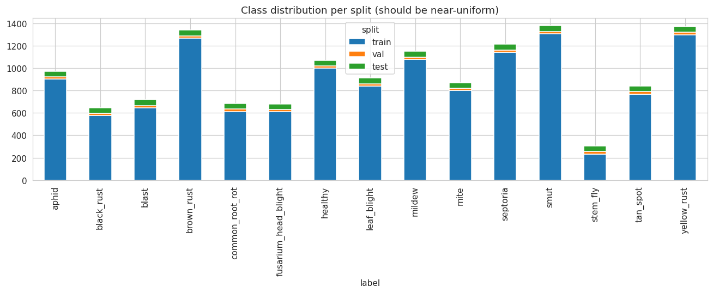
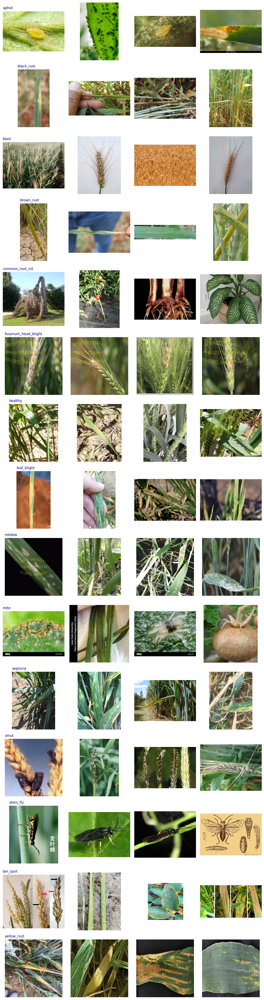
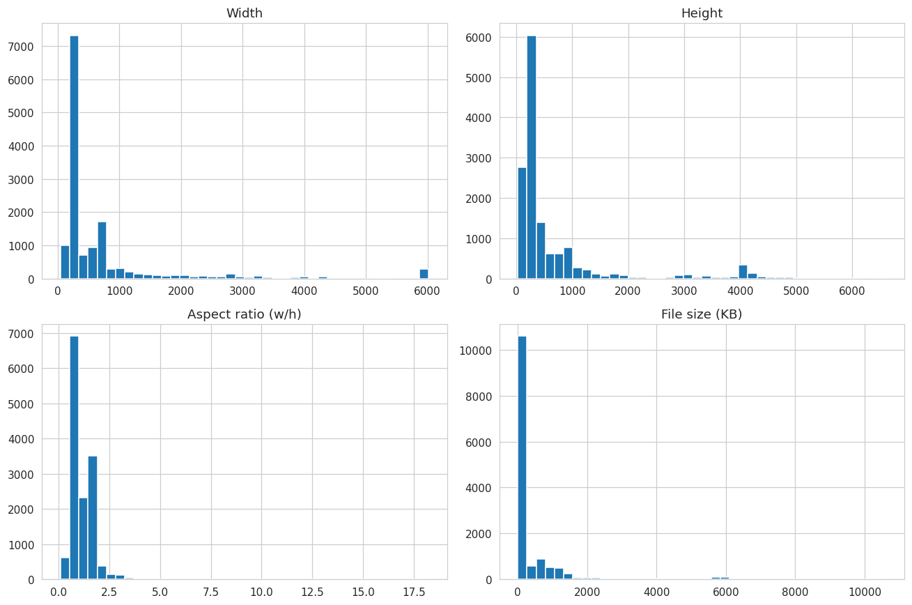
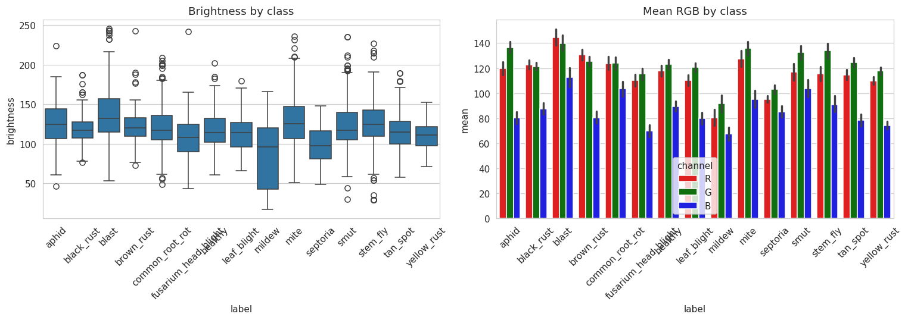
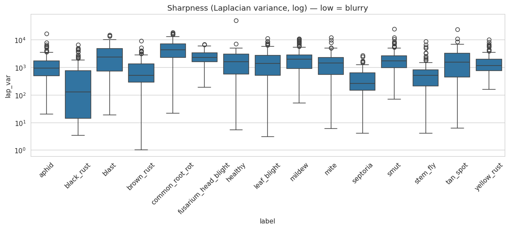

# Wheat Plant Disease Dataset — Exploratory Data Analysis

**Dataset:** `kushagra3204/wheat-plant-diseases` (Kaggle) · **Task:** 15-class wheat disease image classification · **Environment:** Kaggle notebook (dataset attached read-only under `/kaggle/input`)

This document records the full EDA performed on the wheat plant disease dataset that will be used to train an image-based disease-detection model. It walks through each step in order — what the step looked at, the raw result it produced, an explanation of the terminology and numbers involved, and the finding that follows. The headline is that the dataset is **large enough and clean enough to be very usable**, but it hides three problems that must be fixed before training: a corrupted set of folder-name *labels*, heavy internal *duplication with cross-split leakage*, and a wide spread of *image sizes and formats* that forces deliberate preprocessing choices.

---

## Dataset at a glance

| Property | Value | Note |
| --- | --- | --- |
| Total images | **14,154** | 0 corrupt / unreadable |
| Real classes | **15** | folders initially reported 45 due to inconsistent naming |
| Provided splits | train **13,104** / val **300** / test **750** | ≈ 873 train, 20 val, 50 test per class |
| Class balance | mild imbalance, **5.6 : 1** (train) | 234 → 1,310 images per class |
| File formats | JPEG, PNG, WEBP, GIF, MPO | mixed, all decodable |
| Colour modes | RGB, RGBA, P, CMYK | ~1,662 need conversion to RGB |
| Typical size | ~276 × 256 px (median) | but ranges 44 px → 6,016 px wide |
| Internal redundancy | **~44%** share a coarse fingerprint | **646** cross-split collisions (leakage risk) |

The 15 diseases are a **mix of pest, foliar-disease, and head/spike categories**, not just leaf diseases: `Aphid`, `Black Rust`, `Blast`, `Brown Rust`, `Common Root Rot`, `Fusarium Head Blight`, `Healthy`, `Leaf Blight`, `Mildew`, `Mite`, `Septoria`, `Smut`, `Stem fly`, `Tan spot`, `Yellow Rust`. This variety matters: the model must key off insect shapes for pests, lesion texture for rusts/blights, and spike appearance for Fusarium head blight and smut.

---

## 1. Environment & dataset discovery

**What this step did.** It located the dataset inside the Kaggle environment and printed the top three levels of the folder tree, so we could confirm how the images are organised before touching them.

**Result:**

```
Datasets mounted under /kaggle/input:
  - datasets
Using DATA_ROOT = /kaggle/input/datasets

Directory structure (up to 3 levels):
kushagra3204/  (0 images directly inside)
    wheat-plant-diseases/  (0 images directly inside)
        data/  (0 images directly inside)
```

**Terminology & numbers.** On Kaggle the dataset is *mounted* (attached read-only) under `/kaggle/input`; here that top folder is literally named `datasets`, so `DATA_ROOT` points there. The tree `kushagra3204/ → wheat-plant-diseases/ → data/` is three nested wrapper folders (author username → dataset name → author's top folder). The phrase **"(0 images directly inside)"** does *not* mean empty — it means zero image files sit loosely in that folder; the images live deeper, inside `split → class` subfolders.

**Finding.** Seeing `0` at all three levels is the healthy sign: the data is organised hierarchically, which is exactly what an image classifier expects. Once labels are cleaned (Step 3), standard loaders like PyTorch `ImageFolder` or Keras `image_dataset_from_directory` can infer labels straight from folder names.

---

## 2. Master inventory & the "45-class" trap

**What this step did.** It walked the entire tree, recorded one row per image (path, filename, folder-derived label, split, extension), and counted the totals, the splits, and the distinct classes.

**Result:**

```
Total images: 14154
Splits found:  train 13104 | test 750 | val 300
Number of classes: 45
Classes: ['Aphid', 'Black Rust', ... 'aphid_test', 'aphid_valid',
          'black_rust_test', 'blast_test_valid', ... 'yellow_rust_valid']
```

**Terminology & numbers.** Every image's *label* was taken from its immediate parent folder, and its *split* from any `train`/`val`/`test` folder in its path. The three splits are the standard ML partition: **train** (13,104 ≈ 92.6%) is what the model learns from; **val** (300 ≈ 2.1%) is used *during* training to tune choices and catch overfitting; **test** (750 ≈ 5.3%) is held out for a single honest final score.

**Finding — the trap.** `Number of classes: 45` is wrong. There are only **15** real diseases; the author named class folders inconsistently across splits, so each disease appears three times under three spellings:

| split | naming convention | example |
| --- | --- | --- |
| train | Title Case, spaces | `Black Rust` |
| test | lowercase + `_test` | `black_rust_test` |
| val | lowercase + `_valid` | `black_rust_valid` |

One folder is doubly broken — `blast_test_valid` — the Blast validation folder received two suffixes. To a classifier, `Black Rust` and `black_rust_test` are unrelated categories; training on this raw would teach labels that don't exist in the test set, making a good test score impossible. Per-class counts are also revealing: with 750 test / 15 = **50 test** and 300 val / 15 = **20 val** images per class, validation metrics will be *coarse* (each image = 5% of a class's val score), so expect noisy validation numbers.

---

## 3. Label repair (canonicalization)

**What this step did.** It normalised the messy folder names into one clean label per disease, then verified that every repaired class still appears in all three splits.

**Result (abridged):**

```
Canonical classes: 15
Classes missing from a split: none ✅
```

**Terminology & numbers.** *Canonicalization* means mapping many surface spellings to one standard form. The repair lowercased names, converted spaces/hyphens to underscores, and stripped trailing `_test`/`_valid`/`_train` suffixes (repeatedly, so the doubly-suffixed `blast_test_valid` collapsed correctly). The result: **45 → 15** labels.

**Finding.** The repair is clean: exactly 15 canonical classes, and *"Classes missing from a split: none"* confirms every disease is now present in train, val, and test. The per-class train counts are unequal (they feed Step 4's imbalance number), while val and test are flat at 20 and 50 per class. Every later step uses this repaired label.

---

## 4. Class distribution & imbalance

**What this step did.** It plotted how many images each class has, broken down by split, and computed the imbalance ratio for the training set.

**Result:**

```
Train imbalance ratio: 5.6
```



***Figure — Class distribution per split (stacked bars).** Bar-height variation comes from the train segment; val (20) and test (50) are flat across classes.*

**Terminology & numbers.** The **imbalance ratio** is the largest class divided by the smallest:

```
imbalance ratio = largest class / smallest class = 1310 (smut) / 234 (stem_fly) ≈ 5.6
```

So the best-represented disease has ~5.6× more training images than the worst. The ladder runs from `stem_fly` (234) and `black_rust` (576) at the bottom, through a mid-pack around 800–1,100, up to `smut` (1,310) and `yellow_rust` (1,301). Because val (20) and test (50) are identical for every class, all visible variation in the stacked bars comes from the **train** segment.

**Finding.** 5.6 : 1 is **mild-to-moderate** imbalance (under ~3 is ignorable; 3–10 is routine-but-handle-it; 100+ is severe). Left unaddressed, the model becomes biased toward majority classes and shows poor **recall** (missed detections) on the rare ones — the worst failure mode for a disease detector, since a missed infection costs more than a false alarm. Standard fixes: **class weights** (penalise mistakes on rare classes more), **weighted/oversampling** (show rare classes more often), and **targeted augmentation** on small classes. A measurement consequence follows too: **plain accuracy will mislead** here — report **per-class recall, macro-F1, and the confusion matrix** instead, since macro-averaging weights every disease equally.

---

## 5. Sample images per class

**What this step did.** It displayed four random images from each of the 15 classes as a visual sanity and quality audit — checking that labels look right, how varied each class is, what the backgrounds look like, and whether anything is odd (watermarks, composites, wrong scale).



***Figure — Four random samples per class (15 rows).** Note the mix of lab close-ups, whole-plant/head shots, and in-field photos, and the visual similarity of the three rusts.*

**Findings.**

- **Strong intra-class heterogeneity.** Every class mixes tight single-leaf close-ups on plain/lab backgrounds, wider whole-plant or wheat-head shots, and messy in-field photos (soil, hands, variable light). This *lab-to-field mix* is actually good — a model trained on it will be more field-robust than one trained on pristine lab images alone.
- **Three different disease "types."** `aphid`, `mite`, `stem_fly` are **pests** (insects / insect damage); `black_rust`, `brown_rust`, `yellow_rust`, `septoria`, `tan_spot`, `leaf_blight`, `blast`, `mildew` are **foliar diseases**; `fusarium_head_blight` and `smut` appear on the **head/spike**; `common_root_rot` on roots; `healthy` is the negative class.
- **The rust trio will be the hard part.** Black, brown, and yellow rust look genuinely similar — expect these to be the model's most frequent confusions in the confusion matrix.
- **No obvious mislabels** in these samples (only 4 per class, so a spot-check, not a guarantee).

**Modeling implications.** Background can become a *shortcut* — if a class is dominated by one backdrop, the model may learn the background instead of the disease. The observed background variety reduces this risk; segmentation-first or attention approaches reduce it further. The heavy scale variation argues for **aggressive augmentation** (random resized crops, scale jitter, flips, rotation, colour jitter).

---

## 6. Image dimensions, format & corruption

**What this step did.** It opened every image to record its width, height, colour mode, format, and file size, checked for corrupt files, and summarised the resulting distributions.

**Result (abridged):**

```
Corrupt/unreadable images: 0

         width    height    aspect   size_kb
mean    716.00    674.38      1.21    454.38
std    1053.14    981.63      0.63   1104.98
min      44.00     31.00      0.09      2.59
25%     256.00    227.00      0.87     13.13
50%     276.00    256.00      1.00     73.72
75%     709.00    620.00      1.50    274.75
max    6016.00   6600.00     18.23  10616.21

Modes:   RGB 12492 | RGBA 1613 | P 47 | CMYK 2
Formats: JPEG 9076 | PNG 5027 | WEBP 37 | GIF 10 | MPO 4
Top resolutions: 256x256 → 3297 | 709x945 → 513 | ... | 6000x4000 → 289
```



***Figure — Distributions of width, height, aspect ratio, and file size.** All are heavily right-skewed: a small-image cluster plus a long tail of large originals.*

**Terminology & numbers.** The summary table gives a five-number summary per column. Using **width**: *mean* 716 is the average; *std* 1053 is the spread (a std larger than the mean signals a skewed, long-tailed distribution); *min* 44 and *max* 6016 are the extremes; the percentiles read as "X% of images are ≤ this value," so *25%* = 256, *median (50%)* = 276, *75%* = 709. The median (276) sitting far below the mean (716) is the classic right-skew signature — many small images plus a few huge ones.

Key readings:
- **Typical image is small and square-ish** — median ≈ 276 × 256, median aspect **1.00**.
- **Enormous range** — widths span 44 → 6,016 px (137×); file sizes span 2.6 KB → 10.6 MB (~4000×).
- **`aspect` = width / height.** Median 1.00 = square; min 0.09 (~11× taller than wide) and max 18.23 (~18× wider than tall) are almost certainly the multi-panel composite figures seen in the sample grid.
- **A dominant pre-set size:** 3,297 images (23%) are exactly **256 × 256**, suggesting a big chunk was pre-resized while the rest kept native camera resolutions (including 289 full-size 6000 × 4000 DSLR shots).

**Colour mode** = how each pixel's colour is stored, and models expect a fixed channel count (normally 3 = RGB). **RGB** = 3-channel colour (fine); **RGBA** = RGB + alpha/transparency = 4 channels (breaks a 3-channel model); **P** = palette/indexed (needs conversion); **CMYK** = 4-channel print colour (needs conversion). About **1,662 images (~12%)** are non-RGB. **Format** (JPEG/PNG/WEBP/GIF/MPO) is harmless once decoded — GIF may be animated and MPO multi-frame, but only ~14 of those combined.

**Findings & preprocessing recipe.**
1. **Resize everything to a fixed size** — 224 × 224 or 256 × 256 fits pretrained backbones and matches the already-dominant 256² population.
2. **Always convert to RGB** — collapses RGBA/P/CMYK to clean 3-channel input (skipping this crashes or corrupts ~12% of images).
3. **Handle extreme aspect ratios** — a plain square resize badly distorts the 18:1 panoramas and multi-panel collages; use center-crop, letterbox/pad, or filter out composites (aspect < 0.5 or > 2.0 surfaces them).
4. **No corruption handling needed** — 0 unreadable files.

---

## 7. Duplicate detection & train/test leakage

**What this step did.** It computed a compact fingerprint for every image, grouped images sharing a fingerprint to find duplicates, and checked whether any fingerprint appears in more than one split.

**Result:**

```
Potential duplicate groups: 2177 | 6279 images
Example group: septoria_352.png, septoria_894.png, septoria_513.png (all train)
⚠️ Hashes appearing in >1 split (leakage risk): 646
```

**Terminology.** **Average hash (aHash)** builds a compact fingerprint: shrink the image to **8 × 8 grayscale (64 pixels)**, compute the mean brightness, and record for each pixel whether it's above or below that mean — a 64-bit signature of the coarse light/dark layout. Two images with the same fingerprint are near-identical even after resizing or re-compression. Because it's only 8 × 8, it's **coarse** — two genuinely different images with a simple layout (e.g. a centred leaf on a plain background) can collide. So every number here is an **upper bound** (true duplicates + some false positives). **Data leakage** = when information from evaluation data reaches training; here, a near-copy of a training image sitting in val/test.

**Numbers.**
- **6,279 images (~44%) in 2,177 groups** share a fingerprint — heavy internal redundancy, common in scraped datasets.
- The example group is three `septoria` files all in **train** — duplicates *within* train are relatively benign (mild unintended oversampling).
- **646 fingerprints appear in more than one split** — this is the dangerous number.

**Finding — why leakage is the worst item on this list.** The test set exists to estimate performance on *unseen* images. When a near-duplicate of a training image is in the test set, the model is *recognising something it memorised*, so reported test accuracy is inflated — looks great in the notebook, fails on a real field photo. This is the exact benchmark-vs-field gap that matters for deployment, and nothing crashes to warn you.

**Recommended fix (high priority).**
1. **Verify** the 646 with a stricter method (a larger perceptual hash such as 16 × 16 / `phash` / `dhash`, or direct pixel comparison of flagged pairs) — the coarse aHash overestimates.
2. **De-duplicate and re-split cleanly:** ignore the author's splits, pool all 14,154 images, remove exact/near duplicates, and make a fresh **stratified** train/val/test split guaranteeing no fingerprint crosses splits.
3. **At minimum**, delete the val/test images whose fingerprints also appear in train.

---

## 8. Colour & brightness per class

**What this step did.** For ~150 sampled images per class, it measured the average red, green, and blue values and an overall brightness, then compared these across classes.

**Result (per-class means, 0–255 scale):**

```
                          R      G      B  brightness
aphid                 119.7  136.6   80.5       125.1
black_rust            122.8  121.4   87.5       118.0
blast                 144.6  139.8  112.7       138.1   <- brightest
brown_rust            130.5  125.3   80.6       121.8
common_root_rot       123.8  124.1  103.8       121.7
fusarium_head_blight  110.2  115.4   69.9       108.7
healthy               118.0  123.0   89.6       117.7
leaf_blight           110.5  120.6   79.9       112.9
mildew                 80.6   91.6   67.4        85.6   <- darkest
mite                  127.4  135.9   95.2       128.7
septoria               95.3  103.1   85.3        98.8
smut                  116.8  132.6  103.5       124.5
stem_fly              115.6  133.9   90.9       123.5
tan_spot              114.7  124.7   78.4       116.4
yellow_rust          109.9  117.9   74.3       110.5
```



***Figure — Brightness by class (left) and mean R/G/B by class (right).** Mildew is darkest (black backgrounds); green dominates across classes.*

**Terminology & numbers.** Each value is a **mean pixel intensity on a 0–255 scale** (0 = black, 255 = fully saturated in that channel), averaged over ~150 sampled images per class. **brightness** is luminance-weighted, `0.299·R + 0.587·G + 0.114·B` (green weighted most, matching human vision). Two patterns hold almost everywhere: **G > R > B** (the signature of vegetation — chlorophyll reflects green, foliage has little blue), and everything sits in the **darker half** (brightness 85–138 on a scale whose midpoint is 128).

**Findings.**
- **`mildew` is darkest (85.6) — a background artifact, not biology.** Many mildew images are leaf close-ups on solid **black** backgrounds, dragging brightness down. This is a *spurious cue*: the model could learn "dark → mildew," which fails in daylight field photos.
- **`blast` is brightest (138.1)** — also background-driven (pale mature-wheat fields and white-background composites).
- **A real disease signal is visible too:** browning diseases push red up relative to green — `brown_rust` has R 130.5 > G 125.3, and `black_rust` has R ≈ G — whereas healthy vegetation keeps green clearly above red (`healthy` G 123 > R 118). Necrosis/chlorosis turning tissue yellow-brown is the plausible cause.

**Modeling implications.**
1. **Colour is a weak separator** (whole-dataset brightness spread is only ~53 points) — the model must rely on **texture and shape**, not colour histograms.
2. **Defend against background shortcuts** with **colour jitter** augmentation and cropping/segmentation so the model can't win on absolute brightness (e.g. mildew).
3. These per-channel stats feed **normalization** — but if fine-tuning an ImageNet-pretrained backbone, normalize with **ImageNet's** mean/std, which the pretrained weights expect.

---

## 9. Blur / sharpness (Laplacian variance)

**What this step did.** For ~120 sampled images per class, it computed a sharpness score and listed the blurriest images, so low-quality inputs could be reviewed.

**Result:**

```
Blurriest samples:
      label         lap_var
brown_rust          1.01
brown_rust          2.69
leaf_blight         3.03
leaf_blight         3.31
black_rust          3.41
black_rust          3.60
black_rust          3.64
leaf_blight         3.85
leaf_blight         3.99
septoria            4.05
```



***Figure — Sharpness (Laplacian variance, log scale) per class.** Most images are sharp; each class has a low-end tail of blurry/near-blank outliers.*

**Terminology.** The **Laplacian** is an edge detector — it fires strongly at sharp brightness transitions (edges, fine texture) and near-zero on smooth regions. The **variance of the Laplacian** measures how much sharp detail an image contains: a crisp, in-focus image has many strong edges → **high** variance; a blurry image has soft transitions → **low** variance. So **low `lap_var` = blurry, high = sharp**. The chart uses a **log scale** because values span several orders of magnitude.

**Numbers.** The scale is relative, but crisp photos typically score in the **hundreds or thousands**; values of **1–4 are extraordinarily low** — nearly featureless, meaning either badly out-of-focus or dominated by a flat/plain background. The worst (`brown_rust`, 1.01) is essentially detail-free. Important caveat: low variance can also come from a legitimately clean macro shot on a plain backdrop, so this is a **flag for review, not an automatic verdict**. Most classes have healthy median sharpness with a long low-end tail; `brown_rust`, `leaf_blight`, `black_rust`, `septoria` supplied the bottom ten (from a 120-per-class sample).

**Findings.**
1. **A few blurry images are not a crisis — and can help.** Farmers take shaky phone photos; keeping *moderately* soft images improves real-world robustness.
2. **Filter only the extremes** (single-digit `lap_var`, after visually confirming a sample) — near-blank images carry no learnable signal and may be mislabelled.
3. **Don't over-filter** — the goal is removing near-blank junk, not sanitising the set into a lab-clean collection that won't generalise.

---

## 10. Metadata export

**What this step did.** It saved the enriched per-image table — filepath, filename, repaired label, split, extension, width, height, mode, format, size, aspect, and fingerprint — to a CSV in the Kaggle working directory.

**Why it matters.** Downstream cleaning, de-duplication, re-splitting, and modeling can reuse this table without re-scanning all 14,154 images, keeping later steps fast and reproducible.

---

## Consolidated findings

**The good.** 14,154 valid images, **0 corrupt**; 15 clean classes after repair; a standard split layout; enough data per class for transfer learning; a genuine lab-and-field image mix that aids robustness.

**Fix before training — in priority order.**

| # | Issue | Evidence | Action |
| --- | --- | --- | --- |
| 1 | **Train/test leakage** | 646 cross-split fingerprint collisions; ~44% internal redundancy | Verify with a stricter hash, then de-duplicate and re-split (stratified, group-aware) |
| 2 | **Non-RGB images** | 1,613 RGBA + 47 P + 2 CMYK (~12%) | Convert to RGB in the data loader |
| 3 | **Extreme aspect ratios** | aspect 0.09 → 18.23; multi-panel composites | Filter (aspect < 0.5 or > 2.0) or letterbox/pad |
| 4 | **Background shortcuts** | mildew darkest (black bg), blast brightest | Colour jitter + cropping/segmentation |
| 5 | **Class imbalance (5.6 : 1)** | 234 → 1,310 train images/class | Class weights or weighted sampling; evaluate with macro-F1 + confusion matrix |
| 6 | **A few blurry images** | `lap_var` down to ~1.0 | Filter only near-blank extremes |

## What this means for modeling

- **Transfer learning, not from scratch.** ~873 train images/class is ample for fine-tuning a pretrained backbone (ResNet, EfficientNet, ViT) at 224²/256².
- **Trust your metrics only after fixing leakage.** Item 1 is the single highest-value step — without it, every accuracy number is optimistic.
- **Evaluate on the hard cases.** Report per-class recall and the confusion matrix (watch the black/brown/yellow rust trio); don't let easy clean images inflate a single accuracy figure.
- **Augment deliberately.** Random resized crops + scale jitter (for the huge size range), flips/rotation, and colour jitter (against background/brightness shortcuts).

---

## Appendix — terminology glossary

- **Split (train/val/test):** the three-way partition of data — learn on train, tune on val, report once on test.
- **Imbalance ratio:** largest class ÷ smallest class; how lopsided the class sizes are.
- **Quartiles / percentiles (25% / 50% / 75%):** the value below which that fraction of the data falls; 50% is the median.
- **Standard deviation (std):** spread around the mean; std > mean signals a heavily skewed distribution.
- **Aspect ratio:** width ÷ height; 1.0 = square, > 1 = wider than tall.
- **Colour mode (RGB / RGBA / P / CMYK):** how a pixel's colour is stored; models need a fixed channel count, normally 3-channel RGB.
- **Average hash (aHash):** a coarse 64-bit image fingerprint (8×8 light/dark map) used to find near-duplicates.
- **Data leakage:** evaluation information reaching training (e.g. a near-duplicate of a train image in the test set), which inflates measured accuracy.
- **Laplacian variance:** an edge-based sharpness measure; low = blurry, high = sharp.
- **Macro-F1:** the F1 score averaged equally over classes, so rare classes count as much as common ones.
- **Transfer learning:** starting from a model pretrained on a large dataset and fine-tuning it on your smaller one.
- **Stratified split:** a split that preserves each class's proportion across train/val/test.

---

*Documentation of the wheat plant disease dataset EDA. All numbers are from the executed Kaggle notebook.*
